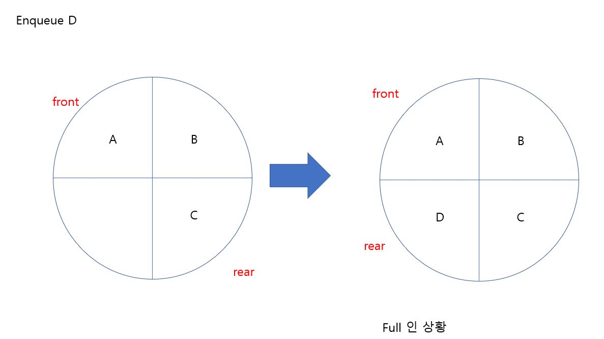
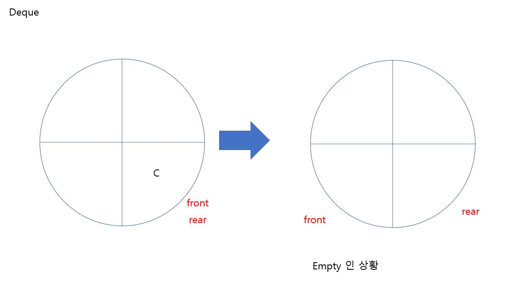
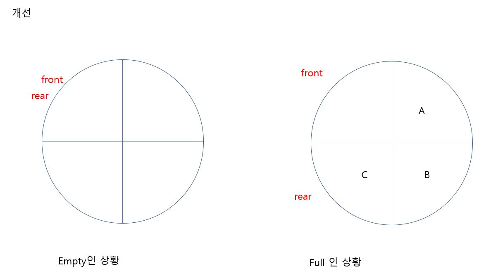

# 큐(Queue)

[TOC]

## 1. 큐(Queue)란

**큐** 또한 스택과 마찬가지로 데이터를 일시적으로 쌓아놓는 자료구조 입니다. 가장 먼저 넣은 데이터를 가장 먼저 꺼내는 선입선출(FIFO:First In First Out)구조를 따르고 있습니다.

**스택**

- enqueue:데이터를 넣는 작업
- dequeue:데이터를 꺼내는 작업
- front:데이터를 꺼내는 쪽 
- rear:데이터를 집어넣는 쪽


## 2. 큐(Queue) 만들기

- 배열로 큐 만들기

  - enqueue 연산 시간복잡도는 O(1)이 걸린다. 
  - dequeue 연산 시간복잡도는 O(N)이 걸린다. 큐에 front에서 데이터가 빠져나가면 배열을 앞으로 한 칸씩 shift 시켜줘야 하기 때문이다.

- 링 버퍼로 큐 만들기

  - 링 버퍼는, 배열의 처음이 끝과 연결되었다고 보는 자료구조이다.

  - 어떤 요소가 마지막 요소인지 식별하기 위한 변수가 front와 rear가 있다.(논리적 식별)

  - front: 맨 처음 요소의 index

  - rear: 데이터가 마지막에 채워져 있는 index

  - enqueue와 dequeue 시간 복잡도는 O(1)이다.

- 링 버퍼의 문제점
  - full(꽉 찬경우), empty(빈 경우)를 구분할 수 없다.
  - enqueue한 후에 rear++
  - dequeue한 후에 front++





- 개선 방법

  - 배열을 꽉 채우지 않는다. MAX-1이 꽉 찬것으로 간주한다.(한 칸을 비워둔다.)

  - rear++ 한 후에 enqueue

  - front++한 후에 dequeue

  - 링 버퍼가 텅 빈 상태(front==rear)

  - 링 버퍼가 꽉 찬 상태(rear+1==front)

    


#### 소스코드

```c++
#define MAX 6
#include <iostream>

using namespace std;

typedef struct {

	int max;
	int front;
	int rear;
	int ring_buffer[MAX];
	int n;

}IntQueue;
int dequeue(IntQueue &queue);
bool isEmpty(IntQueue &queue);
int enqueue(IntQueue &queue, int data);
bool isFull(IntQueue &queue);

int enqueue(IntQueue &queue, int data) {

	if (!isFull(queue)) {
		queue.rear = (queue.rear + 1) % MAX;
		queue.n++;
		queue.ring_buffer[queue.rear] = data;
		
		return queue.rear;
	}


	return -1;

}


int dequeue(IntQueue &queue) {
	
	if (!isEmpty(queue)) {

		queue.n--;
		queue.front = (queue.front + 1) % MAX;
	
	}

	return -1;

}

bool isEmpty(IntQueue &queue) {

	if (queue.rear == queue.front) {
		return true; //empty
	}
	else {
		return false;
	}


}


bool isFull(IntQueue &queue) {

	int next = (queue.rear + 1) % MAX;

	if (next ==queue.front) {
		return true;

	}
	else {
		return false;
	}
}

int main(void) {

	IntQueue queue;
	queue.max = MAX;
	queue.front = 0;
	queue.rear = 0;
	queue.n = 0;


	for (int i = 1; i <MAX;i++) {
		enqueue(queue, i);
		
	}


	if (isFull(queue)) {

		cout << "FULL QUEUE" << "\n";
	}
	else {

		cout << "NOT FULL QUEUE" << "\n";
	}


	for (int i = 1; i <MAX;i++) {
		dequeue(queue);
	
	}
	

	if (isEmpty(queue)) {

		cout << "Empty QUEUE" << "\n";
	}
	else {

		cout << "NOT Empty QUEUE" << "\n";
	}


}


```


## 3.덱(Deque)

**덱** 이란dobule-ended queue를 줄여서 표현한 것으로, 양방향으로 enqueue, dequeue 할 수 있는 자료구조를 의미한다. 

- 앞으로 넣기
- 앞에서 빼기
- 뒤에서 넣기
- 뒤에서 빼기


보통, 배열과 연결리스트로 구현한다.


**Deque C++ 컨테이너**

```c++
#include <deque>
#include <iostream>

using namespace std;

void print(deque<int> &d) {
	for (int x : d) {
		cout << x << ' ';
	}

	cout << "\n";
}

int main(void) {

	deque<int> d;

	d.push_back(1);
	print(d);

	d.push_front(2);
	print(d);

	d.push_back(3);
	print(d);

	d.pop_back();
	print(d);

	d.pop_front();
	print(d);
}
```

