# [DataBase] Normalization(정규화)

[TOC]

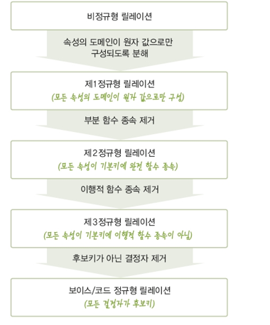

## 1. 정규화의 개념과 이상현상

**1.1 정규화란**

-  잘못된 설계로 인한여 <u>이상현상</u>이 발생하게 되는데 이를 올바르게 설계해나가는 과정을 정규화 한다.
- 함수 종속성을 이용해 릴레이션을 연관성이 있는 속성들로만 구성되도록 분해해서 이상현상이 발생되지 않도록 하는 과정
- 무손실 분해
- 릴레이션이 정규화된 정도를 정규형이라 한다.
  - 정규형의 차수가 높아질수록 요구되는 제약조건이 많아지고 엄격해짐

**1.2 이상현상**

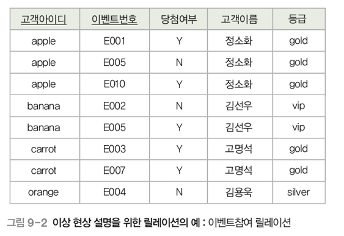

- Relation 내에 데이터의 중복으로 인하여 Relation에대한 <u>삽입, 수정, 삭제 연산</u>을 수행할 때 발생할 수 있는 부작용을 의미한다.

- 삽입이상

  - 새 데이터를 삽입하기 위해 불필요한 데이터도 함께 삽입해야 하는 문제

  - 아직 이벤트를 참여하지 않는 신규 회원 데이터를 삽입하고자 한다. 그러나 개체 무결성 조건 때문에 삽입할 수 없다.

    ex)고객아이디:melon 이벤트번호:NULL 당첨여부:NULL 고객이름:한호정 등급:gold

    

- 갱신이상

  - 중복 tuple중 일부반 변경하여 데이터가 불일치하게 되는 문제

  - 아이디가 apple인 고객의 등급을 gold에서 vip로 변경되었는데, 조건문을 잘못 적용되서 일부 tuple만 수정된 경우apple 고객이 서로 다른 등급을 가지는 문제 발생

    

- 삭제이상

  - tuple을 삭제하면 꼭 필요한 데이터까지 함께 삭제되는 데이터 손실의 문제
  - 아이디가 orange인 고객이 이벤트 참여를 취소해 관련 tuple을 삭제하게 되면 고객 아이디, 고객이름, 등급 데이터까지 손실됨

**따라서, 이상현상이 발생하지 않도록, 릴레이션을 관련 있는 속성들로만 구성하기 위한 릴레이션 decomposition(분해)가 필요하다.(정규화)**

## 2. 함수 종속

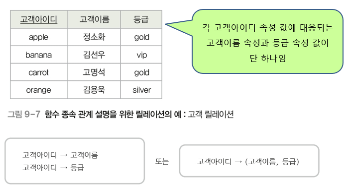

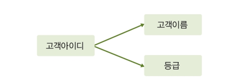

**2.1 함수종속**

- relation 내의 모든 tuple을 대상으로 하나의 X값에 대한 Y값이 항상 하나여야 한다.(함수종속 판단예)

- X와Y는 하나의 Relation을 구성하는 속성들의 부분 집합

- X (결정자)-> Y(종속자)

  - X가 Y를 함수적으로 결정한다.

  - Y가 X에 함수적으로 종속되어 있다.

    

**2.2 함수종속 관계 판단 시 유의사항**

- 속성 자체의 **특성과 의미**를 기반으로 함수 종속성을 판단해야 함

  - 속성 값은 계속 변할 수 있으므로 현재 Relation에 포함된 속성 값만으로 판단하면 안됨

- 일반적으로 기본키와 후보키는 Relation의 다른 모든 속성들을 함수적으로 결정함

- 기본키와 후보키가 아니더라도 결정자가 될 수 있음

- 결정자와 종속자가 같거나, 결정자가 종속자를 포함하는 것처럼 당연한 함수 종속 관계는 고려하지 않음

  ex)

   고객아이디->고객아이디

  {고객아이디,이벤트번호}->이벤트번호

**2.3함수 종속 종류**

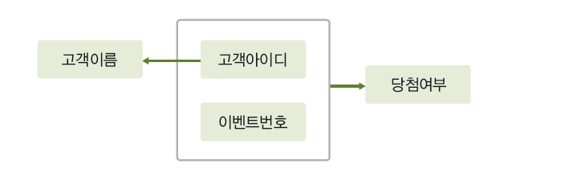

- 완전함수종속(FFD:Full Functional Dependency)
  - 속성집합Y가 속성집합X에 함수적으로 종속되어 있지만, 속성 집합X의 전체가 아닌 일부분에는 종속되지 않음을 나타냄(X전체에만 종속)
  - 일반적인 함수 종속은 완전 함수 종속
  - 당첨여부는 {고객아이디, 이벤트번호}에 부분함수 종속됨

- 부분함수종속(PFD:Partial Functional Dependency)
  - 속성집합Y가 속성집합X에 전체가 아닌 일부분에도 함수적으로 종속됨을 나타냄(전체 또는 일부)
  - 고객이름은  {고객아이디, 이벤트번호}에 부분함수 종속됨

- 이행적함수종속(transitive FD)

  - Relation을 구성하는 세 개의 속성 집합 X,Y,Z에 대해 함수 종속 관계 

    X->Y

    Y->Z

    X->Z가 성립되는데, 이것을 Z가 X에 이행적으로 함수 종속되었다고 함

## 3. 정규화의 종류

### **3.1 제 1정규형**

- Relation의 모든 속성이 **더는 분해되지 않는 원자 값(atomic value)**만 가지면 제 1정규형을 만족함

- 아래 그림은 기본키인 {고객 아이디, 이벤트 번호}에 완전 함수 종속되지 못하고 일부분인 고객아이디에 종속되는 등급과 할인율 속성이 존재하기 때문

  =>기본키에 완전 함수 종되지 않은 등급과 할인율 속성 때문

  

  
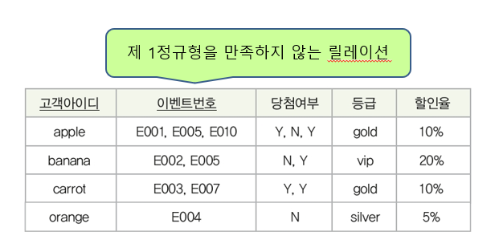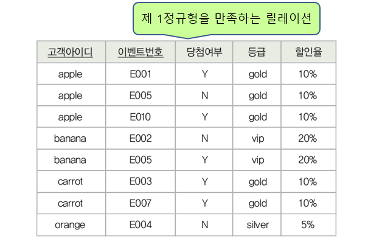

  
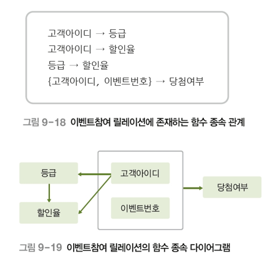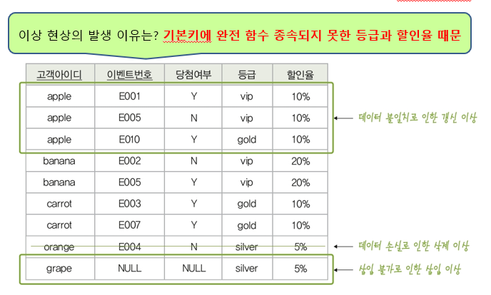

  

### **3.2 제 2정규형**

- Relation이 제 1정규형에 속하고 기본키가 아닌 속성이 기본키에 완전 종속되면 제 2정규형에 속한다.

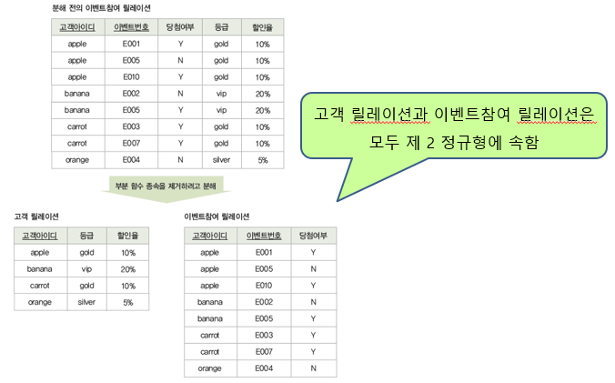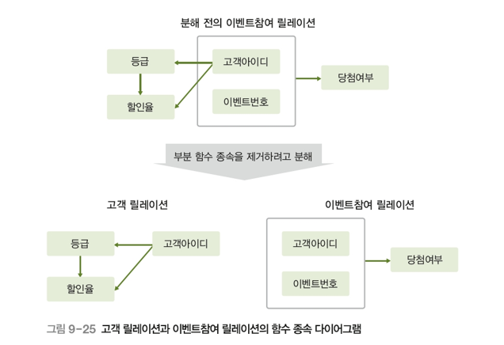

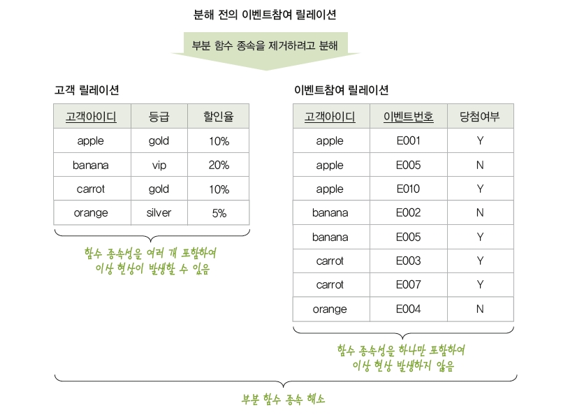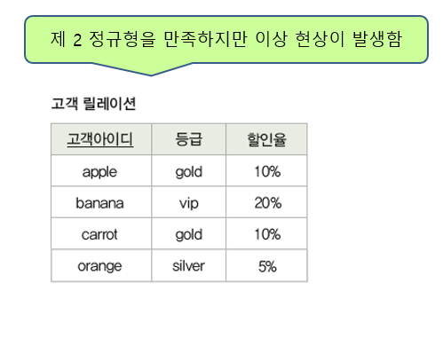

### **3.3제 3정규형**

- Relation이 제 2정규형에 속하고, 기본키가 아닌 모든 속성이 기본키에 이행적 함수 종속되지 않으면 제 3정규형에 속한다.

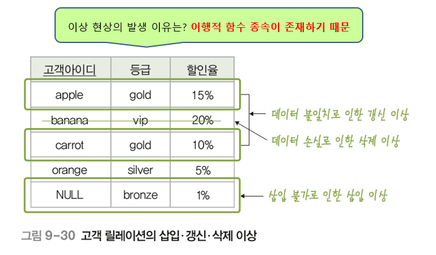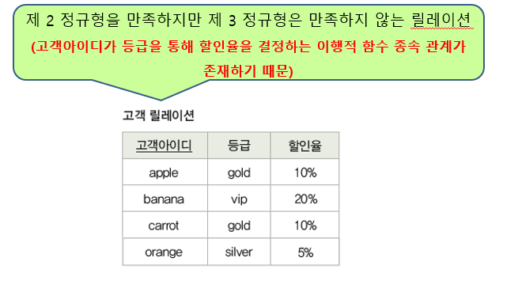

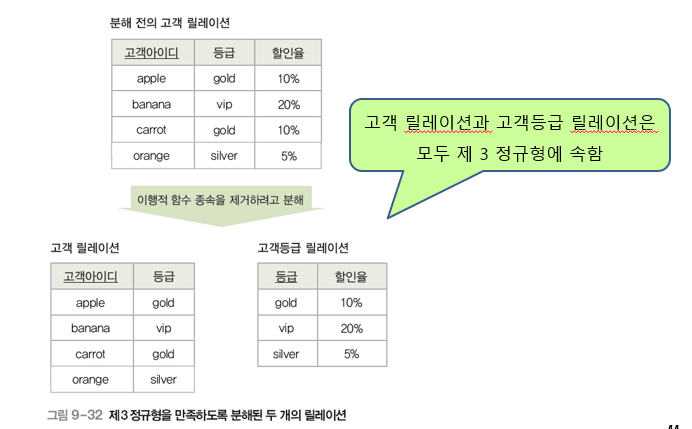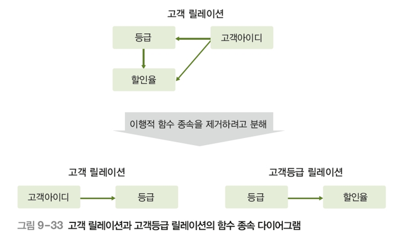

**3.3BCNF 정규형**

- 하나의 Relation에 여러 개의 후보키가 존재하는 경우, 제 3정규형까지 모두 만족해도 이상 현상이 발생할 수 있음
- Relation의 함수 종속 관계에서 모든 결정자가 후보키이면 BCNF 정규형에 속한다.

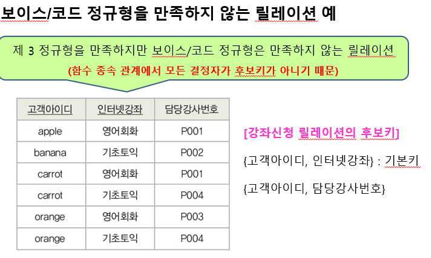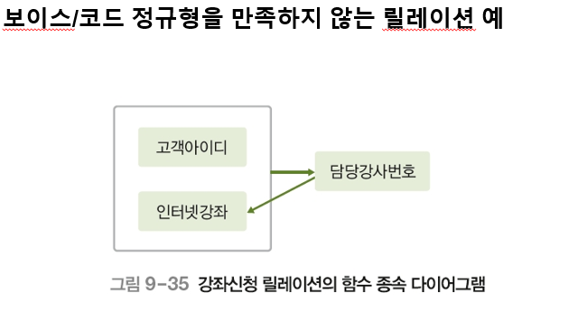

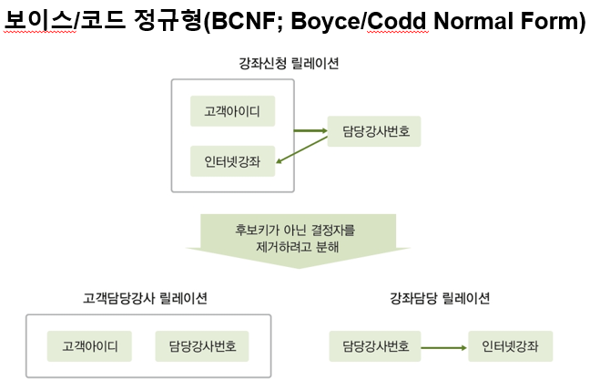

**3.4제4 정규형**

- Relation이 BCNF를 만족하면서, 함수 종속이 아닌 다치종속(MVD:MultiValued Dependency)를 제거하면 제 4정규형에 속함

**3.4제5 정규형**

- Relation이 제4정규형을 만족하면서, 후보키를 통하지 않는 조인 종속(JD:Join Dependency)을 제거하면 제 5정규형에 속함

## 3. 정규화 시 주의사항

- 모든 릴레이션이 제 5정규형에 속해야만 바람직한 것은 아님
- 일반적으로 제 3정규형이나 BCNF에 속하도록 Relation을 분해하여 데이터 중복을 줄이고 이상 현상을 해결하는 경우가 많음