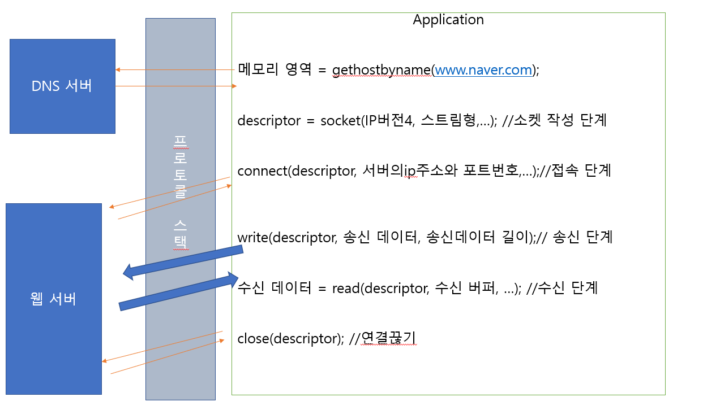

# Chapter01 웹 브라우저가 메시지를 만든다.

[TOC]

## STORY 01 HTTP 리퀘스트 메시지를 작성한다.

> 브라우저와 URL의 관계(1)

- 브라우저는 웹 서버, FTP 서버, 메일 서버를 접근하는 클라이언트 기능을 수행한다.

- 이때, 사용자가 URL을 통해 브라우저에게 접근 방법을 알려주게 된다.

  ```
  접근방법://웹 서버명/elfprxhflaud/파일명
  (http,ftp,mail)
  
  HTTP 프로토콜로 웹 서버에 엑세스 하는 경우
  https://www.naver.com/index.html
           (웹 서버명)    (자원)
  FTP 프로토콜로 파일을 다운로드 하거나 업로는 하는 경우
  ftp://ftp.cyber.co.kr/dir/index.html
  
  클라이언트 PC자체의 파일에서 데이터를 읽어오는 경우
  file://localhost/c:/download/file.zip
  
  ```


> 브라우저의 URL의 관계(2)

- 사용자 => URL 제출

- 브라우저=> URL 해독(어디에 액세스해야 할지 결정)

- 브라우저=> HTTP Request 메시지 작성 및 전송

- 서버=>Request 메시지 속에서 "무엇을" , "어떻게 해서"를 판단한 후 동작

- 서버=>해당 처리후 HTTP Response 메시지 작성 및 전송


> HTTP의 기본 개념

HTTP 응답 코드 종류 && HTTP 메소드 종류

CGI의 개념

[출처]

http://gyrfalcon.tistory.com/entry/HTTP-%EC%9D%91%EB%8B%B5-%EC%BD%94%EB%93%9C-%EC%A2%85%EB%A5%98-HTTP-%EB%A9%94%EC%86%8C%EB%93%9C-%EC%A2%85%EB%A5%98

https://okky.kr/article/433046?note=1352766

- Request메시지

  > ''무엇을"(URI, 파일의 이름 또는 CGI 프로그램)
  >
  > "어떻게 해서"(메소드, 웹서버에서 어떤 동작을 원하는지)

  ````
  (a)
  <메소드><공백><URI><공백><HTTP 버전>   //첫번째 행을 리퀘스트 라인
  <필드명>:<필드값>                    //메시지 헤더
  ...                                //한 행에 한 개의 헤더 필드, 공백까지가 헤더 부분
  <공백 행>                
  <메시지 본문>                       //POST 전송시 데이터 내용이 담긴다.
  ````


- Response 메시지

  > ''무엇을"(URI, 파일의 이름 또는 CGI 프로그램)
  >
  > "어떻게 해서"(메소드, 웹서버에서 어떤 동작을 원하는지)

  ````
  (b)
  <HTTP 버전><공백><스테이터스 코드><공백><응답 문구>//응답문구는 Status code 내용의 짧은 설명문
  <필드명>:<필드값>                    //메시지 헤더
  ...                                //한 행에 한 개의 헤더 필드, 공백까지가 헤더 부분
  <공백 행>                
  <메시지 본문>          //클라이언트에게 송신하는 데이터(바이너리 데이터)
                         -파일에서 읽은 데이터
                         -CGI 애플리케이션이 출력한 데이터
                         
  ````


- status code

  - 코드값 (첫 번째 값 개요, 두번째와 서번째 값은 상세한 상황)

    > 1xx:처리의 경과 상황 등을 통지
    >
    > 2xx:정상 종료
    >
    > 3xx:무언가 다른 조치가 필요함
    >
    > 4xx:클라이언트 측 오류
    >
    > 5xx:서버측 오류


## STORY 02 웹서버의 IP 주소를 DNS 서버에 조회한다.

   1.브라우저:HTTP 메시지 작성  

   2.운영체제에게 송신 요청

3. 웹서버에 전송됨


> IP 주소의 기본

IP주소

- IP 주소는 32 비트의 디지털 데이터
- 1byte씩으로 점으로 구분, 10진수로 표현
- IP주소의 호스트 주소가 모두 0: 서브넷 자체(네트워크 번호)
- IP주소의 호스트 주소가 모두 1: 브로드캐스트(서브넷에 있는 기기 전체에 패킷을 보내는것을 의미)


넷마스크

- 넷마스크를 통해, 네트워크 번호와 호스트 번호로 구별

```
(A)IP 주소 표기 방법 1
10.11.12.13

(B)IP 주소 표기 방법 2
10.11.12.13(ip 주소 본체) /255.255.255.0(네트워크 마스크)

(C)IP 주소 표기 방법 3
10.11.12.13(ip 주소 본체) /24(넷마스크)


(D)서브넷을 나타내는 주소
10.11.12.0/24

(E)서브넷의 브로드캐스트를 나타내는 주소
10.11.12.255/24


IP주소         10.1.2.3
넷마스크       255.255.255.0

네트워크 번호 10.1.2
호스트 번호          3        

```


cf)

* 브라우저는 네트워크로 송출하는 기능이 없기 때문에 운영체제에 요청

* 서브넷: '허브'' 에 여래대의  pc가 접속된 것을 의미한다. 이것의 하나의 단위를 서브넷이라 정의한다.

  또한, 이러한 서브넷들이 라우터에 연결되면 이것이 종합적으로 모이면 네트워크 전체가 완성된다. 

* 00동(서브넷==네트워크 번호)  00번지(호스트번호==컴퓨터)

* 패킷이 전달되는 과정

  - PC에서 목적지에게 패킷을 보냄
  - 허브는 이 패킷을 라우터까지 전송시킴
  - 라우터는 다음 라우터를 판단하고 해당 패킷을 보냄 
  - 해당 패킷은 허브를 통해 라우터가 전송받음


> 도메인 명과 IP 주소를 구분하여 사용하는 이유

- IP 주소 보다 도메인명을 이용하여 통신하는것이 직관적이고 이해하기 쉬울 수 있다 .

  그러나 실행 효율 측면에서는 IP 주소는 4byte 데이터 개수만 필요한 반면에 도메인 주소로 통신할 경우

  문자이기 때문에 많은 Byte가 필요하고 라우터에 부하에 여향을 미친다. 


>  Socket 라이브러리가 IP 주소를 찾는 기능을 제공한다.

- DNS 클라이언트를 DNS resolver(resolver) 라고 정의한다.
- DNS 클라이언트가 DNS 서버로 부터 IP주소를 알아오는 작업을 name resolution이라 한다. 
- resolver는 Socket 라이브러리의 부품(네트워크 통신 기능에 대한 기능 모임집)


> 리졸버를 이용하여 DNS서버를 조회한다.

```c++
메모리 영역 = gethostbyname("www.naver.com");=> DNS 서버에 요청을 보낸다.
      //리졸버의 프로그램 명
/*
- gethostbyname 함수를 통해 얻어진 ip 주소를 통해 브라우저는 HTTP 리퀘스트 메시지와 함께 OS에 건   네주어 송신을 의뢰한다.
*/
```

cf)

프로토콜 스택(TCP/IP 소프트웨어==프로토콜 드라이버)

- OS에 내부에 내장된 네트워크 제어용 소프트웨어


(참고) http://forum.falinux.com/zbxe/index.php?document_srl=518686&mid=C_LIB


> 리졸버 내부의 작동

```
//애플리케이션 프로그램(웹 브라우저)
  -메모리 영역 = gethostbyname("www.naver.com");
  

//Socket
  gethostbyname{
    -DNS 서버에 보내진 조회 메시지 작성 
    -조회 메시지를 DNS 서버에 보냄 
    
    -DNS 서버에서 보낸 응답 메시지 수신
    응답 메시지에서 ip주소를 추출한다.
    애플리케이션으로 돌아간다.
 }

//OS내부의 프로토콜 스택
   -UDP 메시지 송신{
       송신 동작 
   }
   
   -UDP 메시지 수신{
       수신 동작
   }
   
   
//LAN 어댑터

//DNS 서버
```


## STORY 03 전 세계의 DNS서버가 연대한다.

> DNS 서버의 기본 동작

DNS 조회 메시지(이름,클래스, 타입)를 통해 DNS에게 요청하면, DNS서버는 DNS 리소스 레코드에서 해당 정보를 찾아서 정보를 제공 한다.


DNS 조회 메시지 (Socket 라이브러리에서 작성됨)

- **이름**

  목적지 주소

- **클래스**

  DNS를 고안했을때 인터넷 외에 다른 네트워크에서도 이용하기 위해서 클래스라는 것을 도입하였는데

  현재는, 인터넷 이외의 네트워크는 사용하지 않기 때문에 항상 인터넷을 나타내는 `IN`이라는 값이 사용

- **타입**

  해당 타입에 따라서, 서버에서 응당해주는 정보의 내용이 달라집니다.

  A : IP주소를 조회할 때 사용

  MX: 메일 배송 목적지를 조회할 때 사용

  http://openstory.tistory.com/46 (DNS 타입종류)

```
클라이언트                                                    DNS 서버
1.조회메시지(이름,클래스,타입)                          2.소스레코드에서 해당 조회메시지에 따른
                                                      응답항목을 찾음
                                                    3.응답을 보냄
                                                    
						리소스 레코드                                                    
이름         		 클래스      타입    클라이언트에 응답하는 항목
www.naver.com      IN          A           192.0.2.226
cyber.co.kr        IN          MX        10 mail.cyber.co.kr
mail.cyber.co.kr   IN          A           194.0.2.222

...
```

 

> 도메인 계층

도메인 계층이 존재하는 이유는, 하나의 DNS 서버에 리소스 레코드 항목을 모두 저장할 수 없기 때문에 정보를 분산 시켜서 다수의 dns 서버에 등록하고 연대하여 정보를 찾는 구조로 구성되어 있다.


(출처: https://raptor-hw.net/xe/know/17253 )


> DNS 서버를 찾아 IP 주소를 가져오기

DNS 계층 저장 방법

```
www.naver.com

www.naver.com 도메인을 담당하는 DNS서버의 주소를 naver.com 도메인의 DNS 서버에 저장한다.
naver.com 도메인을 담당하는 DNS 서버의 주소를 com 도메인의 DNS 서버에 저장한다.

이러한 식으로 작성하면, 상위의 DNS에서 하위의 DNS서버를 알 수 있고 계층을 타고 내려가다 보면
원하는 도메인 서버를 찾을 수 있다.

더불어, 최상위 root domain DNS 서버의 주소를 모든 DNS 서버가 등록하고 있습니다.
이를 통하며, 루트 도메인을 경유하여 계층적으로 타고 들어가 원하는 DNS 서버를 찾을 수 있습니다.
```

www.opentutorials.org 조회 동작


(출처: https://opentutorials.org/module/288/2802)


> DNS 서버 캐시 

- 현실에서는, 한 대의 DNS 서버에 복수의 도메인 정보를 저장할 수 있다.

- 상위와 하위 도메인을 같은 DNS 서버에 등록할 수 도 있다.

- DNS는 한 번 조회한 정보를 캐시에 저장해 놓는다. 이렇게 되면 클라이언트 조회시 해당 정보가

  캐시에 있으면 바로 정보를 제공하고 아니면 위의 그림과 같은 절차를 따른다.

  여기서 문제가 되는것이 캐시의 정보의 유효성 문제이다.

  만약, DNS 서버에서 정보가 변경시에 캐시의 있는 정보가 반드시 유효하다고 보장할 수 없다.

  이 문제를 해결하기 위해서 캐시 정보에 유효 기한을 설정하고 유효기간이 지나면 캐시에서 삭제한다.

  또한, 조회에 회답할 때 캐시에서 제공 받은 것인지 아니면 DNS 서버에서 회답한 것인지를 알려준다.


## 프로토콜 스택에 메시지 송신을 의뢰한다.

> 데이터 송·수신 동작의 개요

DNS를 통해 IP 주소를 알아온 후에는, 웹서버에게 HTTP 메시지를 송신하기 위해서 OS의 프로토콜 스택(Socket 라이브러리)에 의뢰하는 작업을 시작합니다.

의뢰받은 메시지를 전송하고 받기 위해서 다음과 같은 절차를 거칩니다.

이 과정 역시, 브라우저 프로그램=>Socket라이브러리=>프로토콜 스택 일련의 과정을 거칩니다.

**<데이터 송·수신 동작>**

1. 소켓을 만듭니다.(소켓 작성 단계)
2. 클라이언트는 서버측의 소켓에 파이프를 연결합니다.(접속단계)
3. 데이터를 송·수신 합니다.(송·수신 단계)
4. 파이프를 분리하고 소켓을 제거합니다.(연결 끊기 단계)

우선, **소켓**이란 서버와 클라이언트의 데이터의 출입구를 의미합니다. 

실제로는 메모리에 할당된 일정 공간



> 소켓 작성 단계

- socket라이브러리의 socket 함수를 호출하면 소켓이 만들어진다.

- socket 함수의 return 값으로 descriptor이 나오는데 이것의 일련의 유니크한 번호를 의미한다.

  이를 통하여, 소켓을 식별하는데 사용된다. 이것이 필요한 이유는 컴퓨터 내부에는 소켓이 복수개 존재할 수 있기 때문에 통신할 때 어떤 소켓을 사용하여 통신할 지 판단하기 어렵게 된다. 때문에 descriptor 번호를 통해

  사용하려는 소켓을 식별하여 통신에 사용한다.


> 접속 단계

- connect라는 함수를 통해 웹 서버에 접속을 의뢰하게 된다.

- 이 때 필요한 매개변수로는 3가지가 필요하다. 

  - descriptor (컴퓨터 내부의 소켓을 식별하기 위한 번호, 내부적으로 사용으로 위한)

  - 서버의 ip주소(DNS에서 조회하여 전달받은  IP주소) 

  - 포트번호(컴퓨터 외부에 소켓을 식별하기 위한 번호, 상대측을 위한)

    - 포트번호가 필요한 이유는 서버의 ip 주소로만으로는 어느 네트워크의 컴퓨터인지만 식별되기 때문에 ip 주소만으로는 소켓까지 지정할 수 없습니다. 때문에, 포트번호를 이용하여 어느 컴퓨터의 어느 소켓에 접속할지 판별할 수 있게 됩니다.

    - 보통, 서버의 포트의 경우 규칙으로 정해져 있습니다. 웹 서버는 80, 원격 서버 22, 메일 서버 25 등 

    - 클라이언트의 포트의 경우, 소켓 작성 단계시 socket 함수 호출 시 프로토콜 스택이 임의의 유니크한 번호를 할당해줍니다. 그 이후 접속 단계 connect 함수 호출 시 클라이언트 포트 번호를 서버 측에게 알려줍니다.

    - connect 함수를 호출을 통해, 상대 서버측과 연결되면 상대 IP 주소, 포트 번호등을 **소켓**에 저장합니다.


> 송·수신 단계

< 송신>

- write 함수를 통해 데이터를 보낼 수 있습니다.

- write(descriptor, 송신 데이터, 송신데이터 길이);

  송신 데이터가 의미하는 것이 HTTP 리퀘스트 메시지 입니다.

- write 함수 호출하면 데이터가 전송하고 서버 측에서는 이 데이터를 전달 받은 후 내부적으로 처리후 응답메시지를 보낸다.

<수신>

- 서버 측에서 응답 메시지를 보내면 read 함수를 통해 응답메시지를 임시적으로 수신 버퍼에 저장합니다. 일정 시간이 지난 후 애플리케이션 프로그램의 내부에 마련한 메모리 영역에 해당 내용을 전달합니다.


> 연결 끊기 단계

- close 함수를 호출하면 소켓이 사라지게 됩니다.
- 웹의 HTTP 1.0프로토콜의 경우, 응답 메시지 송신이 끝나면 웹 서버 측에서 연결 끊기 동작을 실행 하게 됩니다. 먼저 웹 서버측에서 close 함수 호출을 통해 연결을 끊습니다. 그 후, 클라이언트에서는 read 함수를 통해 데이터 송·수신 동작이 완료되어 연결이 끊겼다는 사실을 브라우저에게 통지합니다. 그러면 브루어저도 clost 함수호출을 통해 해당 소켓을 제거하게 됩니다.


