# Chapter05 서버측의 LAN에는 무엇이 있는가?

[TOC]

이전 장에서는, 인터넷에 들어간 패킷이 통신 회선이나 프로바이더의 네트워크를 통해 서버측의 NOC또는 POP로 운반되는 과정을 공부하였습니다. 이번 장은 목적지 서버 앞에 있는 방화벽, 캐시서버, 부하 분산 장치 등을 탐험해보도록 하겠습니다.

## STORY 01 웹서버의 설치 장소

> 사내에 웹 서버를 설치하는 경우

(a)라우터에 직접 연결하는 경우

- (a) 와 같이 구성하다 보면 보안상 취약점이 발생할 수 있습니다.
- 악의적인 패킷이 어플리케이션에 전송되었을때 바로 전달되기 때문에 위협이 발생할 수 있습니다. 

(b)방화벽으로 분리하는 경우

- 보안상의 이유로 방화벽을 중간에 두는 방법을 많이 사용 합니다.
- 방화벽은 특정 서버에서 동작하는 특정 어플리케이션에 액세스하는 패킷만 통과 시키고, 그 외의 패킷을 차단하는 역할을 합니다.(즉, 허가된 어플리케이션만 패킷을 서버에 보낼 수 있습니다.)
- 방화벽을 사용함으로써 보안성이 더 강화됨

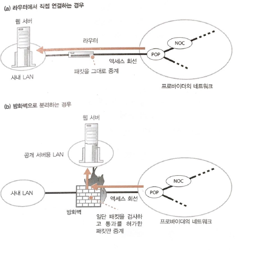

> 데이터센터에 웹 서버를 설치하는 경우

(c)데이터센터에 웹 서버를 설치한 경우

- 사내가 아닌 프로바이더가 운영하는 데이터 센터에 웹서버를 설치하는 경우 입니다.
- 사용자는 일정한 금액을 내고 프로바이더가 제공하는 서버를 빌려 운영합닌다.
- 데이터센터는 NOC에 직접 접속되어 있거나 IX에 직접 연결되어 있습니다. 이때 연결하는 회선은 고속회선이기 때문에 다른 측에서 이 웹서버에 접속했을 때 속도가 빠릅니다. 또한, 데이터 센터는 자연재해를 대비하여 내진설계된 건물로 운영되기 때문에 안정적 입니다.
- 데이터 센터는 서버 외에도 기기의 가동 상태감시, 방화벽 설치 운영, 부정 침입 감시라는 부가 서비스를 제공합니다.

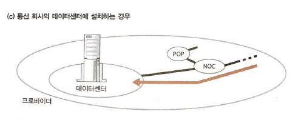

## STORY 02 방화벽의 원리와 동작

> 패킷 필터링

방화벽의 주요 개념은 미리 설정된 애플리케이션의 패킷은 통과시키고 그 외의 패킷을 차단하는 역할을 주로 수행합니다. 패킷을 선별하는 방식에 따라 방화벽의 종류는 크게 3가지로 분류됩니다.

- 패킷 필터링형
- 애플리케이션 게이트웨이형
- 서킷 게이트웨이형

그 중 가장 많이 사용하는 방화벽 유형은 패킷 필터링형 입니다.

> 패킷 필터링의 조건 설정 개념

패킷안에 헤더안에 제어정보가 기록되어 있습니다. 이러한 제어정보를 통해 방화벽은 패킷 필터링 기능을 수행합니다.

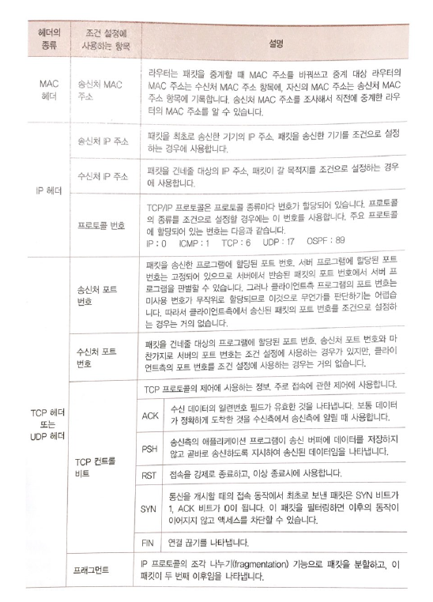

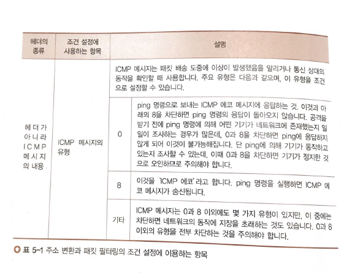

패킷 필터링은 start poing와 end point에 따라 패킷필터링 조건을 설정합니다.

1. 시점과 종점으로 판단

   - start point:송신처 IP

   - end point:수신처 IP

     

2. 포트번호(애플리케이션 한정)

   시점과 종점만으로 판단한다면, 인터넷과 웹 서버 사이를 흐르는 패킷은 전부 통과하게 됩니다. 만약 하나의 컴퓨터에 웹 서버(80)와 FTP 서버(22)가 존재한다고 가정해봅시다. 시점과 종점만 가지고 판단하게 되면 누군가가 부정정으로 파일 서버에 접속하여 정보를 빼내도 막을 방법이 없습니다.  그 외에도 보안적인 문제가 잠재되기 때문에 포트 번호를 통하여 접속 가능한 애플리케이션을 설정 합니다.

   

3. 컨트롤 비트로 접속 방향을 판단

   - 위의(1,2)만 가지로는 **웹 서버=>인터넷으로 액세스하는 동작을 정지할 수 없습니다**. 기본적으로 웹에서 사용하는 TCP 프로토콜을 양방향으로 패킷이 전송됩니다. 만약 웹 서버에서 인터넷으로 흐르는 패킷을 방화벽을 통해 정지 시키면 인터넷=>웹서버로 액세스 하는 동작도 정지하게 됩니다.

     따라서, 패킷이 흐르는 방향(웹=>인터넷 또는 이터넷=>웹)이 아닌 **액세스 방향을 판단하여 정지시켜야 합니다.** 이때 사용되는 것이 TCP 헤더에 있는 **컨트롤 비트** 입니다.

     

   - TCP 최초의 접속 단계에서는 클라이언트와 서버는 3개의 패킷을 주고 받습니다.

     1. 클라이언트 =>서버(최초의 패킷)

        컨트롤 비트 (SYN=1, ACK=0)

     2. 서버=>클라이언트(두 번째 패킷)

        커트롤 비트(SYN=1, ACK=1)

     3. 클라이언트=>서버

        컨트롤 비트(ACK)

   - 즉, 최초의 패킷만 ACK 컨트롤 비트가 0이고 나머지 ACK 컨트롤 비트는 모두 1 입니다.

     최초의 패킷이 클라이언트에서 서버가 아닌  **웹 서버측에서=> 인터넷(결국 클라로감)**으로 흘러갈 경우

     방화벽을 통하여 2행처럼 구성하게 되면 클라이언트가 패킷을 받지 못하기 때문에 TCP 접속 동작은 실패하게 됩니다. 이를 통해 웹서버에세 인터넷으로 패킷을 보내는 것을 차단시킬 수 있습니다.

​        https://m.blog.naver.com/PostView.nhn?blogId=koromoon&logNo=120162515270&proxyReferer=https%3A%2F%2Fwww.google.com%2F

4. 패킷 필터링 조건으로 사용되는 항목 즉, 헤더는 다양합니다.

<인터넷->웹서버로 패킷이 전송되는 경우>

- 인터넷에서 웹서버로 패킷이 전송되는 경우 방화벽은 **strat point(송신처 IP)는** **누구든 상관 없기 때문**에 패킷필터링 설정에 대하여 end point(수신처 IP) 만 가지고 판단합니다.(1행)

  ex)

  웹 서버가 naver라고 치면 이 곳에 접속하는 클라이언트 송신 ip는 패킷필터링의 대상이 되지 않습니다.

  

<웹서버->인터넷으로 패킷이 전송되는 경우>

- 클라이언트에게 요청받은 웹 서버는 ACK 패킷은 데이터 패킷을 전송해야 합니다.

  이때, start point(송신처 IP)와 패킷 테이블이 일치하는 패킷만 전송합니다.(3행)

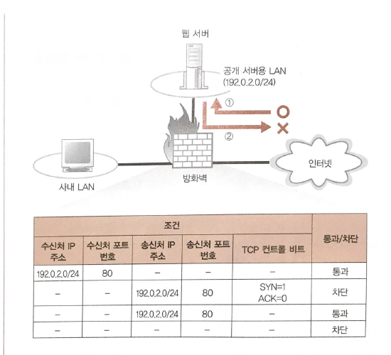

위의 조건을 모두 고려하면 판단 해봅시다.

1. 인터넷에서=>서버로 패킷이 도착한 경우 (1행의 경우) 이 패킷은 최초의 패킷이 되고 방화벽의 조건에 따라 통과하게 됩니다.
2. 서버=> 인터넷으로 패킷을 전송할 때 2행이 아닌 3행과 일치하기 때문에 패킷이 통과하게 됩니다.

cf)

그러나 UDP 프로토콜을 사용하면 위의 예시가 적용되지 않습니다.

DNS 서버는 UDP 프로토콜을 사용합니다. UDP는 접속동작이 없기 때문에 액세스 방향을 알 수 없습니다.

따라서, 사내=>인터넷 DNS 서버에 접속하는 것은 허가하고 인터넷=>사내의 DNS 서버에 액세스하는 패킷을 차단한다는 조건을 설정할 수 없습니다.  

정리하자면, 패킷 필터링형 방화벽은 수신처 IP 주소, 송신처 IP 주소, 수신처 포트 번호, 송신처 포트 번호, 컨트롤 비트 등으로 패킷을 통과시킬지 판단합니다.

## STORY 03 복수서버에 리퀘스트를 분배한 서버의 부하 분산

> 복수의 서버를 이용한 분산

예를 들어 서버에 대한 액세스(사용자의 요청)이 많을 경우 회선을 초 고속 회선으로 바꾸게 되면 빠르게 패킷을 서버에게 전송할 수 있습니다. 그러나 고속화한 회선에서 흘러오는 대량의 패킷에 대해서 서버의 처리 능력이 따라잡지 못할 수 있습니다.(데이터 센터,사내 서버 공통사항) 

cf) 어떠한 요청이 CGI등의 애플리케이션에서 페이지를 동적으로 만드는 연산의 경우,서버 파워를 많이 사용하게 됩니다.

<해결방식>

1. 라운드 로빈

   여러 대의 웹 서버를 설치하고 한 대가 담당하는 사용자 수를 줄이는 것입니다.

   예를 들어 DNS 서버에 여러 대의 웹 서버를 등록해 놓으면 DNS 서버는 해당 사이트로 사용자의 요청이 있을 때마다 차례대로 IP주소를 알려줍니다. 예를 들어 192.0.2.60, 192.0.2.70 192.0.2.80이 있을 때 순서를 변경하는 라운드 방식을 통해 균등하게 IP주소를 알려줍니다.

   이 방식의 문제점

   - 클라이언트 측은 제일 먼저 DNS를 가지고 웹 서버에 접근하는데 그 주소의 웹 서버가 고장이 날 수 도 있습니다.  클라이언트는 해당 IP로 접근해도 접속이 불가능한 사태가 발생할 수 있습니다.  그래서 최근 많은 브라우저는 DNS 서버에서 제공 받은 맨 앞의 IP 주소를 통한 액세스가 시패하면 다음 IP 주소를 통해 접근을 시도 합니다.

   - 이러한 라운드로빈 형식의 문제는 CGI 등의 애플리케이션에서 페이지를 동적으로 만드는 경우 복수의 페이지에 걸쳐 대화할 수 있는데 웹 서버가 변하게 되면 대화가 도중에 끊길 수 있기 때문입니다. 

     ex)

     쇼핑 사이트에서 첫 페이지에서 주소,성명을 입력하고 다음 페이지에서 신용카드 번호를 입력하는 경우

   

   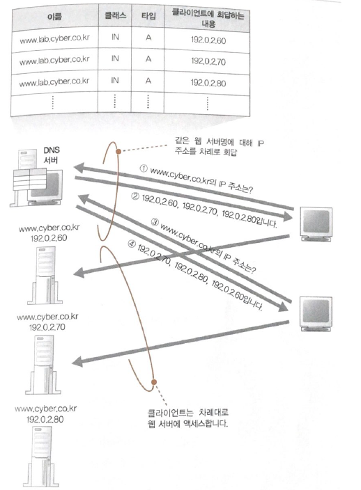

   

2. 부하 분산장치

   - 부하 분산장치(로드 밸런서 등)을 이용하는 방식 입니다. 부하 분산장치를 웹 서버 대신 DNS 서버에 등록해 둡니다.

   - 부하 분산 장치는 웹 서버들과 정기적으로 정보를 주고 받으면서 CPU나 메모리 사용률을 체크합니다. 

     그 후 적합한 웹서버에 연결시켜 줍니다. 또한, 복수의 페이지에 걸쳐있을 때는 부하에 상관없이 이전의 리퀘스와 같은 웹 서버에 연결해주는 작업도 진행합니다.

     <복수의 페이지에 걸쳐있을때 전후 관계를 판단하기 위한 방법>

     - 양식에 입력한 데이터를 보낼 때 전후이 관련을 나타내는 정보를 부가하는 방법
     - HTTP  사양을 확장하여 전후 관계를 판단하기 위한 정보 를 HTTP 헤더에 필드(쿠키)를 부가하는 방법

   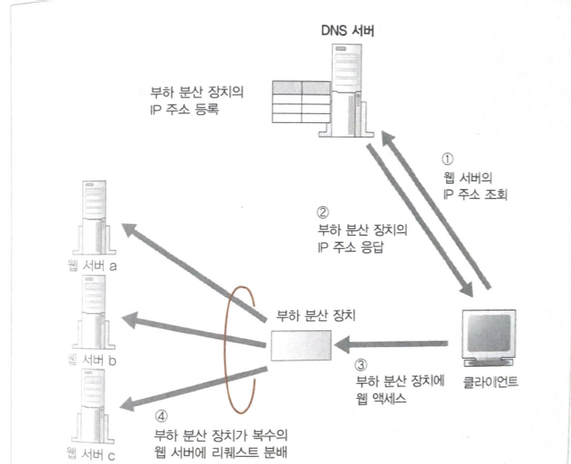

   

## STORY 04 캐시서버를 이용한 서버의 부하 분산

> 캐시 서버를 이용한 분산

캐시 서버는 프록시라는 구조를 사용하여 데이터를 캐시에 저장하는 서버 입니다.

- 웹 서버에 대한 액세스 동작을 중계

- 웹 서버에서 받은 데이터를 디스크에 저장해 두고 웹 서버를 대신하여 데이터를 클라이언트에 전송해주는

  역할을 수행 합니다. 이러한 데이터를 캐시라고 부릅니다.

  - 캐시에 데이터를 저장한 후 웹 서버 측에서 데이터가 변경되면 캐시의 데이터를 사용할 수 없음
  - CGI 애플리케이션이 출력하는 페이지 데이터 내용도 매번 달라지기 때문에 캐시를 사용할 수 없음
  - 일정하게 동일하게 변하지 않는 데이터는 캐시로 이용할 수 있음
  - 웹 서버의 부하를 줄일 수 있음

  

cf)

프록시: 클라이언트와 웹 서버 사이에 설치하여 액세스 동작을 중개하는 구조

<캐시 서버의 동작>

1. 캐시 서버를 웹 서버 대신 DNS 서버에 등록 합니다.

2. 캐시의 동작은 캐시에 데이터가 없는 경우와 있는 경우로 나누어 집니다. 

   클라이언트에 requset 요청이 오면 캐시 서버를 경유했다는 의미로 패킷에 via라는 헤더 필드를 추가하여 

   웹서버에 전송합니다.

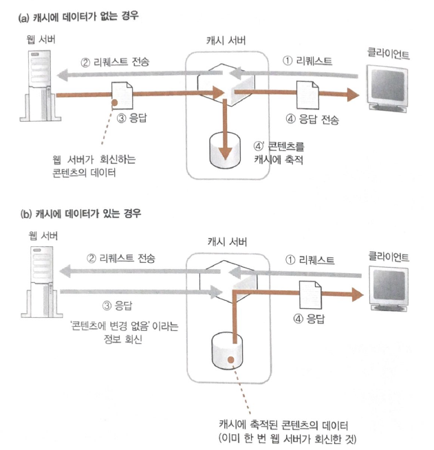

<캐시에 데이터가 없는 경우 HTTP>

- 캐시는 서버에게 데이터를 받으면 응답 메시지를 캐시에 저장하고 저장한 일시를 기록합니다.

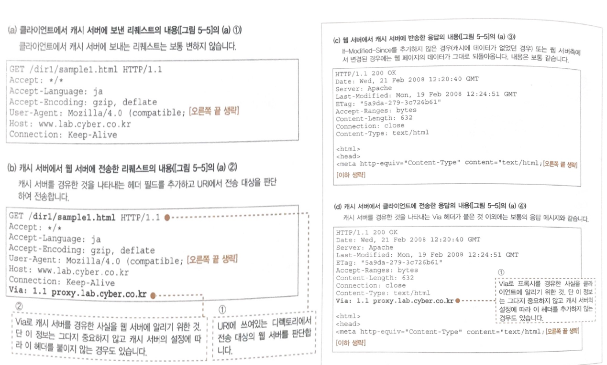

<캐시에 데이터가 있는 경우 HTTP>

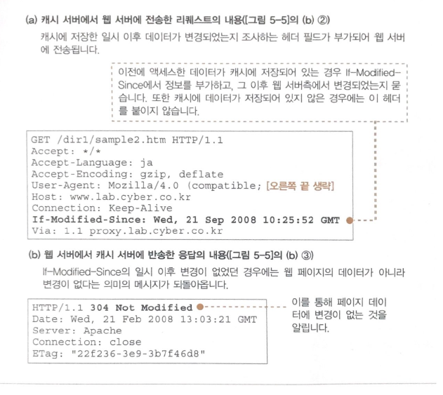

만약, 캐시 서버에 연결되어 있는 웹 서버가 한 대라면 웹 서버의 도메인명이나 ip 주소를 캐시 서버에 지정해두고 그곳에만 보내면 되지만 웹 서버가 여러대라면 어떤 서버로 전송될 지 판단해야 합니다.

그에 대한 방법은 다양합니다. 대표적인 방법은 디렉토리를 이용한 판별입니다.

방법.  디렉토리 이용한 판별

- 리퀘스트 메시지의 URI에 쓰여있는 디렉토리를 보고 판단하는 방법 입니다.

  예를 들어 URI가 /dir1/ 이라는 디렉토리이면 www1.lab.cyber.co.kr로

  ​                 URI가 /dir2/ 이라는 디렉토리이면 www2.lab.cyber.co.kr로

  위와 같은 내용을 캐시 서버에 설정해둡니다.	

> 포워드 프록시

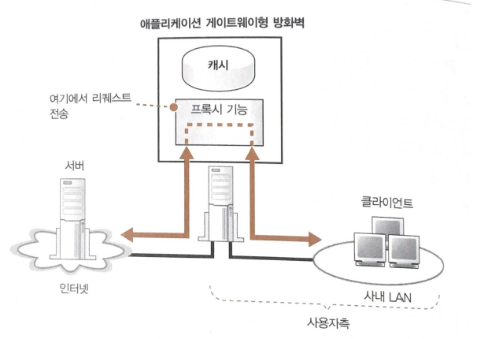

포워드 프록시란 클라이언트에 캐시 서버를 두는 것 입니다.  

- 포워드 프록시를 사용할 경우에는 웹 브라우저에서 프록시 서버라는 항목에 포워드 프록시 ip 주소를 설정합니다.

- 포워드 프록시를 설정해두면 클라이언트에 대한 서버의 요청을 포워드 프록시가 담당하게 됩니다.

- 포워드 프록시는 리퀘스트의 내용을 조사한 후 전송하므로 리퀘스트의 내용에 따라 액세스가 가능한지 판단할 수 있습니다. 즉 위험한 사이트나 작업과 관계 없는 사이트에 대한 액세스를 금지시킵니다. 패킷 필터링 방화벽에 비해 세밀한 조건을 두고 설정할 수 있습니다. 또한, 사내에서 웹 서버를 접속할 때 이전에 액세스한 페이지의 경우 프록시 캐시에 저장되어 있는 결과를 얻어오기 때문에 빠르게 데이터를 얻을 수 있습니다.

- 웹 브라우저에서 프록시를 설정한 경우

  - 브라우저는 URL 내용과 관계없이 전부 프록시 서버에 전송 합니다.

  - 브라우저가 HTTP 메시지를 작성할 때 URL 그대로 URI에 기록합니다.

  - 서버 측에 두는 캐시 서버의 경우 웹 서버에 대해서 등록을 해야 하지만 클라이언트 측의 캐시서버는 웹 서버에 대해 등록해줄 필요가 없습니다.

    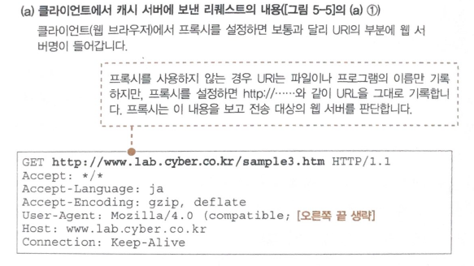

  

- 웹 브라우저에서 프록시를 설정하지 않는 경우

  - 브라우저는 URL 입력 창에서 http://....라는 문자열에서 액세스 대상의 웹 서버를 계산하는 작업을 수행합니다.
  - 브라우저가 HTTP 메시지를 작성할 때 URL에서 웹 서버의 이름은제외하고 파일이나 프로그램 경로명을 추출하여 그것만 URI에 기록합니다.

> 리버스 프록시

포워드 프록시의 경우 브라우저에 대한 설정이 필요합니다. 그러나 이 방법은 브라우저의 설정이 번거롭고 잘못 설정할 경우 브라우저가 제대로 동작할 수 없게 됩니다.

서버 측에서는 인터넷에 공개하는 웹 서버에 누가 액세스하는지 알 수 없고, 브라우저에 프록시를 설정할 수 없기 때문에 웹 서버 바로 앞에 프록시를 두는 방법을 사용하지 않습니다.  다른 방식의 프록시 기법을 사용하는데 그것이 바로 '리버스 프록시' 입니다.

- request 메시지의 **URI**에 쓰여있는 <u>**디렉토리명**</u>과 <u>**전송 대상의 웹 서버**</u>를 대응시켜  리퀘스트 메시지를 전송할 수 있도록함
- 캐시 서버에서 채택하고 있는 방식

> 트랜스페어런트 프록시

캐시 서버에서 전송 대상을 판단하는 방법으로, 리퀘스트 메시지에서 패킷의 헤더를 조사하는 방법 입니다. ip 헤더의 수선처 ip 주소가 기록되어 있으므로 이를 이용하여 액세스 대상의 웹 서버를 찾는 방식을 트랜스페어런트 프록시라 합니다.

장점

- 포워드 프록시 처럼 브라우저에 설정할 필요가 없음
- 전송 대상을 캐시 서버에 설정할 필요가 없음
- 어느 웹 서버에서나 전송할 수 있음

단점

트랜스페어런트 프록시에  request 메시지를 건내주는 방법을 주의해야 합니다.

- 리버스 프록시의 경우 DNS에 주소를 등록하여 클라이언트가 보낸 리퀘스트를 받을 수 있습니다. 그러나 트랜스페어런트 프록시의 경우 DNS 서버에 등록하는 절차가 없습니다. 이러한 구조라면 리퀘스트 메시지는 브라우저에서 웹 서버로 바로 흘러가게 됩니다. 즉, 트랜스페어런트 프록시에 전송되지 않습니다.

  이 구조를 해결하기 위해 웹 서버로 리퀘스트 메시지가 흘러가는 길에 트랜스페어런트 프록시를 설치 합니다. 

  이렇게 해서 리퀘스트 메시지가 트랜스페어런트 프록시에 도착하고 이를 해당 웹 서버에 전송하게 됩니다.

  보통, 리퀘스트 메시지가 흐르는 길이 많으면 여기에 전부 트랜스 페어런트 프록시를 설치해야 하기 때문에 길이 한개로 수렴하는 네트워크를 구성합니다. 

## STORY 05 컨텐츠 배포 서비스

> CSDP

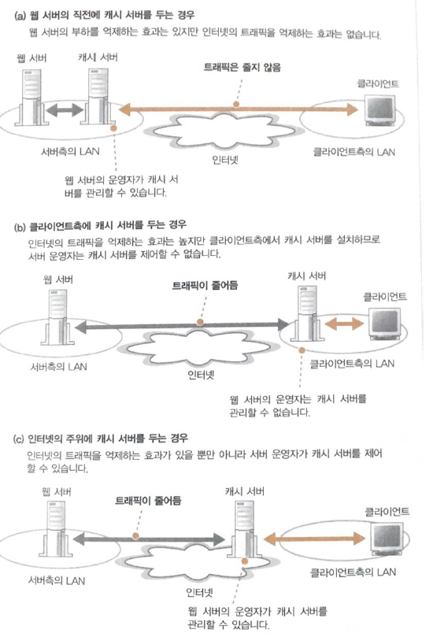

(a)와 (b)의 장점을 모두 결합 시킨 (c)의 방식이 있습니다. 이 방식은 프로바이더와 계약하여 웹 서버 운영자가 제어할 수 있는 캐시 서버를 클라이언트 측의 프로바이더에 두는 방법 입니다.

웹 서버 관리자가 캐시서버를 제어할 수 있는 점에서 장점이 있지만 한계가 존재합니다.

인터넷을 공개하는 서버는 어디서 웹 서버에 액세스하는지  알 수 없습니다. 그러면 각 프로바이더 마다 POP 전부에 캐시 서버를 설치해야 한다는 문제가 발생하게 됩니다.

이 문제를 해결할 수 있는것이 CDS(Content Delivery Service) 입니다. 컨텐츠 배포 서비스로 캐시 서버를 설치하고 이것을 웹 서버 운영자에게 대출하는 서비스를 제공하는 서비스 입니다. 이러한 사업을 한는 사업자를 CDSP(Content Delivery Service Provider)라 합니다.

- 클라이언트는 웹 서버에 액세스할 때 CDSP의 캐시 서버에 액세스 합니다.
- CDSP에서 제공하는 캐시 서버는 다수의 웹 서버의 데이터를 캐시에 저장할 수 있으므로 다수의 웹 서버 운영자가 공동으로 이용할 수 있도록해 웹 서버 운영자의 한 회사당 비용을 절감할 수 있습니다.

CDSP 캐시를 이용하는데 핵심이 되는 것은 다수의 캐시 서버 중에서 가장 가까운 캐시 서버를 찾아내고 클라이언트를 여기에 액세스하도록 중개하는 구조가 필요합니다. 포워드 프록시를 이용하면 간단히 해결되겠지만 사용자가 직접 따르게 하는것은 불가능하기 때문에 다음과 같은 방법이 있습니다.

방법(1)

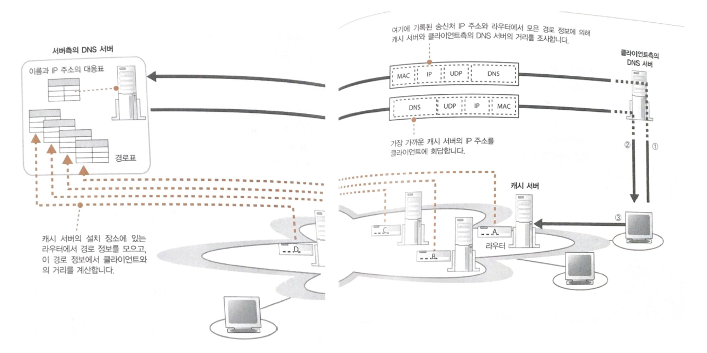

방법(2)

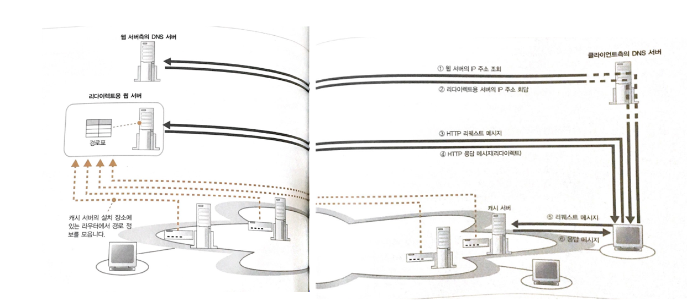

- http의 Location헤더를 이용한 방법 입니다. Location 헤더는 서버의 응답이 컨텐츠에 다른곳에 있다는 302이므로 Location 헤더를 통해 가야할 URL을 지정합니다.

  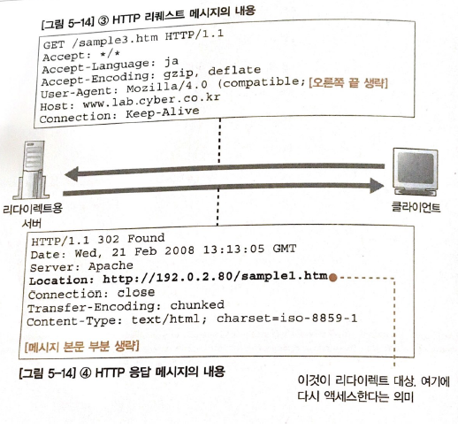

- 즉, DNS에 redirect 서버를 등록해놓고 클라이언트가 해당 서버로 요청시  리다이랙트 서버는 캐시 서버에서 설치된 장소에서 라우터 경로 정보를 얻고 클라이언트가 보낸 패킷의 ip 주소와 결합해 최적의 캐시 서버를 찾습니다. HTTP 메시지 증가로 오버헤드가 많지만 방법(1)의 방식보다 HTTP메시지의 송신처 IP 주소를 바탕으로 판단하기 때문에 정밀도가 높습니다.

  
> 캐시 내용의 갱신

캐시 서버의 효율을 캐시의 내용을 갱신하는데 있습니다. 위에서 살펴본 방식에서는 한 번 액세스한 데이터는 저장해 두고, 두 번째 이후의 액세스 동작이 이용하여 액세스 동작의 효율을 높이는데 있습니다. 

그러나, 이 방식은

- 최초의 액세스 하는 경우에 도움이 되지 않음
- 두 번째 이후의 액세스에서도 원래 데이터를 가진 웹서버에 갱신된 내용의 유무를 확인한다는 동작이 있음

이 점을 개선하기 위해서는 웹 서버에 데이터가 갱신되면 즉시 캐시 서버에 반영하여 캐시를 최신 상태로 유지한다면 원래 데이터의 갱신 확인 절차가 필요 없게 됩니다. 그렇게 된다면 최초의 액세스 동작에도 캐시의 데이터를 이용 할 수 있습니다. CDS가 제공하는 캐시 서버에는 이러한 대책이 내장되어 있습니다.

