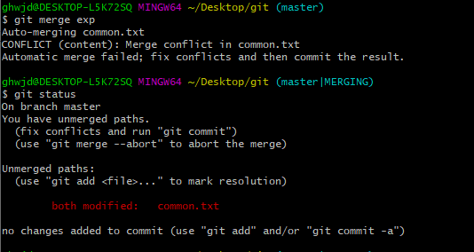
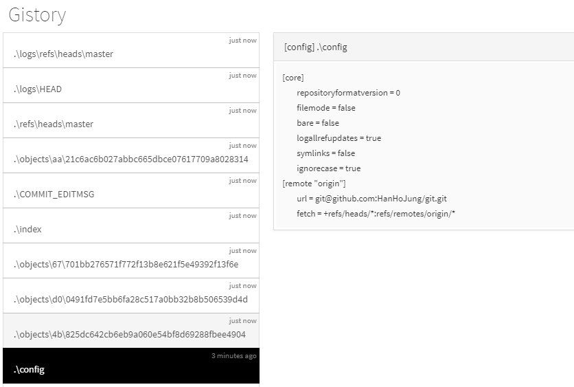
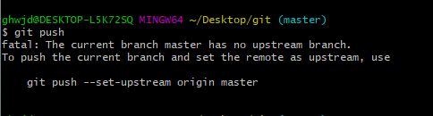
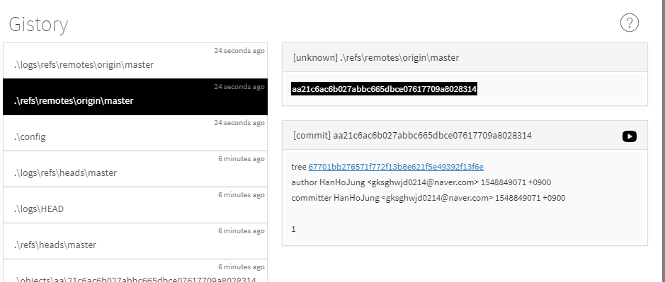
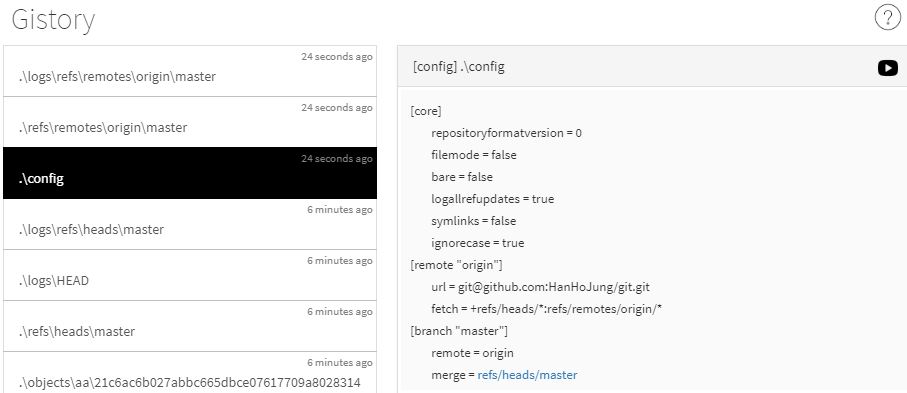
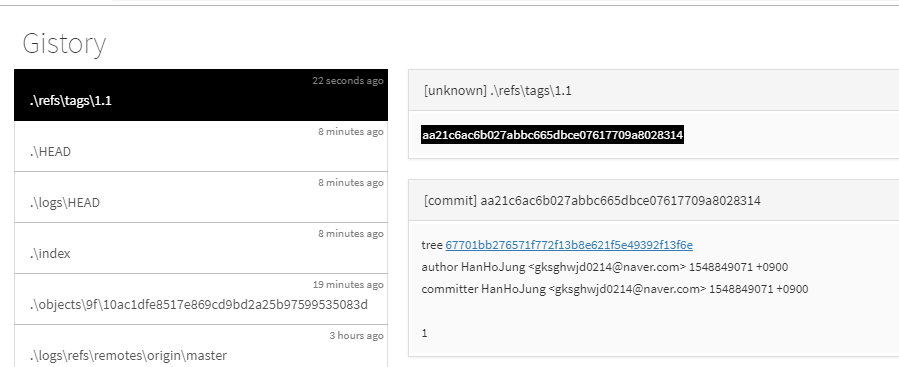
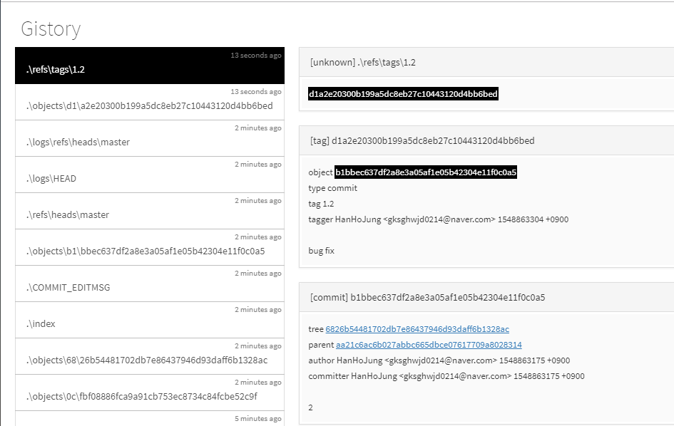

#  Git

[TOC]


## git의 원리(Add,Commit,Status)

해당 공부는 git이 내부적으로 어떻게 동작하는지 알아보기 위한 학습 입니다.

**gistory**라는 tool을 사용하여 git의 내부 동작을 살펴보는 형식으로 진행 하였습니다.


### Install&Excute

> Install

```bash
pip install gistory
mkdir 파일명
cd 파일명
git init
cd .git
gistory
http://localhost:8805/
```


### **ADD**

> git add의 원리

```bash
cd .git
gistory
```

.PNG)

- .git 디렉토리 안에 들어있는 파일 또는 디렉토리의 모습이다.


```bash
vim f1.txt
vim f2.txt
git add f1.txt f2.txt
cd .git
gistory
```


.PNG)

- git add f1.txt f2.txt를 하면 .git 디렉토리 내에 **index** 파일과   **./objects**   디렉터리가 생성됩니다.

- **./objects** 디렉터리 내에 생긴 각각 파일은 f1.txt f2.txt 파일을 의미합니다. 또한, 그 파일의 내용은

  f1.txt에 작성된 내용 f2.txt에 작성된 내용이 저장되어 있습니다.

- **index** 파일은 각 object 들의 경로와 파일명이 저장되어 있습니다.


```bash
cp f1.txt f3.txt
git add f1.txt f2.txt
cd .git
gistory

```

.PNG)

- f1.txt를 복사한 f3.txt는 objects 파일은 파일명을 달라도 내용이 같으면 같은 object 파일을 가르킨다.
- 만약, f1.txt를 10000번 복사한다고 했을때도 하나의 object 파일만 존재하지 어마어마한 중복을 제거할 수 있는 장점을 가진다.
- 정리하자면 git에서 어떠한 파일을 생성하고 만들어지는 과정을 대략 이렇다.
  - 파일이 생성하고 add 명령을 하면 **파일 안에 저장되어 있는 내용**과 **부가 정보**를 압축한다.
  - 그  후 sha1 알고리즘을 적용하여 일정한 길이의 텍스트를 얻어낸다.
  - 그 결과 나온 앞 두자리가 디렉토리가 되고 나머지 뒤가 파일명이 된다.
  - 또한, index 파일에 추가된 파일의 object 파일명 주소와 파일이름을 같이 저장한다.


### COMMIT

> git commit의 원리

```bash
vim f1.txt
vim f2.txt
git add *
```

.PNG)

```bash
git commit -m "1"
```

.PNG)

- commit을 하면, 두 개의 object 파일이 생성된다.

  1. commit 시점의 f1.txt와 f2.txt 파일명을 가리키는 object 파일이 생성된다.

  2. 1번 파일명을 가리키는 파일, commit 메시지 , 작성자를 저장하는 object 파일이 생성된다.


```bash
f1.txt 내용 수정
git add f1.txt
```


.PNG)

```bash
git commit -m 2
```

.PNG)

- objects 파일의 종류
  1. 파일의 내용을 담고 있는 파일(blob)
  2. blob 파일의 이름과 파일명을 가르키는 파일(tree)
  3. tree, parent(이전 commit), commit 작성자, commit 내용을 저장하는 파일(commit)

- commit을 하게 되면 즉, 버전이 생성되면 버전마다 각각의 tree 파일을 가지고 있다. 우리는 tree 파일을 통하여 그 시점의 프로젝트 내의 폴더의 현재 내용을 알 수 있다. 이러한 것을 스냅샷이라고 한다. 


### STATUS

> status의 원리

.PNG)

- 현재 상태는 working director 영역과 Index, repository 영역의 파일의 내용이 모두 같은 상태를 의미합니다.

  즉, 디렉토리 내의 변화가 이루어지지 않은 상태를 나타냅니다. 


.PNG)

- 파일이 수정 되었음을 감지하는 방법을 추정해보면 대략 이렇다. Index 파일은 항상 파일의 최신 상태를 나타내고 있습니다. 만약 file이 수정되면 파일의 내용을 sha1 알고리즘으로 해시 한 파일명과 Index 파일 내용과 다르면 파일이 수정됨을 알 수 있습니다.

.PNG)

- git은 Index라는 object 파일과 최신 commit을 나타내는 object 파일의 내용 비교를 통하여 그 내용이 일치하면 **commit할 내용이 없는 것**이고 일치하지 않는다면 **commit 대기 상태**를 나타냅니다.


## git의 원리(branch)

### branch 만들기

> branch

**브랜치의 목록을 볼 때**

`git branch`

**브랜치를 생성할 때** 

`git branch "새로운 브랜치 이름"`

**브랜치를 삭제할 때**

`git branch -d "브랜치 이름" `

**병합하지 않은 브랜치를 강제 삭제할 때** 

`git branch -D "브랜치 이름"` 

**브랜치를 전환(체크아웃)할 때**

`git checkout "전환하려는 브랜치 이름"`

**브랜치를 생성하고 전환까지 할 때** 

`git checkout -b "생성하고 전환할 브랜치 이름"`


### branch 정보확인

> branch 비교

**브랜치 간에 비교할 때**

`git log "비교할 브랜치 명 1".."비교할 브랜치 명 2"`

```bash
git log master..exp
//master에는 없고 exp에 있는것만 보여줌

git log exp..master
//exp 없고 master에 있는것만 보여줌
```

`git log -p "비교할 브랜치 명 1".."비교할 브랜치 명 2"  `(소스코드 까지 보여줌)


**브랜치 간의 코드를 비교 할 때** 

`git diff "비교할 브랜치 명 1".."비교할 브랜치 명 2"`

```bash
git diff mater..exp
//exp에 있는것은 +로 표시 없는것은 -로 표시

git diff exp..master
//master에 있는것은 +로 표시 없는것은 -로 표시
```


**로그에 모든 브랜치를 표시하고, 그래프로 표현하고, 브랜치 명을 표시하고, 한줄로 표시할 때** 

`git log --branches --graph --decorate --oneline`


**로그를 거꾸로 출력하기**

`git log --reverse`


### branch 병합

> branch 병합

 **A 브랜치로 B 브랜치를 병합할 때 (A ← B)**

`git checkout A`

`git merge B`


### branch 수련

> fast forward

 A 브랜치에서 다른 B 브랜치를 Merge 할 때 B 브랜치가 A 브랜치 이후(B브랜치가 앞 서 있는 상황)의 커밋을 가리키고 있으면 그저 A 브랜치가 B 브랜치와 동일한 커밋을 가리키도록 이동시킬 뿐이다.

별도의 commit을 생성하지 않음


> merge commit

공통인 부모가 다르면 fast commit을 할 수 없습니다. 이 때는 merge commit을 하게 됩니다.

Git은 각 브랜치(master,iss53)가 가리키는 공통 조상 commit을 찾고 이를 이용하여 3-way Merge를 수행 합니다.

3-way Merge의 결과로 별도의 커밋을 만들고나서 해당 브랜치(병합의 주체.여기서는 master)가 그 commit을 가리키도록 이동 합니다. 이렇게 병합된 commit은 부모가 여러개고 Merge commit이라고 부릅니다.

cf)

fast forward은 commit을 생성하지 않음 


.PNG)

.PNG)

.PNG)

.PNG)

.PNG)


https://git-scm.com/book/ko/v2/Git-%EB%B8%8C%EB%9E%9C%EC%B9%98-%EB%B8%8C%EB%9E%9C%EC%B9%98%EC%99%80-Merge-%EC%9D%98-%EA%B8%B0%EC%B4%88


### branch 병합 시 충돌해결

> conflict

자동으로 합칠 수 없는 경우에는 conflict 해결을 사용자가 직접 해주어야 한다.




cf)

'<<<<<<< HEAD' 부터 '======='  사이의 구간이 현재 checkout된 브랜치의 파일의 내용이고 '=======' 부터 '>>>>>>> exp'  구간이 병합하려는 대상인 exp 브랜치 파일의 코드 내용 입니다.


## stash

> stash

다른 branch로 checkout 해야 하는데 아직 현재 브랜치의 작업이 끝나지 않은 경우 commit 하기가 애매 합니다.

이러한 경우 stash를 이용하면 작업중이던 파일을 임시로 저장해둘 수 있습니다. 그 후 다른 branch로 이동하고 작업을 끝낸 후에 원래 branch로 복귀한 후에 이전에 작업한 내용을 stash를 통해 복구할 수 있습니다.

- stash는 stack처럼 최근에 stash한 내용을 저장한다.(stack자료구조)

- stash는 working copy(즉, 한 번이라도 add한 파일)에 한 번이라도 올라온 파일만 저장한다.

- git stash를 적용하면 우리가 작업한 내용을 숨길 수 있음

  

**stash 수행**

`git stash` 또는 `git stash --save`


**stash 목록**

`git stash list`


**stash 적용**

`git stash apply`


**stash 삭제**

`git stash drop`


**stash 적용하고 삭제**

`git stash pop`//git stash apply; git stash drop;


## git의 원리(branch2)

> branch

이번 chapter에서는 branch의 동작 원리에 대하여 알아보도록 하겠습니다.

```bash
git init
```

.PNG)

- git init을 하게 되면 HEAD라는 텍스트 파일이 생성 됩니다.
- HEAD라는 텍스트 파일의 내용은 **ref:refs/heads/master** 라는 내용이 적혀있습니다.


```bash
vim f1.txt
git add f1.txt
```

.PNG)

- 파일 하나를 만들고 add 명령을 통해 추적을 해도 HEAD 파일의 내용은 변하지 않습니다.

```bash
git commit f1.txt -m "1"
```

.PNG)

- commit을 한 시점부터 refs/heads/master 파일이 생성 됩니다.
- refs/heads/master 파일은 최신 commit의 object id를 가르키고 있습니다.
  - commit 파일과 commit 파일 안에 object(tree)파일 또 그 안을 들어가 object(blob )파일을 통해 우리는 현재 시점의 파일의 상태를 알아볼 수 있습니다.

```bash
vim f2.txt
git add f2.txt
git commit f2.txt -m '2'
```

.PNG)

- commit을 수행한 순간 refs/heads/master 파일의 내용은 최신 commit을 가르키고 있습니다. 이로서 우리는 ref:refs/heads/master라는 파일은 항상 최신 commit의 object id를 가르킴을 알 수 있습니다.

```bash
git branch exp
git checkout exp
```

.PNG)

- branch를 수행하면 refs/heads/exp라는 파일이 생성됩니다.

- git checkout을 수행하면 HEAD 파일이 refs/heads/exp를 가르킴니다.

- 이로서 우리가 checkout을 할 때에 파일이 내용이 바뀌는 원리에 대해 추측해 볼 수 있습니다.

  HEAD라는 파일을 통해 해당 branch가 변경되고 각각 branch들이 가지고 있는 refs/heads/브랜치명

  파일이 가리키는 commit 파일을 통하여 우리는 그 시점(snap shot)의 파일의 상태를 알 수 있습니다.

- 더불어, .git/refs/heads/exp를 지우면 exp라는 branch가 삭제 됩니다.

  반대로 .git/refs/heads/exp를 생성하고 commit object id를 저장하면 branch가 생성됩니다.


> reset과 checkout

이전 commit으로 돌아가고 싶을 때는 `reset` 이라는 명령어를 사용하면 과거로 돌아갈 수 있습니다.

<명령어>

`git reset --hard "commit object id" `

예를 들어서 상황을 설명해보도록 하겠습니다. 현재 4개의 commit을 수행한 상태입니다. 이 상태에서 2번 commit의 상태로 돌아가보도록 하겠습니다.

.PNG)

```bash
git reset --hard 43e8787ae3c9bafe91b7888e7b7492886b736d03
```

.PNG)

- refs/heads/master라는 파일은 4번 commit object id에서 2번 commit의 object id를 가르키고 있습니다.

- 이렇게 reset 명령어는 해당 branch의 refs/heads/master의 내용을 변경하여 이전의 상태로 돌아가게 됩니다.

- 또한, reset을 하더라도 4번 log는 삭제되지 않습니다.

- ORIG_HEAD 파일과  .\logs\refs\heads\브랜치명 파일에는 우리가 명령을 수행했던 log들이 남아 있습니다.

  - ORIG_HEAD

    ```bash
    위험한 명령(정보를 제거할만한 명령 )을 수행하기 전에 ORIG_HEAD 파일 내에 현재 checkout branch가 가리키는 최신 commit id를 기록한다음에 reset 명령을 수행합니다.
    
    git reset --hard ORIG_HEAD //reset 이전 상태로 돌아갈 수 있습니다.
    ```

  - .\logs\refs\heads\브랜치

    ```bash
    checkout branch에서 했었던 명령들에 대한 기록들이 저장되어 있습니다.
    
    git reflog //이 명령어를 통해 ./logs/refs/브랜치 log 파일의 정보를 볼 수 있습니다.
    git reset HEAD@{1} //해당 상태로 돌아갈 수 있다.
    ```

    

.PNG)


- checkout commit id를 통하여 특정 commit 을 가리키는 detached  상태로 돌아갈 수 있다.

  이렇게 전환 branch는 HEAD 파일이 특정 commit을 가르킴(branch의 경우 refs/heads/브랜치를 가르킴)

  (실제 브랜치는 아님)

  ```bash
  git checkout "commit id"
  ```

  .PNG)


> reset

- git reset에는 다양한 옵션이 존재합니다.(soft, mixed, hard)
- hard는(working directory, index, repository의 내용이 모두 삭제)
- mixed(index, repository의 내용이 모두 삭제)
- soft(repository 내용만 삭제)


> merge & conflict

```bash
1번 commit(master branch)
f1.txt
function(){
    return 'common'
}

2번 commit(exp branch)
f1.txt
function(){
    return 'exp'
}

3번 commit(master branch)
function(){
    return 'master'
}

git merge exp 
충돌이 발생
```

.PNG)

- conflict가 발생한 상황에서  index 파일에 번호가 붙게 된다.

  - 1번으로 적힌 파일은 master와 exp 공통인 조상의 파일의 내용이다.

    ```c
    function(){
        return 'common'
    }
    ```

  - 2번으로 적힌 파일은 exp 파일의 내용이다.

    ```c
    function(){
        return 'exp'
    }
    ```

  - 3번으로 적힌 파일 master 파일의 내용이다.

    ```c
    function(){
        return 'master'
    }
    ```

    

- ORIG_HEAD 파일도 병합은 위험한 작업이니 현재 commit object id를 저장하고 병합작업을 수행한다.

- MERGE_HEAD 파일은 merge가 될 브랜치의 최신 commit을 가리킨다.(여기서는 exp branch의 commit)

- 충돌 파일의 내용을 가리키는 object(blob) 파일도 생성된다.

- git mergetool 명령어를 통해 충돌부분을 해결할 수 있습니다.

  .PNG)


> 3way-merge

- BASE는 ME와 Other의 공통의 조상

- 2way merge 방식은 Base는 보지않고 Me와 Other를 비교해서 병합하는 방식 입니다.
- 3way merge는 Base 참고하여 Me, Other를 비교해서 병합하는 방식 입니다.
  - 3way는 Me, Base, Other이 모두 다를때만 conflict 발생


```
3way merge에서, ME에서 OTHER로 병합할 때
ME  BASE OTHER
A     A
결과는 빈칸이다. ME는 BASE로 부터 파일을 수정하지 않았고 Other는 수정했으므로 다른 사람이 채택된것이 채택된다.

ME  BASE OTHER
     D     D
결과는 빈칸이다. ME만 원래에서 바겼기 때문입니다.     
```


## git의 원리(원격 저장소)

**commit 메시지 수정**

`git commit --amend`

**원격 저장소 등록하기**

` git remote add "원격저장소이름" <원격저장주소> `

**원격 저장소 보기**

`git remote`

**원격 저장소 자세히 보기**

`git remote -v`

**원격 저장소 삭제**

`git remote remove "원격저장소이름"`

**원격 저장소 동기화**

`git push -u "원격저장소이름" master`//처음 push 할 때만 u옵션을 줍니다.


> 원격저장소의 원리

```bash
git init
vim f1.txt
git add f1.txt
git commit -m "1"
git remote add "원격저장소이름" "원격저장주소"

```



- remote add 명령어로 했을때 ./git/config 파일에 url, fetch 내용이 추가 됩니다.
- url: 원격 저장소의 주소를 의미 합니다.


```bash
git push
```



- 이 메시지는 우리의 지역 저장소의 branch와 원격저장소의 branch가 서로 연결되어 있지 않음을 나타냅니다.
- upstream은 원격저장소의 의미 입니다.
- 이를 해결하기 위해서는 `git push --set-upstream "원격저장소이름" "지역저장소이름"  ` 해당 명령어를 입력해야 합니다.


```bash
git push --set-upstream origin master
```

- 이 작업은 원격저장소의 master branch와 지역저장소의 master branch를 연결시키는 작업을 수행 합니다.
- 더불어, 업로드 하는 작업까지 수행 합니다.
- 이 명령을 수행한 결과 .\refs\remotes\origin\master라는 파일이 생기고 그 파일 내용은 최신 commit을 가리키고 있습니다.
- 더불어 confing 파일에 master의 remote branch는 origin이라는 정보와 merge대상이 refs/heads/master라는 정보가 추가 됩니다.







> pull과 fetch의 차이점

`git pull` 원격 저장소로 부터 필요한 파일을 다운 받고 병합을 수행한다.

`git fetch` 원격 저장소로부터 필요한 파일을 다운만 받음 병합 작업은 수행하지 않는다.

 git pull = git fetch && git merge origin/master


## git의 원리(Tag)

> Tag

git에서의 태그는 특정한 commit 버전을 가리키는 기능을 가집니다. 보통, release 할 때 그 시점의 commit을 가리키기 위해 Tag를 사용 합니다. branch와 비슷하지만 branch는 항상 최신 commit을 가리키는 상태로 변하고 tag는 고정되어 있습니다. 다만 내부적인 매카니즘은 동일 합니다.

Tag의 종류에는 두 가지가 있습니다.

- light weight tag
- annotated tag//자세한 정보를 담고있는 태그

**태그 목록 보기**

`git tag`

**태그 생성 (light weight tag)**

`git tag "태그 이름" [태그가 가르킬 버전의 커밋 아이디]`

**태그 생성 (annotated tag)**

`git tag -a "태그 이름" -m "태그에 대한 설명" [태그가 가르킬 버전의 커밋 아이디]`

**태그 삭제**

`git tag -d "삭제할 태그명"`

**태그 원격 저장소로 업로드**

`git push --tags` //원격 저장소로 tag를 올릴려면 반드시 이 명령이 필요하다.

**annotated tag 자세히 보기**

`git tag -v "annotated tag명"`

**해당 tag로 checkout**

`git checkout "tag명"`


`<light weight tag>`

```bash
git tag 1.1
```



- refs\tags\1.1 파일이 생성되고 그 시점의 commit을 가리키고 있습니다.


`<annotated tag>`

```
git tag -a 1.2 -m 'bug fix'
```



- light weight tag와 달리 annotated 태그는 태그 요약 정보에 대한 blob(tag) 파일이 생깁니다.


## git의 원리(Rebase)

merge와 rebase는 서로 다른 branch가 **하나의 branch**로 변화를 통합하기 위해서 사용됩니다.

그러나 서로 다른 방식을 가지고 있습니다.


<feature branch에서 master를 합치는 상황>

-  merge의 경우 **<u>master와 feature의 base</u>**와 **<u>feature의 최신 commit</u>** **<u>master 최신 commit</u>**을 

   3way-merge 방식을 이용한 결합된 결과를 가르키게 됩니다.

- rebase의 경우 master branch의 최신 commit에서 feature 내용을 하나씩 가져와서 병합하는 방식 입니다.

  - feature branch는 master branch의 최신 commit으로 checkout 되고  feature의 base의 이후의 

    작업들은 임시 저장 공간에 저장됩니다(안에 저장된 요소 하나하나를 fetch라 부릅니다.)

    또한, feature base가 master branch의 최신 commit으로 변경 됩니다.

  - 그 후 master branch의 최신 commit에서(feature의 현재 base) fetch 요소를 하나씩 가지고 오면서 병합을 하고 그때마다 feature branch는 이동하게 됩니다.

=>rebase의 장점은 history를 보기에 편한 방식 입니다.(merge는 history가 병렬로 진행되어서 파악하기 어렵습니다.)


## git의 원리(git flow)

- git flow란 버전관리를 효율적으로 하기 위한 방식을 의미한다. git flow 외에 github flow, gitlab flow 등의 방식이 존재합니다.


우선, git flow의 branch는 5가지로 구성됩니다.

- feature
  - 새로운 기능을 추가할 때 사용되는 브랜치 입니다
  - develop branch에서 파생됩니다.
  - feature branch는 각각 개발자의 repository에만 존재하고 원격 저장소인 origin에 반영되서는 안됩니다.
  - 기능을 완성할 때마다 develop에 merge 또는 rebase 작업을 수행합니다.


- develop
  - 개발에 적용되는 branch
- release
  - 사용자에게 결과를 배포하는 시점(다운로드를 받게하는 순간, 웹 서버에 반영되는 순간 등)에 develop에서 새로운 branch를 만듭니다.
  - release 이후에 발생하는 bug 수정이나 문서를 업데이트 할때에는 release branch 안에서 작업을 수행 합니다.
  - 테스트까지 마치면 master branch와 develop에 병합을 수행합니다. 이때, master branch에서는 release 시점에서 tag를 통하여 기록을 남깁니다.
- hotfix
  - 사용자에게 버전을 제공하는데 긴급하게 버그가 발생한 경우에 master에서 파생되는 branch입니다. 긴급하게 문제를 해결한다음에 master와develop에 병합을 한다음에 master의 version을 tag로 남깁니다.
- master


(참조)

https://ujuc.github.io/2015/12/16/git-flow-github-flow-gitlab-flow/

