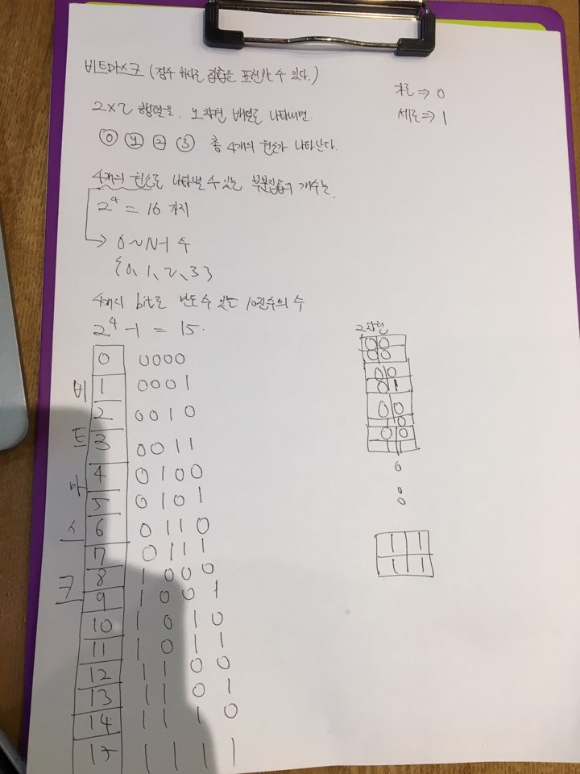

#  종이 조각

> **문제분류:Brute force**
>
> **문제번호:14391**

> solution 1.
>
> 문제의 크기: N,M(1 ≤ N, M ≤ 4)
>
> 시간제한: 2초
>
> 
>
> 각 칸은 가로 조각 또는 세로 조각으로 이루어져 있습니다. 즉 두 가지 상태이기 때문에 이 모든 경우를 세보면
>
> 가로 또는 세로 총 2가지 경우 최대 칸 수는 16칸이기 때문에 216 가지의 경우의 수 가 나옵니다.
>
> 2가지 상태로 구분 지을 수 있기 때문에 비트마스크로 문제를 해결할 수 있습니다.
>
> 2차원의 배열의 수를 1차원의 배열로 만들고 각 수가 가로 또는 세로인 경우를 비트마스크로 구할 수 있습니다.
>
> 
>
> 
>

https://github.com/HanHoJung/Algorithm/tree/master/Algorithm/Brute-Force/14391.cpp  

