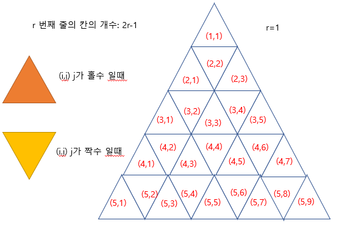

# 삼각형의 값

> **문제분류:Brute force**
>
> **문제번호:4902**
>
> **제한시간:2초**

> solution 1.
>
> 
>
> 삼각형의 모양은 두 개가 있고 각각의 경우에 대해서 나누어 보면
>
> **j가 홀수인 경우**
>
> - 다음 칸은 row가 늘고 left고정, right+2
>
> ```c++
> go(row + 1, left, right + 2, sum);
> ```
>
> 
>
> **j가 짝수인 경우**
>
> - 다음 칸은 row가 줄거 left-2, right 고정
>
> ```c++
> go(row - 1, left - 2, right, sum);
> ```
>
> 
>
> ```c++
> void go(int row, int left, int right, int total) {
> 
> 	if (row<1 || row>n)
> 		return;
> 
> 	if ((left < 1) || (right > (2 * row - 1)))
> 		return;
> 
> 	int sum = total + s[row][right] - s[row][left - 1];
> 	m = max(sum, m);
> 
> 	if (left % 2 == 0) {//짝수인 경우
> 		go(row - 1, left - 2, right, sum);
> 	}
> 	else {//홀수인경우
> 		go(row + 1, left, right + 2, sum);
> 	}
> 
> }
> ```
>
> 
>
>  https://github.com/HanHoJung/Algorithm/blob/master/Algorithm/Brute-Force/4902.cpp


