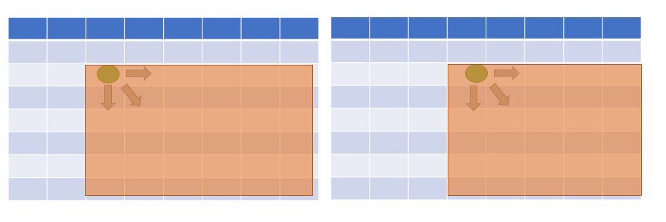
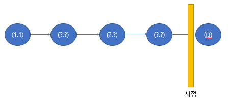
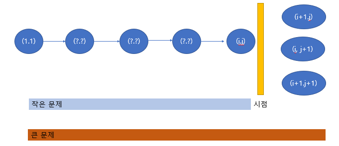

# 이동하기

> **문제분류:다이나믹 프로그래밍**
>
> **문제번호:11048**

> solution 1.
>
> 문제의 크기: 미로의 크기 N,M (1 ≤ N, M ≤ 1,000)
>
> 제한시간:1초
>
> 
>
> 문제의 조건
>
> - 준규가 (r, c)에 있으면, (r+1, c), (r, c+1), (r+1, c+1)로 이동할 수 있음
>
> =>항상, 아래와 오른쪽으로만 갈 수 있다. 그 이유는 r+1,c+1도 아래와 오른쪽을 합 한것
>
> - 준규가 (N, M)으로 이동할 때, 가져올 수 있는 사탕 개수의 최댓값 구하기
>
> - 방에 놓여져있는 사탕을 모두 가져갈 수 있다. 또, 미로 밖으로 나갈 수는 없다.
>
> - 사탕의 개수는 0보다 크거나 같고, 100보다 작거나 같다.
>
> - 좌표가 움직일 때마다 범위가 줄어들기 때문에 큰 문제와 작은 문제로 나눌 수 있습니다. 때문에 다이나믹으로 문제를 해결할 수 있습니다.
>
> 
>
> **<방법1>**
>
> 
>
> `d[i][j]` =>(1,1)에서 시작해서 (i,j) 도착하는 사탕의 합의 최대값
>
> `Miro[i][j]`=>miro배열은 각 미로의 사탕 값을 저장하고 있습니다.
>
> `Miro[i][j]>=0`
>
> 
>
> (1,1)=>(?,?)=>(?,?)=>...=>(i,j)
>
> 특정 좌표에서 이동할 수 있는 경우를 따져보면 다음과 같습니다.
>
> **case1 오른쪽으로 이동(r, c+1)**
>
> `d[i][j]=d[i][j-1]+Miro[i][j] ` 
>
> **case2 아래쪽으로 이동(r+1, c)**
>
> `d[i][j]=d[i-1][j]+Miro[i][j] ` 
>
> **case3 대각선으로 이동(r+1, c+1)**
>
> `d[i][j]=d[i-1][j-1]+Miro[i][j] ` 
>
> `d[i][j]=max(d[i][j-1],d[i-1][j],d[i-1][j-1])+Miro[i][j] ` 
>
> 
>
> **<방법2>**
>
> 
>
> i,j에서 갈 수 있는 방법
>
> **case1 오른쪽으로 이동 (i,j+1)**
>
> `d[i][j + 1] = max(d[i][j + 1], d[i][j] + MAP[i][j + 1]);`
>
> **case2 아래쪽으로 이동 (i+1,j)**
>
> `d[i+1][j] = max(d[i + 1][j], d[i][j] + MAP[i+1][j]);`
>
> **case3 대각선으로 이동 (i+1,j+1)**
>
> `d[i+1][j + 1] = max(d[i + 1][j + 1], d[i][j] + MAP[i+1][j + 1]);`
>
> 
>
> **<방법3>**
>
> 이 방법은 대각선으로 이동하는 경우의 수를 제외하는 방법 입니다.
>
> `Miro[i][j]`>=0 이기 때문에, 대각선으로 한 번에 이동하는 것보다 
>
> 아래,오른쪽 또는 오른쪽 아래로이동하는 것이 많은 영역을 방문하기 때문에 항상 큰 값이 나오게 됩니다.
>
> 따라서, 대각선의 경우를 제외해도 식이 성립합니다.
>
> 
>
> i,j에서 갈 수 있는 방법
>
> **case1 오른쪽으로 이동 (i,j+1)**
>
> `d[i][j + 1] = max(d[i][j + 1], d[i][j] + MAP[i][j + 1]);`
>
> **case2 아래쪽으로 이동 (i+1,j)**
>
> `d[i+1][j] = max(d[i + 1][j], d[i][j] + MAP[i+1][j]);`

https://github.com/HanHoJung/Algorithm/blob/master/Algorithm/DP/11048.cpp

[https://github.com/HanHoJung/Algorithm/blob/master/Algorithm/DP/11048(1).cpp](https://github.com/HanHoJung/Algorithm/blob/master/Algorithm/DP/11048(1).cpp)

[https://github.com/HanHoJung/Algorithm/blob/master/Algorithm/DP/11048(2).cpp](https://github.com/HanHoJung/Algorithm/blob/master/Algorithm/DP/11048(2).cpp)

[https://github.com/HanHoJung/Algorithm/blob/master/Algorithm/DP/11048(3).cpp](https://github.com/HanHoJung/Algorithm/blob/master/Algorithm/DP/11048(2).cpp)

