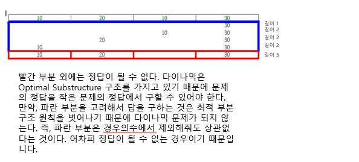

# 가장 긴 증가하는 부분 수열

> **문제분류:다이나믹 프로그래밍**
>
> **문제번호:11053**

> solution 1.
>
> 문제의 크기:수열의 크기 N (1 ≤ N ≤ 1,000),  수열 A를 이루고 있는 Ai (1 ≤ Ai ≤ 1,000)
>
> 제한시간:1초
>
> 이 문제는 수열이 주어졌을때 부분 수열의 최대길이를 구하는 문제 입니다.
>
> 
>
> 문제의 조건
>
> - 수열에는 부분수열이 존재 합니다. 
> - 수열의 일부를 선택해서 만든 수열이 순서를 유지하고 증가하는 것 중에 가장 큰 길이를 구하는 문제입니다.
>
> 부분수열이라는 것은 어떤 수가 포함되거나 포함되지 않는 경우를 의미하므로 부분수열이 경우의 수는 2<sup>n</sup> 경우의 수가 발생합니다. 그러나 n=1000이므로 많은 시간이 소요됩니다. 따라서 이 문제를 다른 방식으로 생각해보아야 합니다.
>
> 다이나믹으로 이 문제를 해결할 수 있습니다. 이유는 다음과 같습니다.
>
> 
>
> 
>
> 다이나믹 식을 정의해보면 DP[i]는 A[i]가 마지막으로 선택되었을 때 부분수열의 길이 최대값을 나타냅니다.
>
> 점화식을 세워보면 다음과 같습니다.
>
> ```
> (0<=j<i<n)
> dp[i]
> 
> if(arr[j]<arr[i] && dp[i]<dp[j]+1)
> 	dp[i] = dp[j]+1
> 
> (0<=j<i<n)
> dp[i] = max(dp[j]+1)
> ```
>
> 

https://github.com/HanHoJung/Algorithm/tree/master/Algorithm/DP/11053.cpp


