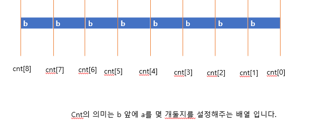

#  AB

> **문제분류:기타**
>
> **문제번호:12970**
>
> **시간제한:2초**

> solution 1.
>
> 
>
> <문제의 조건>
>
> - 문자열 S의 길이는 N이고, 'A', 'B'로 이루어져 있다.
> - 문자열 S에는 0 ≤ i < j < N 이면서 s[i] == 'A' && s[j] == 'B'를 만족하는 (i, j) 쌍이 K개가 있다.
>   - 정수 N, K((2 ≤ N ≤ 50, 0 ≤ K ≤ N(N-1)/2)
>
> A가 a개, B가 b개 있으면
>
> (i,j )쌍이 (0~ a*b)가 되는 문자열을 만들 수 있습니다.
>
> - 0개 되는 경우는 앞에 모두 B 뒤에 모두 A
>
>   ex)A+B=6개 일때  BBBAAA =>0개
>
> - n개 되는 경우 앞에 모두 A 뒤에 모두 B
>
>   ex)A+B=6개 일때  AAABBB=>9개
>
> 우선, B를 b개 놓고(고정해 둡니다.) A를 어디에 둘지 판별합니다.
>
> 그 후, A의 개수 a를 b 위치 어디에 둘지 (a+b=n)이  되는 한도 내에서 탐색을 하여 a를 b앞에 둔 후에
>
> 출력을 해주면 문제를 해결할 수 있습니다.
>
> 

https://github.com/HanHoJung/Algorithm/blob/master/Algorithm/etc/12970.cpp

