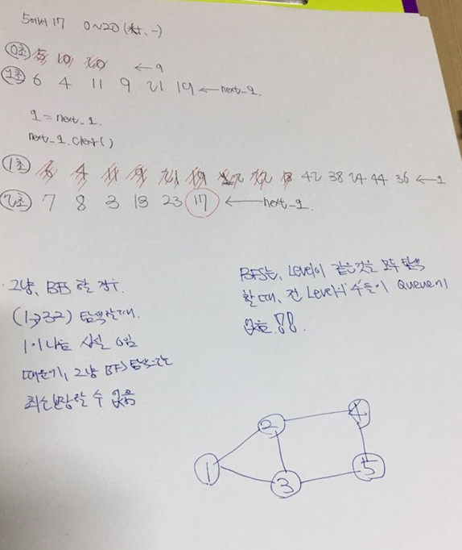

# 숨박꼭질3

> **문제분류:그래프와 bfs**
>
> **문제번호:13549**

> solution 1.
>
> 문제의 크기:  N(0 ≤ N ≤ 100,000), K(0 ≤ K ≤ 100,000)
> 문제 조건: 
> 제한시간:2초
>
> 이 문제는 수빈의 위치 N에서 3가지 연산(+1, -1, *2)을 통하여 최단 시간안에 동생의  위치에 도달하는 
>
> 시간을 찾는 문제입니다. BFS를 통하여 문제를 해결할 수 있습니다. 그런데 이 문제는 숨바꼭질 1과 다르게 *2 연산을 하는 시간이 0초 입니다. 때문에 단순 BFS 탐색으로는 탐색을 할 수 없습니다.
>
> 그 이유는 가중치가 다르면 BFS 탐색시 레벨 당 가중치 값이 모호해지기 때문에 탐색을 했다고 그 값이 최소라고 보장할 수 없습니다. 때문에 우리는 다른 방법을 생각해야 됩니다.
>
> (첫번째 방법) Queue를 두 개 이용한다.
>
> - bfs는 Level이 같은 것을 모두 탐색할 때 전 Level의 수들이 모두 Queue에 없습니다.
> - 또한, 큐 안에 노드의 레벨 차는 최대 1입니다.
>
> 이러한 성실을 이용하여, 두 개의 Queue사용하면 가중치가 0인 것도 bfs 탐색을 할 수 있습니다.
>
> 
>
> (두번째 방법Deque
>
> 덱을 사용하면 동일한 효과를 낼 수 있다. 한쪽에는 가중치가 0인거 다른 쪽에는 가중치가 1인것을 넣어주면 된다.
>
>

https://github.com/HanHoJung/Algorithm/blob/master/Algorithm/13549.cpp

