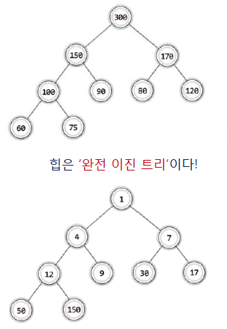

# 우선순위 큐(Priority Queue)

[TOC]

> 정의

- Queue(큐) 자체는 FIFO(먼저 들어간 데이터가 먼저 나옴) 구조를 가지고 있습니다.  그러나, 우선순위 큐는 들어간 순서에 상관없이 **우선 순위가 높은 데이터**가 먼저 나오게 됩니다.

- 여기서 말하는 우선 순위는 프로그래머가 정하기 나름이다. 일정의 규칙에 따라 데이터의 우선순위를 정할 수 있따.

  

> 큐에 구현

- 큐를 구현하는 방법은 크게 3가지로 나타낼 수 있습니다.

  1. 배열

     - 배열의 경우 우선순위가 높은 데이터를 배열의 앞쪽에 위치시킵니다.
     - 데이터를 삭제 할 때  마다 한 칸씩 밀어내기 때문에  성능이 떨어지는 문제가 있습니다.
     - 데이터 삽입(가장 작은 값)시 해당 값의 위치를 찾기위해 배열에 저장된 모든 원소에 대하여 비교연산을 진행해야 하는 문제가 있습니다.

  2. 연결 리스트

     - 연결 리스트로 구현할 경우 데이터를 삭제 할 때 마다 한 칸씩 밀어내지 않기 때문에 이러한 문제가 발생하지 않습니다.
     - 연결리스트도 마찬가지로 데이터 삽입(가장 작은 값)시 해당 값의 위치를 찾기위해 배열에 저장된 모든 원소에 대하여 비교연산을 진행해야 하는 문제가 있습니다.

  3. 힙(heap)

     - 1과2의 경우 데이터가 많을때 성능을 저하시키는 주요 원인이 됩니다. 따라서 힙(Heap)이라는 자료구조를 이용하여 우선순위 큐를 구현합니다.
     - 힙은 이진 트리이되 <u>완전 이진 트리</u> 입니다. 
     - 모든 node에 저장된 값은 자식 노드에 저장된 값보다 크거나 같아야 합니다.(우선 순위 알고리즘에 맞춰서)
     - 힙은 최대 힙(Max Heap), 최소 힙(Min Heap) 종류가 있습니다.
       - 최대 힙(Max Heap)은 루트 노드로 올라갈수록 저장된 값이 커지는 완전 이진 트리를 가리켜 최대 힙이라고 정의합니다.
       - 최소 힙(Min Heap)은 루트 노드로 올라갈수록 저장된 값이 작아지는 완전 이진 트리를 가리켜 최대 힙이라고 정의합니다.
     - 힙과 우선순위큐는 동일한 것이 아닙니다. 힙은 우선순위 큐를 구현하기 위해 쓰이는 자료구조 입니다. (힙은 완전 이진 트리의 일종 입니다.)

     



> 구현

힙(Heap)자료구조를 이용하여 구현

< 데이터 삽입>

- 완전이진트리 유지를 위해 트리의 끝에 데이터를 삽입해준다.
- 삽입된 데이터에 대해서 부모 node와 우선순위를 비교합니다. 삽입된 데이터의 우선 순위가 더 높으면 부모 노드와 자리를 바꿔줍니다. 만약 그렇지 않다면 비교를 중단합니다.
- root노드까지 검사를 진행 합니다.


<데이터 삭제>

- root node를 삭제합니다.  root node 삭제후 heap의 규칙이 유지되야 되기 때문에 정렬과정이 필요합니다.

- 마지막 노드(완전 이진트리의 마지막 레벨의 가장 오른쪽에 위치한 노드)를  root node로 올리고 우선순위에 따라서 정렬해줍니다. 교환 시에, 우선순위가 낮은 node를 선택해서 정렬하면 heap 기본조건이 무너지기 때문에 주의해야 합니다.


> 성능 평가

<배열 기반 우선순위 큐>

- 배열 기반 데이터 저장의 시간 복잡도 O(n)

- 배열 기반 데이터 삭제의 시간 복잡도 O(1)

  

<연결리스트 기반 우선순위 큐>

- 연결리스트 기반 데이터 저장의 시간 복잡도 O(n)

- 연결리스트 기반 데이터 삭제의 시간 복잡도 O(1)

  

<힙 기반 우선순위 큐>

- 힙 기반 데이터 저장의 시간 복잡도 O(logn)

- 힙 기반 데이터 삭제의 시간 복잡도 O(logn)

  

힙(heap을 통하여 우선순위큐를 구현하는 것이 성능상 우수하다. 그렇다면 힙은 트리이기 때문에 배열이나 연결 리스트중 하나를 선택해서 구현해야 한다. 보통, 트리는 연결리스트 기반으로 주로 구현하기 때문에 연결리스트 기반으로 힙을 구현하는것이 맞다. 그러나 연결리스트 기반으로 힙을 구현하면 마지막 노드(마지막 레벨 우측 노드) 를 찾는 과정이 까다롭고 시간이 오래 걸리기 때문에  **배열을 통하여 힙(Heap)**을 구현하게 됩니다.


> c++ stl priority_queue

```c++
#include <queue>
#include <iostream>
using namespace std;

priority_queue<int> pq;//최대힙
priority_queue<int,vector<int>,greater<int>> pq1;//최소힙

int main() {
	pq.push(3);
	pq.push(1);
	pq.push(4);
	pq.push(1);
	pq.push(5);
	pq.push(9);

	while (!pq.empty()) {
		printf("%d ", pq.top());
		pq.pop();
	}

	cout << "\n";
	cout << "\n";

	pq1.push(3);
	pq1.push(1);
	pq1.push(4);
	pq1.push(1);
	pq1.push(5);
	pq1.push(9);

	while (!pq1.empty()) {
		printf("%d ", pq1.top());
		pq1.pop();
	}
}


```

> 배열 기반 힙정렬 구현

````c++
#include <iostream>
#include <vector>
#include <queue>
#include <algorithm>
using namespace std;

void enqueue(vector<int> &arr, int date) {
	int add = date;
	arr.push_back(add);
	int last = arr.size() - 1;//마지막 노드
	while (last != 1) {

		if (arr[last / 2] > arr[last]) {
			swap(arr[last / 2], arr[last]);
			last = last / 2;
		}
		else {
			break;
		}
	}

	//5 2 3 4 1
}

int dequeue(vector<int> &arr) {
	int out = arr[1];
	int last = arr.size() - 1;//마지막 노드
	swap(arr[1], arr[last]);
	arr.pop_back();
	last = arr.size()-1;
	
	int start = 1;
	int left;
	int right;
	
	while ((start*2+1)<=last) {
	
		left = start * 2;
		right = start * 2 + 1;

		
		int index;
		
		if (arr[left] > arr[right]) 
			index = right;
		else 
			index = left;
		
		
		if (arr[start] < arr[index]) {
			return out;
		}
		else {
			swap(arr[start], arr[index]);
			start = index;
			
		}
		
	}

	
	if (start * 2 <=last) {

		if (arr[start] > arr[start * 2]) {
			swap(arr[start], arr[start * 2]);
		}
	}

	return out;

}

int main(void) {
	int n;
	cin >> n;
	vector<int> arr = { 0 };
	for (int i = 0; i < n; i++) {
		int input;
		cin >> input;
		enqueue(arr, input);
	}
	


	for (int i = 0; i <n; i++) {
		cout<<dequeue(arr)<<"\n";

	}
	
}


````


https://visualgo.net/ko/heap