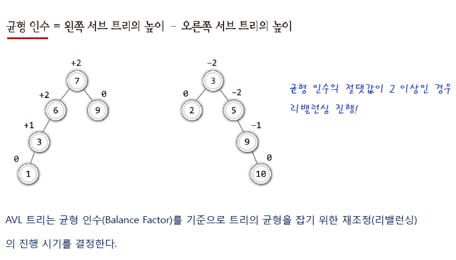

# 검색


[TOC]


## 1. 검색이란

**검색**이란, 데이터의 집합에서 특정 키를 설정하고 조건에 맞는 데이터를 찾는것이다.

**검색의 3요소**

- 키:데이터에서 주목하는 항목
- 조건:찾을려는 요소를 키를 이용하여 연산자(논리연산자, 동등연산자 등)를 통해 표현
- 데이터의 집합


**검색에 사용되는 대표 자료구조**

- 배열
- 선형 리스트
- 이진검색트리


**검색 알고리즘 선택 조건**

데이터의 집합에서, 단순히 검색만 한다면 속도가 빠른 검색 알고리즘을 선택하면 됩니다. 하지만,  삽입/삭제등이 빈번하게 이루어지는 경우에는 검색 속도만 빠른 알고리즘을 선택하기 보다는 삽입/삭제에 소요되는 비용이 적은 알고리즘을 선택해야 합니다. 예를들어, 데이터 집합에서 삽입/삭제가 빈번하게 발생하는 경우에는 배열을 이용한 알고리즘 보다는 선형 리스트를 이용한 검색 알고리즘을 적용하는 것이 좋습니다.


때문에, 종합적으로 판단하여 효율적인 알고리즘을 선택하는것이 중요합니다. 

**cf)본 챕터에서는 배열을 이용하여 검색하는 방법을 위주로 설명되어 있습니다.**


## 2. 검색 알고리즘

- 정렬되지 않은 대상을 기반으로 하는 탐색(선형 검색)
- 정렬된 대상을 기반으로 하는 탐색(이진 검색)

### - 선형 검색(Linear Search)

정의:임의로 늘여놓은 배열에서 순차적으로 원하는 키 값을 찾는 알고리즘 입니다.

선형 검색은, 원하는 키 값을 만날 때까지 배열의 인덱스를 이동시키면서 탐색하는 알고리즘 입니다.


출처: http://abouteverything.tistory.com/11  (해당 블로그 그림을  보면 탐색과정을 쉽게 볼 수 있습니다.)


종료 조건

- 검색할 키 값을 찾은 경우
- 검색할 키 값을 발견하지 못한 경우


시간복잡도

- Best case

  해당 키값이 배열에 가장 앞 부분에 있어서 한 번에 찾은 경우 O(1) 입니다.

- Worst case

  크기가 n인 배열이 있을때(인덱스는 0부터 시작) 원하는 요소가 배열의 끝에 있는 경우

  또는, 배열에 찾는 요소가 없을 때 시간복잡도는 O(N) 입니다.


### - 이진 검색(Binary Search)

정의:요소가 오름차순 또는 내림차순으로 정렬된 배열에서 적용할 수 있는 검색 알고리즘 입니다. 

이진 검색법을 사용하면, **검색할 요소의 범위**를 절반씩 줄일 수 있는 장점이 있습니다.


- Mid=(Left+Right)/2 index를 의미한다.
- Left, Right는 index를 의미한다.


종료조건

- 검색할 키 값을 찾은 경우
- 검색할 키 값을 발견하지 못한 경우


시간복잡도

- Best case

  해당 키값이 한 번에 찾은 경우 O(1) 입니다.

- Worst case

  ```
  입력의 개수 : N
  시행 횟수: K
  
  
  1회: N/2
  2회: N/2 * 1/2
  3회: N/2 * 1/2 * 1/2
  ...
  k회:(1/2)^k * N
  
  (1/2)^k * N  ≈ 1
  
  때문에,
  (1/2)^k * N  = 1이라고 가정을 하고
  양변에 2^K를 곱해주면
  N = 2^k
  logN = K (밑은 2임)=>입력의 개수 N에 따른 시행횟수
  시간복잡도 O(logN)
  
  ```


> Lower Bound

- 탐색값 k에 대하여, k 이상이 처음 나오는 위치를 찾는 과정


> Upper Bound

- 탐색값 k에 대하여, k 를 초과한 값이 처음 나오는 위치를 찾는 과정

  

> 차이

- 상한과 하한의 차를 이용하여 해당 수가 배열에 몇 개 있는지를 구할 수 있다.
- 상한-하한

```c++
int upper_bound(vector<long long> arr,int key) {
	
	int left = 0;
	int right = arr.size() - 1;

	while (left < right) {
		int mid = (left + right) / 2;
		if (arr[mid] <= key) {
			left = mid + 1;
		}
		else if (arr[mid] > key) {
			right = mid;
		}

	}
	return left;
}

int lower_bound(vector<long long> arr, int key) {

	int left = 0;
	int right = arr.size() - 1;

	while (left < right) {
		int mid = (left + right) / 2;
		if (arr[mid] >= key) {
			right= mid;
		}
		else if (arr[mid] > key) {
			left = mid + 1;
		}

	}

	return left;
}
```

https://chogahui05.blog.me/221235974287


> 보간 탐색

이진 검색은 찾는 대상이 중앙에 취하건 맨 앞에 위치하건 그 위치에 상관하지 않고 일관되게 반씩 줄여가며 탐색을 진행합니다. 때문에 찾는 대상의 위치에 따라서 탐색의 효율에 차이가 발생 합니다.  이를 보완한 알고리즘이 보간 탐색 입니다.

원리는, 중앙에서 탐색을 시작하는게 아니라 탐색 대상이 앞쪽에 있으면 앞쪽에서 데이터를 찾고 뒤쪽에 있으면 뒤쪽 부터 찾는 알고리즘 입니다.(대상에 비례하여 탐색의 위치를 결정)


<비례식 구성>

- low:탐색 대상의 시작 index
- high:탐색 대생의 마지막 index
- s:찾는 대상에 저장된 index
- x:arr[s]
- 오차율을 최소하하기 위해 s의 자료형은 실수형
- 보간탐색은 **데이터의 값**과 그 **데이터가 저장된 위치의 인덱스 값**이 비례한다고 가정


```c++
#include <iostream>
#include <vector>
using namespace std;

int Isearch(vector<int> &arr, int left, int right, int target) {
	int mid;

	if (left > right)
		return -1; //-1은 탐색 실패

	mid = ((double)(target - arr[left]) / (arr[right] - arr[left])*(right - left)) + left;
	
	if (arr[mid] == target)
		return mid;

	else if (target < arr[mid])
		return Isearch(arr, left, mid - 1, target);
	else
		return Isearch(arr, mid + 1, right, target);

}
int main(void) {

	vector<int> arr = { 1,3,5,7,9 };
	int idx = Isearch(arr, 0, arr.size() - 1, 1);

	if (idx == -1)
		cout << "탐색 실패\n";
	else
		cout << idx << "\n";


	idx = Isearch(arr, 0, arr.size() - 1, 11);

	if (idx == -1)
		cout << "탐색 실패\n";
	else
		cout << idx << "\n";


	idx = Isearch(arr, 0, arr.size() - 1, 2);

	if (idx == -1)
		cout << "탐색 실패";
	else
		cout << idx << "\n";
}

```

단순히  mid 값을 찾는 경우를 보간법으로 바꾼다고 해서 보간탐색이 성되는것이 아닙니다.

예를 들어, Isearch(arr, 0, arr.size() - 1, 2); 호출한 경우 mid값이 계속 0이되어 Isarch(arr,1,4,2)가 계속 호출되는 경우가 발생하게 됩니다. 때문에 종료조건을 단순히 left>right 크다는 조건으로 해결할 수 없습니다.

즉, **arr[target]<arr[left] 또는 arr[target]>arr[right]**인 경우

이러한 결과가 발생하는 이유는 정렬된 탐색 대상의 범위를 좁혀가면서 정렬을 진행하기 때문 입니다.

( first와 last가 target을 향해서 점점 좁혀감)

```c++
#include <iostream>
#include <vector>
using namespace std;

int Isearch(vector<int> &arr, int left, int right, int target) {
	int mid;

	if (arr[left] > target || target>arr[right])
		return -1; //-1은 탐색 실패

	mid = ((double)(target - arr[left]) / (arr[right] - arr[left])*(right - left)) + left;
	
	if (arr[mid] == target)
		return mid;

	else if (target < arr[mid])
		return Isearch(arr, left, mid - 1, target);
	else
		return Isearch(arr, mid + 1, right, target);

}

int main(void) {

	vector<int> arr = { 1,3,5,7,9 };
	int idx = Isearch(arr, 0, arr.size() - 1, 1);

	if (idx == -1)
		cout << "탐색 실패\n";
	else
		cout << idx << "\n";


	idx = Isearch(arr, 0, arr.size() - 1, 11);

	if (idx == -1)
		cout << "탐색 실패\n";
	else
		cout << idx << "\n";


	idx = Isearch(arr, 0, arr.size() - 1, 2);

	if (idx == -1)
		cout << "탐색 실패";
	else
		cout << idx << "\n";
}
```


### - 해시법


### - 이진 탐색 트리


이진 탐색 트리의 삭제의 경우

1. 삭제할 노드가 단말 노드인 경우(no child)

   

2. 삭제할 노드가 하나의 자식 노드를 갖는 경우(one child)

   

3. 삭제할 노드가 두 개의 자식 노드를 갖는 경우(two child)

   

- 탐색 O(logn)
- 삽입 O(logn)
- 삭제 O(logn)


### - AVL 트리

이진 탐색 트리의 탐색 연산은 O(log n) 이지만 균형이 맞지 않을 수록 O(n)에 가까운 시간 복잡도를 가집니다.

**<불균형한 이진 탐색 트리>**

![ë¶ˆê· í˜•í•œ 이진탐색트리에 대한 이미지 검색결과](data:image/png;base64,iVBORw0KGgoAAAANSUhEUgAAAPwAAADICAMAAAD7nnzuAAABZVBMVEX////6+vr39/ff39/w8PD19fXBwcGXl5f8/PzX19fk5OTu7u6JiYny8vJ8fHyrq6vJycnPz8+jo6O0tLSHh4fo6OiRkZGbm5u3t7d3d3eYmJi9vb1wcHDHx8eurq7T6frBlFxjY2Nra2vp9P0jYpP/+e3f7/sAAAD458uJYlVqnMXx+v/V2eCfhHWCmLNobHnK1+n/+uVDT3/A3vH21aBKIhsDHzt7qc7o0bBtPUuAs9TW+f+yhVYUY5////Xl2NGjbTK8gk8AInn/9N+pfU4yfbP/6r5fJwAANFqykG6OaUHg0r91bWNeg7QQMkZJNR7Ru6iguNLQo29OQ11iW0ZZOVunwMuXVjdhm885YJ8AN25baX+eq7Kyn4JYT1lDIUjUnVz7y4cAG0ufz/PNjUNmHiWdorZ/RhfcvpZzUmh4dFFkOm+02efGqYRJJTZFSEpPVHQAAEovMGlhGUilbUeleFxCbJWdDz+QAAAIcUlEQVR4nO2d6ZfkNhHAbcuXfKkl21K7bXfoJpNMQgI7ZIFlFyaBJRuWQAjDFXJwhRvCTf5+3DuzMy350PIez/26NL9vo/YH1eiqKlWVLOuWW2753wlLutiB3EP3ZHbQOuGCdDBRCOodujtzEiUVwXHqdHhpVPMmDw/dpbnw2CZ3pBbEG3ygzswMLnjca1w0a2fgW2jQYjk0x0se9P8l0KB8Mby+0xV46aOqHfspFgT2zA+zfPzHKFnM15MDsE6mfl1UkCc+atLJ3xmbqSOHgJHp38sGrq6Lkkjzhe6/c8TUTLedl80sHTkADusdc/d+94LckEFVc0uBlJbT3z//nNxCJo7CowYL5ST7wx//pApPi/n6MyuU2dLfj/78l8+owqNM/gYMC0X4kxdOesI71bQmcKyEy956Nkd4q+4d4gYJr675IeFtsMILVcfpC4+y2bozL4iVSktfeH/S7DtiykBV304++byi4bHlbN2ZF5v52m8aVQkEQ8t0txOomqUjhyAqdOPKoar2HUTjqUFbwC7MUrOkA8AD351k2dSlnJ8A1XCuCNi49CiB6sm4Ii7yMZu1DGrod7VoTPqyqMCe8degomff7MAVYQSoI2OPkme9IXbyTdupAcDX/BP8RiDnZn3bsV8lO/eeX8De7S/xSBHUOHI7SkRJwumTZgeygrdH3JKVYIwRwVc5frrWUaO70oGCG+EOVO5rtMsE/p43SphBteefBVSZMvGHyDlgw05HmujdPXCh3OCJb5NB9dcQooIeugsHpJ30eECHQw7K0hFvZfMuDB3bnMlQFzcOfhfROl+T2seRCTafdeO/D/EyCFYk9/01CbjwjTgF0eX1BmIJoU8tnxS1rMjhRileEy5FN/HzjETSme8gkRlwDsa8tXkT9bY5x2/qQ/RnXnCx5YM/oAy+n7NMyMjpFmVwA3Qv8dh4nG5UwTb8Qn8gA+saBDeEYUc5vakvQXs8NBf5XgF44sdbjSpHE7jKji6Cw3IDuLqO1oUb5mMH4dETKckmJ+8ydudzUlMvdh8MSyH9efL4gw8/+vlXJOnLAOppt5L38ru/uG+d//L91/bbvF40JxSU+/sw7db3r379sdRIoNo3/eAFy/qNPPLWGmoAz4Dwj377nrzjGST8w3+/+UBuMUf40/98qsTld2seqPBqHv3pS5++pnwSMqgqHllLf/bzLjv9dgX1nMdSos35xYs73rm/34gCNWUFCs5Wq7v62oTso0Ubep6K0bojRw+uNOOKOdRZb1m2xlMTMsjRiriYXPU4gzvw3ZYnJpISLKuBu+J3xFMTPwnm68hBwNlYuSSbwA9bWVTD0qckgz7w1m7shy7jo0CgCqpev0fJe+lWYZ6tXYsCLqR0jedXkvhOW2V4t95XRoRrOX61ZYvIsW0b+3z79AbPHd0NgYHWRdY0TZUF/o3is0ggazkybprKYWieMKdYbB/wqaeT3CYlGAveGnDYj0KgltR5FkLgQVnT4MyIOOQRWK/elEGUwEskT2OSltvD2Su2YEe+CDabhjO/NEP1RVelYsN4zSvh09KNaB1U3I9NkL9Odtk4ZV4IerP5pW3Aa6jRWns4ydoKKWeKmWNTATZiaY+oQcui7acfeH5mgA5Ub0eKrOAGvvTr0ZKhJfixX2zHj3oMtmz4JWUz5cOfzNc4ekIx6cROV4Nv5gABa/RbnMEdeofpRhZwbcVIG3iOwb4TYbVqTJaXqhY+2Cw0R6kifPbJX//29x/IAcoEavqlK6v05xf/+Pj84p9ypCqG+k5EKQeknb/djfq9f8lJCelm1i7NR9QvFXv2+ItKjPIGqHs/4mrt7Ltf+rKciNQJD/Sk7wtvhfe+el+W3iDhrbOvff2zUgNY4eU1f/76nSfCy+8FQF3zym5/9o1vPrBOX3pZmvbxBqhpo5zz1umrXygq5aEICvWRDEfNLDzB9BVls4cbn92utJd1ukz840WfTkzhXuKHRBOUZUMOXtG9erkA/VYCmUxKcDnggd8Fok4kXYS5gDzwu6Cs8YmPh3LRQUFHpceTPn0Y5Jdh6CrhYjv80j0sFsWyb7zE6wxHJgTo4iCg8iW11wYissIa9HXVFXHNg/pm6Uc55+3O1PcCsLWE9olpkBWsppTWosgYvVoHkQklMztst5Obc86WeO+llLYxYejHYMOVNM0grKBWE3oW4Kt5U+Qr2Ar+JK4wQNEbxeyJX4N2aWiwAyNyb0cogQfkTbMwIel8FCb034AlBR+HO4XZeWjLwODzLuaqhWPb4J9IuAbvJyXEqK0JIfUCG+Do2rFMru50bcq4YMT3/TVbcUJNyMu0r97EwkWS4/KJuyd0YrRMEhN8XeUG78ptbFtv38wL00XFDVj9tPFQNhDC5QUGPAJusawYfvs1N0D7p9uxvGvKoUsfTyi5vibO4eiZusCxyQr0rudPVhGEXXzGq6aXNYWbj7MzbTQfJHBfAU+1+znaztKRQ0D1Ni3cwz7vBSyevKukYuVQvbyp6Jkv9956U05MgJuKJVT1/eEbLyrCexVQJy9iitvi/OKHP1KEt6HquD3h7/74J99ShYdaZUQV/uyn752ZKvz5xc8edMLLu70pwj9669vVd7//zvck6e0VUOEjIZmsJxFCb3/n+TvSNw7URwNc0RvVh+qaLzOgjtyw/8jbw8cvy8L7YOPWemUW+gRgn4uIuM5PlcKtJhsKXX7hGuys3z0NNG3TunATEDv4tMUKO0w33U7pMBSqSXcFnXjqOAJfR5aM5p3EqzVQBecaO+fDN5LRivTvL6Hh5IOX8TQDP+47wkXF1BMvJVtqSGC2yzZkf1/vRDcpUAutqqDGsZu6Ma5XTQBZtxkg9kVSBCIokqAFasJP4qQIRa4J29wtt/wf+C/tWIM9fl/IwAAAAABJRU5ErkJggg==)

이러한 이진 트리의 단점을 해결한 트리를 가리켜 **balanced binary search tree(균형 잡힌 이진트리)** 라고 부른다. 그 종류는 다음과 같다.

- AVL 트리
- 2-3 트리
- 2-3-4 트리
- Red-Black 트리
- B 트리


**AVL 트리**

정의

- 노드가 추가될 때, 그리고 삭제될 때 트리의 균형 상태를 파악해서 스스로 구조를 변경하여 균형을 잡는 트리 입니다.

- AVL 트리에서는 균형의 정도를 표현하기 위해서 Balance Factor(균형 인수)라는 것을 사용합니다.

  Balance Factor = 왼쪽 서브 트리의 높이 - 오른쪽 서브 트리의 높이

  

  균형 인수의 절대값이 클수록 트리의 균형이 무너진 상태를 의미합니다. 따라서  AVL 트리는 균형 인수의 절대   값이 2 이상인 경우에 균형을 잡는 작업을 수행합니다.

  

- AVL 트리의 균형이 무너지는 상태 

  **case 1:  LL 자식 노드 두 개가 왼쪽으로 연이어 연결된 경우**

  - 균형 인수가 +2인 노드를 균형 인수가 +1인 노드의 오른쪽 자식 노드가 되게 하는 방식 입니다.
  - 우회전을 한 번 수행해 줍니다.

  


**case 2:  RR 자식 노드 두 개가 오른쪽으로 연이어 연결된 경우**

- 균형 인수가 +2인 노드를 균형 인수가 +1인 노드의 왼쪽자식 노드가 되게 하는 방식 입니다.
- 좌회전을 한 번 수행해 줍니다.


**case 3:  LR 자식 노드 왼쪽으로 하나, 그리고 오른쪽으로 하나 연결된 경우**

- RR회전 후  LL회전을 통해 균형 있는 이진트리로 변하게 된다.


**case 4:  RL 자식 노드 오른쪽으로 하나, 그리고 왼쪽으로 하나 연결된 경우**

- LL회전 후 RR회전을 통해 균형 있는 이진트리로 변하게 된다.

