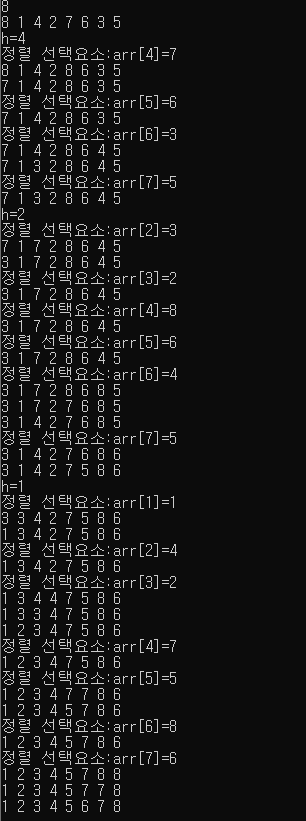

# 정렬(sorting)

[TOC]

> ## 정렬(Sorting)

정렬이란 **key(이름, 학번, 키 등)의 대소**를 이용하여 **데이터 집합**을 **일정한 순서로** **나열**하는 작업을 의미한다.


> ## 정렬 알고리즘 분류

- stable 알고리즘

​       stable 정렬 알고리즘이란, **같은 값의 키**를 가진 요소의 순서가 **정렬 전후에도 그 순서가 유지**되는 것을 의미합

​       니다.

- unstable 알고리즘

  un stable 정렬 알고리즘이란, **같은 값의 키**를 가진 요소의 순서가 **정렬 전후에도 그 순서가 유지** 되는 것을 보장 할 수 없습니다. 


### 버블정렬

> 정의: 이웃한 두 요소의 대소 관계를 비교하여 교환을 반복한다. => stable한 알고리즘

**방법**

- 인접한 두 요소의 값 비교

- 앞의 값> 뒤에 값(오름차순으로 정렬하고 싶은 경우)

  앞의 값<뒤에 값(내림 차순으로 정렬하고 싶은 경우)

- 더 이상 비교할 대상이 없을 때 까지 반복적으로 수행

**장점**

- 구현이 간단함

- 데이터를 하나씩 비교할 수 있어서 정밀한 비교 가능


**단점**

- 비교횟수가 많기 때문에 성능이 떨어짐
- 이미 정렬되어 있더라도 계속 비교연산 함


**시간 복잡도**

O(n<sup>2</sup>)

```
1회 n-1 번 비교연산

2회 n-2 번 비교연산

...

n-1회 1번 비교연산

1+2+...+n-1 = (n-1)(1+n-1)/2 = n(n-1)/2
```


```c++
#include <iostream>
#include <vector>
using namespace std;

void show(vector<int> &arr, int n) {

	for (int i = 0; i < n; i++) {
		cout << arr[i] << " ";
	}
	cout << "\n";
}


//오름차순
void bubble(vector<int> &arr) {
	int n = arr.size();
	for (int i = 0; i < n - 1; i++) {
		for (int j = i + 1; j < n; j++) {
			if (arr[i] > arr[j]) {
				int temp = arr[j];
				arr[j] = arr[i];
				arr[i] = temp;
				show(arr, n);
			}

		}


	}
}

////내림차순
void bubble2(vector<int> &arr) {
	int n = arr.size();
	for (int i = 0; i < n - 1; i++) {
		for (int j = i + 1; j < n; j++) {
			if (arr[i] < arr[j]) {
				int temp = arr[j];
				arr[j] = arr[i];
				arr[i] = temp;
				show(arr, n);
			}


		}
	}
}

int main(void) {

	int n;
	cin >> n;
	vector<int> arr(n);

	for (int i = 0; i < n; i++) {
		int input;
		cin >> input;
		arr[i] = input;
	}

	bubble(arr);


}
```


### 선택정렬

> 정의: 데이터의 가장 작은 요소/큰요소를 선택해 맨 앞/뒤로 보내서 정렬하는 알고리즘=>unstable 알고리즘

=>서로 떨어져 있는 요소를 교환하기 때문이다.

```
unstable 예시=>같은 값 요소에 대하여 순서가 뒤 바뀜
3(L) 4  2 3(R) 1

1 4 2 3(R) 3(L)

1 2 4 3(R) 3(L)

1 2 3 4(R) 3(L)
```


**방법**

- 아직 정렬하지 않은 부분에서, 가장 작은/큰 key 값을 선택
- 탐색후, 아직 정렬하지 않은 부분의 첫 요소와 교환
- 더 이상 비교할 대상이 없을 때 까지 반복


**장점**

- 비교 횟수는 많지만, 교환 횟수가 적기 때문에 데이터 교환이 많이 이루어져야하는 데이터 상태에서 가장 효율적이다.
- 데이터의 양이 적을 때 성능이 좋음


**단점**

- unstable 하다.(즉, 값이 같은 경우에 상대적인 위치가 바뀔 수 있다.)


**시간 복잡도**

O(n<sup>2</sup>)

```
1회 n-1 번 비교연산

2회 n-2 번 비교연산

...

n-1회 1번 비교연산

1+2+...+n-1 = (n-1)(1+n-1)/2 = n(n-1)/2
```


```c++
#include <iostream>
#include <vector>
using namespace std;

void show(vector<int> &arr, int n) {

	for (int i = 0; i < n; i++) {
		cout << arr[i] << " ";
	}
	cout << "\n";
}


//오름차순
void select(vector<int> &arr) {
	int n = arr.size();
	for (int i = 0; i < n - 1; i++) {
		int min = i;
		for (int j = i + 1; j < n; j++) {

			if (arr[min] > arr[j]) {
				min = j;
			}
		}
		int temp;
		temp = arr[min];
		arr[min] = arr[i];
		arr[i] = temp;
		show(arr,n);

	}
}

////내림차순
void select2(vector<int> &arr) {
	int n = arr.size();
	for (int i = 0; i < n - 1; i++) {
		int max = i;
		for (int j = i + 1; j < n; j++) {

			if (arr[max] < arr[j]) {
				max = j;
			}
		}
		int temp;
		temp = arr[max];
		arr[max] = arr[i];
		arr[i] = temp;
		show(arr, n);

	}
}

int main(void) {

	int n;
	cin >> n;
	vector<int> arr(n);

	for (int i = 0; i < n; i++) {
		int input;
		cin >> input;
		arr[i] = input;
	}

	select(arr);


}
```


### 삽입정렬

> 정의: 선택한 요소를 그 보다 더 앞쪽의 알맞은 위치에 삽입하는 작업을 반복하여 정렬하는 알고리즘

=>stable 알고리즘

**방법**

- 선택한 요소(정렬이 되지 않은 요소)의 앞 요소(정렬이 된 요소)와 크거나 /작은 요소를  비교 합니다.
- 선택한 요소 보다 정렬된 기준에 맞지 않으면 교환 합니다.
- 정렬이 모두 완료될 까지  해당 방법을 반복합니다.

**장점**

- 정렬을 마쳤거나(정렬 완료 상태) 정렬을 마친 상태에 가까우면 정렬 속도가 매우 빠릅니다.


**단점**

- 삽입할 위치가 멀리 떨어져 있으면 대입해야 하는 횟수가 많아 효율성이 떨어진다.

  ex)

   1 2 3 4 5 **0** 6(내림차순으로 정렬)


**시간 복잡도**

O(n<sup>2</sup>)

```
1회 1 번 비교연산

2회 2 번 비교연산

...

n-1회 n-1 번 비교연산

1+2+...+n-1 = (n-1)(1+n-1)/2 = n(n-1)/2
```


```c++
#include <iostream>
#include <vector>
using namespace std;

void show(vector<int> &arr, int n) {

	for (int i = 0; i < n; i++) {
		cout << arr[i] << " ";
	}
	cout << "\n";
}


//오름차순
void insert(vector<int> &arr) {
	int n = arr.size();
	for (int i = 1; i < n; i++) {
		int j;
		int temp = arr[i];
		cout << "정렬 선택 요소:" << "arr[" << i << "]=" << temp << "\n";
		for (j = i; j >= 1 && arr[j - 1] > temp; j--) {
			arr[j] = arr[j - 1];
			show(arr, n);

		}
		arr[j] = temp;
		show(arr, n);
	}
}

////내림차순
void insert2(vector<int> &arr) {
	
	int n = arr.size();
	for (int i = 1; i < n; i++) {
		int j;
		int temp = arr[i];

		for (j = i; j >= 1 && arr[j - 1] < temp; j--) {
			arr[j] = arr[j - 1];

		}
		arr[j] = temp;

	}
	show(arr, n);
}

int main(void) {

	int n;
	cin >> n;
	vector<int> arr(n);

	for (int i = 0; i < n; i++) {
		int input;
		cin >> input;
		arr[i] = input;
	}

	insert2(arr);


}
```


### 셸 정렬

> 정의: 셸 정렬은 정렬할 **배열의 요소**를 **그룹**으로 나눠 그 그룹별로 삽입 정렬을 수행하고 합치는 과정을 반복 

​              하여 **요소의 이동횟수**를 줄이는 알고리즘 입니다.

=> 아래 그림은 선택정렬 할 때의 모습입니다. 이미 정렬이 된 요소를 정렬하기 때문에 각 요소의 이동(대입) 연산       

​     은 발생하지 않습니다. 그러나 0 위치를 찾는데 총 6회의 이동이 필요합니다. 이 문제를 해결할 수 있는것이

​     셸 정렬 입니다.


셸 정렬을 하면 0의 이동횟수를 총 5회 안으로 줄일 수 있습니다.


**방법**

- 증분값(h)를 기준으로 그룹을 나눕니다.

- 그룹별로 삽입정렬을 진행합니다.

- 정렬이 완료될 때까지 해당 과정을 반복합니다.


그룹을 나눌 때 값을 증분값이라고 합니다. 

우선, h=n/2(h>=1)로 시작하고  그룹별로 나누어서 셸 정렬의 모습을 살펴봅시다.


**장점**

- 삽입정렬의 단점을 보안할 수 있습니다.

**단점**

- stable 하지 않다.
- 증분값에 따라 성능이 달라진다.


**시간 복잡도**

O(n<sup>2</sup>) =>최악의 경우

O(n<sup>1.5</sup>) =>평균적인 경우





h=4 일때

4개의 그룹으로 나타낼 수 있습니다.

| 증분값(h) |       그룹        |      그룹값       |
| :-------: | :---------------: | :---------------: |
|     4     |       {0,4}       |        8,7        |
|     4     |       {1,5}       |        1,6        |
|     4     |       {2,6}       |        4,3        |
|     4     |       {3,7}       |        2,5        |
|     2     |     {0,4,2,6}     |     {8,7,4,3}     |
|     2     |     {1,5,3,7}     |     {1,6,2,5}     |
|     1     | {0,1,2,3,4,5,6,7} | {8,1,4,2,7,6,3,5} |

=>h=4 흰색 그룹과 회색 그룹

​    h=2 흰색 그룹과 회색 그룹

​    흰색 그룹의 요소들과 회색 그룹의 요소가 썩이지 않는다.

=>증분값을 짝수로 하다 보니 요소가 썩이지 않는 문제가 발생합니다. 때문에 그룹을 나누었음에도 정렬 알고리즘의 원하는 성능이 나오지 않습니다. 때문에 증분값 h를 홀수로 진행되게 만들어야 효율적인 성능을 얻을 수 있습니다. 때문에, 셸정렬의 핵심은 증분값 설정에 있습니다.


```c++

#include <iostream>
#include <vector>
using namespace std;

void show(vector<int> &arr, int n) {

	for (int i = 0; i < n; i++) {
		cout << arr[i] << " ";
	}
	cout << "\n";
}


//오름차순
void shell(vector<int> &arr) {
	int n = arr.size();
	int h, i, j;

	for (h = n / 2; h >= 1; h = h / 2) {
		cout << "h=" << h << "\n";
		for (i = h; i < n; i++) {
			int temp = arr[i];
			cout << "정렬 선택요소:arr[" << i << "]=" << arr[i] << "\n";
			for (j = i - h; j >= 0 && arr[j] > temp; j = j - h) {
				arr[j + h] = arr[j];
				show(arr, n);
			}
			
			arr[j+h] = temp;
			show(arr, n);
		}
		
	}
	


}

//내림차순
void shell2(vector<int> &arr) {
	int n = arr.size();
	int h, i, j;

	for (h = n / 2; h >= 1; h = h / 2) {
		cout <<"h="<< h << "\n";
		for (i = h; i < n; i++) {
			int temp = arr[i];

			for (j = i - h; j >= 0 && arr[j] < temp; j = j - h) {
				arr[j + h] = arr[j];
			}

			arr[j + h] = temp;
			show(arr, n);
		}
		show(arr, n);
	}


}

int main(void) {

	int n;
	cin >> n;
	vector<int> arr(n);

	for (int i = 0; i < n; i++) {
		int input;
		cin >> input;
		arr[i] = input;
	}

	shell(arr);


}

```


### 퀵정렬

> 정의


방법

- 임의의 pivot을 중심으로 전체 원소들을 왼쪽 부분집합과 오른쪽 부분 집합으로 분할(Divide) 한다.

- 한 배열에서 왼쪽 부분 집합에는 pivot보다 작은 값을 오른쪽에는 pivot 보다 큰 값을 이동 시킨다.

  - left 정렬 대상의 가장 왼쪽 index를 가르키는 변수
  - right 정렬 대상의 가장 오른쪽 index를 가르키는 변수
  - low는 pivot을 제외한 가장 왼쪽에 위치한 index를 가르키는 변수
  - high는 pivot을 제외한 가장 오른쪽에 위치한 index를 가르키는 변수

  

- low의 오른쪽 방향 이동

  - 피벗보다 큰 값을 만날때 까지
  - pivot 보다 정렬의 우선순위가 낮은 데이터를 만날때 까지

- high의 왼쪽 방향 이동

  - 피벗보다 작은 값을 만날때까지
  - pivot보다 정렬의 우선순위가 높은 데이터를 만날때 까지

```
arr[low]>=arr[pivot] 크거나 같다
arr[high]<=arr[pivot] 작거나 같다와 같이 코드를 작성하지 않은 이유는 
예를 들어 3,3,3,3 중복되는 데이터가 존재할 때 low와 high 값이 증가하지 않게
되어서 무한 루프가 발생하기 때문입니다.
```

- 테스팅 값

  2 1 3 4 5 9 7 6 8

  ```
  5 1 3 4   2   9  7 6 8
          high  low
          
  2 1 3 4   5   9  7 6 8
          high  low       
          
  피벗인 5와 2를 변경해줌으로 5를 기준으로 왼쪽에는 작은값 오른쪽에는 큰 값이 정렬되어진다.
  따라서 마지막에 pivot값과 high값을 바꾸는 이유이다.
  ```

  

  

> 시간복잡도

pivot이 항상 중간 값으로 결정되는 이상적인 상황을 가정해보자

총 31개의 데이터를 대상으로 퀵 정렬을 수행해보자

- 31개의데이터를 15개씩 둘로 나누어 총 2조각이 된다.(1회)
- 15개의 데이터를 7개씩 둘로  나누어 총 4조각이 된다.(2회)
- 7개의 데이터를 3개씩 둘로  나누어 총 8조각이 된다.(3회)
- 3개의 데이터를 1개씩 둘로 나누어 총 16조각이 된다.(4회)

수행 횟수를 k라 하고 데이터 수를 n이라고 할때

k = logn(밑이 2)

각 회수마다 n번의 정렬이 필요함으로 

시간복잡도는 O(n * logn) 입니다.


위와 같은 경우는 평균적인 시간 복잡도 입니다.

최악의 경우를 가정해봅시다. 

1 2 3 4 5 6 이라는 배열이 있을때

1회 수행시 1개 5개로 나눔

2회 수행시 1개 4개로 나눔

3회 수행시 1개 3개로 나눔

4회 수행시 1개 2개로 나눔

...

n-1회 수행시 1개 1개로 나눔

수행횟수 n-1 각 횟수마다 n번의 정렬이 필요함으로 

시간복잡도는 O(n<sup>2</sup>) 이 도출됩니다.


```c++
//내림차순

#include <iostream>
#include <vector>
using namespace std;
int partition(vector<int> & arr, int left, int right);

void quickSort(vector<int> &arr, int left, int right) {
	if (left <= right) {
		int pivot = partition(arr, left, right);
		quickSort(arr, left, pivot - 1);
		quickSort(arr, pivot + 1, right);
	}

}


int partition(vector<int> & arr,int left, int right) {
	int pivot = arr[left];	
	int low = left + 1;
	int high = right;

	while (low <= high) {
		
		while (low <= right && arr[low] >= pivot )
			low++;


		while (high >= (left + 1) && arr[high] <= pivot)
			high--;

		if (low <= high) {
			int temp = arr[low];
			arr[low] = arr[high];
			arr[high] = temp;
			
		}

	}

	int temp = arr[left];
	arr[left] = arr[high];
	arr[high] = temp;
	return high;
}


int main(void) {
	int n;
	cin >> n;
	vector<int> arr(n);

	for (int i = 0; i < n; i++) {
		cin >> arr[i];
	}
	

	quickSort(arr, 0, n-1);

	for (int i = 0; i < n; i++) {
		cout<< arr[i]<<"\n";
	}

	
}
```


### 병합정렬

> 정의

- 병합정렬은 분할 정복(Divide and Conquer) 알고리즘 디자인 기법에 근거하여 만들어진 알고리즘 이다.
- 배열을 요소가 하나가 될 때까지 쪼개고(Divide)
- 각 단계에 대하여 해결할 수 있는 부분까지 정렬을 마치고(Conquer) 결합(Combine) 하는 방식을 통해 정렬된 결과를 얻을 수 있다.


> 시간복잡도

데이터가 n일때 분할의 과정이 `log n` 이 도출된다. 각 단계마다 combine하는 시간복잡도가 n이므로 

O(nlogn)이 도출된다.

```c++
#include <iostream>
#include <vector>
using namespace std;
//오름차순
void combine(vector<int> &arr, int left, int mid, int right) {
	int k = 0;
	vector<int> brr(right-left+1);

	int L = left;
	int R = mid + 1;
	while (L <= mid && R <= right) {

		if (arr[L] >= arr[R]) {
			brr[k++] = arr[R];
			R++;
		}else if(arr[L] < arr[R]) {
			brr[k++] = arr[L];
			L++;
		}

	}
	
	if (L > mid) {//배열의 앞 쪽은 모두 정렬이 완료된 상태
		for (int i = R; i <=right; i++) {//배열의 뒤 쪽 정렬
			brr[k++] = arr[i];
		}
	}
	
	if (R > right) {//배열의 뒤쪽은 모두 정렬이 완려된 상태
		for (int i = L; i <=mid; i++) {//배열의 뒤 쪽 정렬
			brr[k++] = arr[i];
		}
	}

	k = 0;

	
	
	for (int i = left; i <= right; i++) {
		arr[i] = brr[k++];
	}


}


//내림차순
void combine2(vector<int> &arr, int left, int mid, int right) {
	int k = 0;
	vector<int> brr(right - left + 1);

	int L = left;
	int R = mid + 1;
	while (L <= mid && R <= right) {

		if (arr[L] >= arr[R]) {
			brr[k++] = arr[L];
			L++;
			
		}
		else if (arr[L] < arr[R]) {
			brr[k++] = arr[R];
			R++;
		}

	}

	if (L > mid) {
		for (int i = R; i <= right; i++) {
			brr[k++] = arr[i];
		}
	}

	if (R > right) {
		for (int i = L; i <= mid; i++) {
			brr[k++] = arr[i];
		}
	}

	k = 0;


	for (int i = left; i <= right; i++) {
		arr[i] = brr[k++];
	}


}

void divide(vector<int> &arr, int left, int right) {
	int mid;
	if (left < right) {//left가 작다는 것은 더 작게 쪼갤 수 있음을 의미함
		mid = (left + right) / 2;
		
		divide(arr, left, mid);//left~mid까지 데이터 정렬
		divide(arr, mid + 1, right);//mid+1~right까지 데이터 정렬

		combine(arr, left, mid, right);


	}


}

int main(void) {

	vector<int> arr = { 8,2,3,7,1,5,4,6};
	int n = arr.size();

	divide(arr, 0, n-1);
	
	for (int i = 0; i < arr.size(); i++) {
		cout << arr[i] << " ";
	}

	cout << "\n";

	
}
```


### 기수 정렬(Radix Sort)

> 기수 정렬

- 기수 정렬은 정렬할려는 수 에 대해서 앞서고 뒤섬을 비교하지 않습니다.

  ```
  기수(radix)란 주어진 데이터를 구성하는 기본 요소를 뜻합니다.
  -10진수
    기수:0부터 9까지 수
  -2진수
    기수:0부터 1까지 수
     
  ```

- 기수 정렬은 기수의 개수만큼 버킷이 필요합니다.

- 길이가 같은 데이터들을 대상으로는 정렬이 가능하지만, 길이가 같지 않는 데이터를 대상으로는 정렬이 불가능 합니다.

  ```
  - 1,7,9,5,2,6(정렬 가능)
  - 12,98,20,30,101(정렬 불가능)
  - red, why, zoo, box(정렬 가능)
  - professional, doctor, simple(정렬 불가능)
  
  그러나, 정렬의 대상 및 기준에 따라서 특정 알고리즘을 적용하면 길이가 같지 않는 데이터도 정렬할 수 있습니다. 하지만 가능한 경우가 매우 제한적 입니다.
  ```


> 기수정렬의 종류

- LSD(Least Significant Digit)
  - 덜 중요한 자릿수 부터 정렬을 하는 방식(수의 마지막 자리 수 부터 시작해서 정렬)


- MSD(Most Significant Digit)

  - 가장 큰 자릿수에서부터 정렬하는 방식(수의 첫째 자리 수 부터 시작해서 정렬)

  - LSD의 방식의 반대로 하게되면 올바른 결과가 나오지 않습니다.

    

    =>따라서, MSD는 중간에 데이터를 검사해야 합니다. 

> 시간복잡도

- 시간 복잡도는 데이터의 최대길이(maxLen) * 원소의 개수(n) = O(maxLan*n) = O(n)
- 데이터 삽입과 데이터 추출을 하나의 연산으로 바라봄

```c++
#include <iostream>
#include <vector>
#include <queue>
#define BUCKET_SIZE 10
using namespace std;

void RadixSort(vector<int> &arr, int n, int maxLength) {
	/*
	  -10진수의 수를 만들기 때문에 Bucket은 10개가 필요합니다.
	  1.배열에 저장된 원소에 대하여 마지막 수부터 비교합니다.
	  2.그 후, 해당 버켓에 저장합니다.
	  3.그것을 원래 배열 arr에 저장합니다.
	  이 과정을 최대 자리 수만큼 반복
	*/
	queue<int> bucket[10];
	
	int radix;
	int divfac = 1;

	for (int digit = 0; digit < maxLength; digit++) {

		for (int i = 0; i < n; i++) {//버킷에 데이터 삽입
			radix = (arr[i] / divfac) % 10;
			bucket[radix].push(arr[i]);

		}

		int k = 0;
		for (int i = 0; i < BUCKET_SIZE; i++) {//버킷 데이터 추출
			
			while (!bucket[i].empty()) {
				arr[k++] = bucket[i].front();
				bucket[i].pop();
			}
		}

		divfac = divfac * 10;

	}

}

int main(void) {

	int n;//배열의 개수
	int maxLength;//수의 최대 길이
	cin >>n>>maxLength;
	vector<int> arr(n);
	for (int i = 0; i < n; i++) {
		cin >> arr[i];
	}
	
	RadixSort(arr, n, maxLength);

	for (auto num : arr) {
		cout << num << " ";
	}
	cout<<"\n";

}
```

