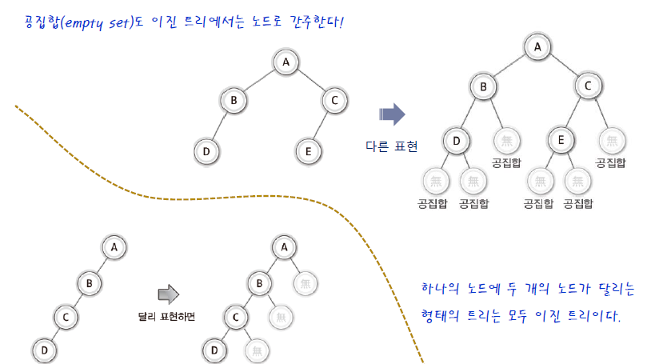
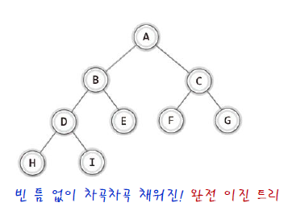
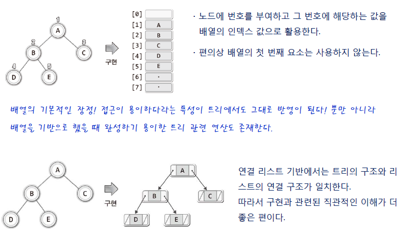
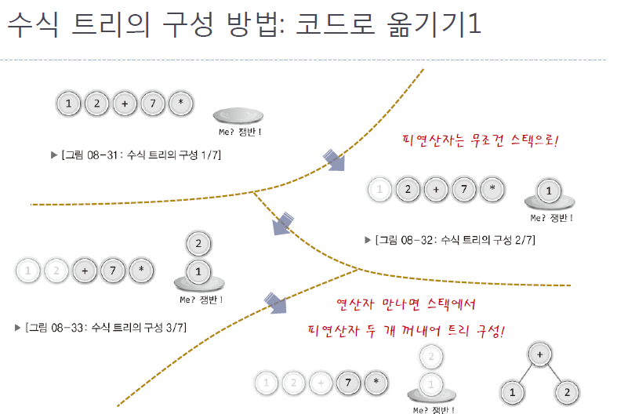
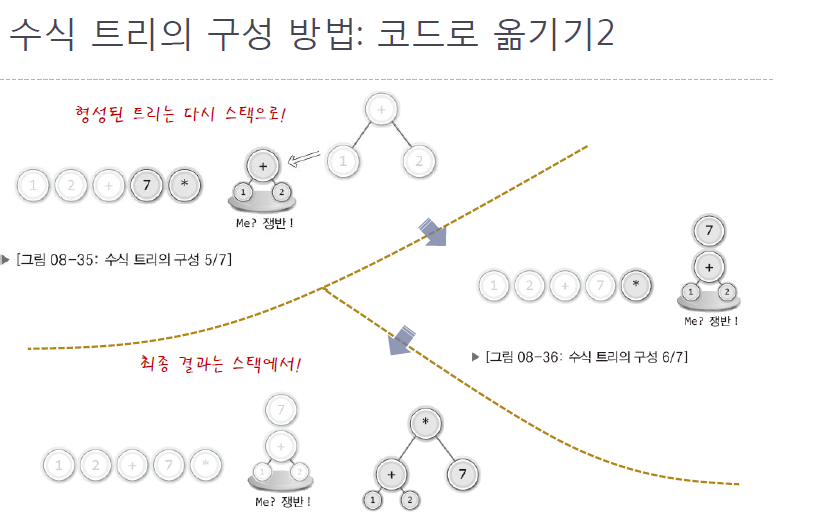

# 트리(Tree)

[TOC]

## 트리(Tree)

> 정의

Tree는 node로 이루어진 자료구조 입니다.

1. 하나의 root node를 갖는다.
2. root node는 0개 이상의 child node를 가집니다.
3. child node 또한 0개 이상의 자식 노드를 가집니다(반복적으로 정의 됩니다.)
4. Tree는 cycle이 존재하지 않습니다.
5. 비선형 자료구조로 계층적인 관계를 표현할 때 자주 사용됩니다.
6. cycle이 없는 하나의 Connected Graph(연결그래프)


> 용어


- root node: 트리 구조의 최상위 위치한 node
- leaf node(terminal node): 자식이 없는 node
- internal node(nonterminal node): leaf node가 아닌 node
- sibling node: 부모가 같은 node의 집합
- level: 트리의 각층의 번호
- height: Tree의 최대 level
- degree: 한 node가 가지고 parent node의 개수
- sub tree: 큰 tree에 속하는 작은 tree


> 종류

**Binary Tree(이진트리)**

- root node를 중심으로 두 개의 sub tree로 나누어진다.
- 나누어진 두 sub tree도 모두 Binary tree여야 한다.
- node가 존재할 수 있는 곳에 node가 존재하지 않는다면, empty set node가 존재하게 됩니다.




**Binary Search Tree(이진 탐색 트리)**

- 노드의 왼쪽 서브트리에는 그 노드의 값보다 작은 값들을 지닌 노드들로 이루어져 있다.
- 노드의 오른쪽 서브트리에는 그 노드의 값과 같거나 큰 값들을 지닌 노드들로 이루어져 있다.
- 좌우 하위 트리는 각각이 다시 이진 탐색 트리여야 한다.
- 왼쪽과 오른쪽 서브 트리도 이진 탐색 트리이다.
- 이진 탐색 트리의 노드에 저장된 key(키)는 유일하다.


**Full Binary Tree(정 이진 트리)**

- node들의 child node가 하나도 없거나 또는 두 개를 가진 형태로 구성된 tree를 Full Binary Tree라 정의힌다.

  (즉, node는 child node를 단 한개만 가질 수 없음 아이에 없거나 두 개를 가져야 한다.)


**Perfect Binary Tree(포화 이진 트리)**

- 모든 level이 꽉 찬 Binary Tree를 Full Binary Tree라고 정의한다.

- Full Binary Tree는 Complete Binary Tree이다. (역은 성립하지 않음)

- height가 h일때 2<sup>h</sup>-1개의 node를 가집니다.

- node의 총 개수가 n일 때 높이 h는 log(n+1) =h(밑이 2인로그) 입니다.

  ```
  height 0
  1개
  
  height 1
  2개
  
  height 2
  4
  ...
  
  height h-1
  2^(h-1)
  
  1+2+4+..+2^(h-1)
  
  
  노드의 총합을 n이라고 할 때
  2^h-1 = n
  2^h = n+1
  log로 변한하면
  log(n+1)=h
  ```

  


**Complete Binary Tree(완전 이진 트리)**

- Full Binary Tree 처럼 모든 level에 node가 찬 상태는 아니지만 위에서 아래로 왼쪽에서 오른쪽의 순서를 가진 tree를 Complate Binary Tree라 정의한다.
- 모든 sub tree의 레벨이 같아야 하고 마지막 레벨의 node는 반드시 왼쪽 부터 채워져야 합니다.




> 트리의 구현 방법




> 이진 트리의 순회(Traversal)


순회(Traversal)의 종류


![이진트리의 순회에 대한 이미지 검색결과](data:image/jpeg;base64,/9j/4AAQSkZJRgABAQAAAQABAAD/2wCEAAkGBxISEBUQEBAQFRAQGBgWExAWGRsVEBgYFxoiGRcfGRYYKCogGCAmGxUVIjIiJSkrLjEuGSAzODQsOCguOisBCgoKDg0OGhAQGy0lHyUtLS0vKzItLS0vLS0tLS0tLy0vLy0tLS0tLS0tLS0tKy0tLS0tLS0tLSstLS0tLS0tLf/AABEIAJMBVgMBIgACEQEDEQH/xAAbAAEAAwEBAQEAAAAAAAAAAAAABAUGAwcCAf/EAD0QAAIBAwICBQkIAQMFAQAAAAECAwAEERIhBTEGExZBVBQiMjNRYXKRoQcjNEJxgbHBUhUkYoLR4fDxov/EABcBAQEBAQAAAAAAAAAAAAAAAAABAgP/xAAhEQEBAAIDAQABBQAAAAAAAAAAAQIREiExA1ETIjJBsf/aAAwDAQACEQMRAD8A9I6N8BtpLSJ3gRnZcljzJzVj2bs848niz7O+v3on+Cg+D+zVYOCyLc3ExghkaZtUV3r0XUa9WEEYJUlACHwVOMOTjJOQsm6N2Q528QztX72as/DR/WofG+ENLdRTG3t7iJEZOqlOOrcsD1iAqyklQQTsRgY5mqwcH4mww90Qdbaij4BXqpgpXIyuZHtsryAj2HPUF/2Zs/DR/WnZmz8NH9azX+hcSUyGObBnkWR2606t7dUyoIwumVWOndWBXIOMHU8BtJo0fyiRnkeWZgS2pRGZGMQAwNOI9Ax7fbQc+zNn4aP607M2fho/rVvSgqOzNn4aP607M2fho/rVvSgqOzNn4aP607M2fho/rVvSgqOzNn4aP607M2fho/rVvSgqOzNn4aP607M2fho/rVvSgqOzNn4aP607M2fho/rVvSgqOzNn4aP607M2fho/rVvSgqOzNn4aP607M2fho/rVvSgqOzNn4aP607M2fho/rVvSgqOzNn4aP607M2fho/rVvSgqOzNn4aP607M2fho/rVvSgqOzNn4aP607M2fho/rVvSgqOzNn4aP607M2fho/rVvSgqOzNn4aP607M2fho/rVvSgqOzNn4aP607M2fho/rVvSgqOzNn4aP607M2fho/rVvSgqOzNn4aP607M2fho/rVvSgqOzNn4aP607M2fho/rVvSg8/wCn3CoYI4jDEqFmIJHeMUqZ9pvqofjb+KUF70T/AAUPwf2ahWdxMtzdRsJ8NcxtCxjeSHqTDCrBWyFQaxL37HU2DU3on+Ch+D+zWen6UTx31xG5iW2heREaUrFCWS1inC9cMsr5kdjlcaFJGSpoLDiV7cxT3XVRTSFooTbqVZoNS6+s3Hmg4KnGQWwBVLepxN5GuFkkTRBH1apG5XJuW6z7piup+oSMkFc7+bjO9l0y4/cW88KQlRG0UksrMoZECSwoWkJIKxhZnyVyRseQNRLXpyesEPVhi0pTW8iq5D3cluvVoqYkCCLLcsZQEsSTUG5TkP8A59O6vqvP+CdMrl0sFkjt83DW6TTNJjUJ7VplZQqhVcuhGncZ0qD5+V9AFUKUpQKUpQKUpQKUpQKUpQKUpQKUpQKUpQKUpQKUpQKUpQKUpQKUpQKUpQKUpQKUpQKUpQKUpQYv7TfVQ/G38Up9pvqofjb+KUF70T/BQfB/Zq1Kj2VVdE/wUHwf2at6D8K1CueEwySpM6sXi9Aa36oEZIPVA6CwycMVJHcanUoPnSK+qUoFKV8u4AySABzJ2FB9UqHbcWt5G0R3ELsOaq6s3yBqZQKUpQKUpQKUpQKUpQKUpQKV+Fsc6hwcWt3fq0uIGf8AwV1LfIHNBNpSlApSlApSlApSlApSlApSvwmg/aVCTi9uX6tbiAyf4B1L/LOam0ClKUClKUClKUGL+031UPxt/FKfab6qH42/ilBe9E/wUHwf2at6qOif4KD4P7NW9ApSlApSlArHmJL2See7INhZu8ccJyImaH10ko/OAwZQDthSe+thWOsIUU3fCrg6RdNPJA3LrIrjJcITzZGdgRzxg1nJK+OHwQX6I3+lCO0lGqG6zHHMBjKOqp58eobgg53GQKtejF1IHns53MktoV0zH0pIpATEzf8ALzXU+3TnvqN0eivrWKOG7axNrbJoN0rusrKgwhaJl0ocAajrI2OOe3TosTNPc3+CIrnq44MjBaKENh8HkGaRyPcAe+l1uaGkpSlaUpSlApSlApSlApSlBlLiHy+7mimJ8hsiqNFnCzTFQ7dYRzRFZRp5Ek5ziofDRbXyr1fCV8gckR3R6uNsLkCREHnqpI81hhtwcYqbautve3FtOdMfEGEsDnZWYxiOWPP+Q0BgO8N7q+ejPD72yjjtZDZvZWwKi5Lulx1Sg6NUWnQGGwJ14wM4rEkvqJfRqeSOaawmdpDbhHhlbd2hkyFDn8zKyMpPeNJ55rQ1mujknlF3cXy56hljt7duXWLGWZ3H/EvJgHv0k99aWrj4QpSlaUpSlApSlApSlArLX8RvryS1ZmFnaBOuRSVM0sg1KjEb6FTSSBzLDPKtTWXScWnEZhKdMPEOreKU7J1yII2jJ7iVRGGee4rOSVBsTa3Q6u34TFJYhzF5RiJEJRtLtGnpMqsCNWx2OM1Y8CZ7a6bh7uzxGPrrV3JaQIGCSRsx3bSWQgnfDe6o3RzhF7YgWqGzksUkdkld5EuUidzIVMYUq5BZgG1qMY22rtwuUXXEGuo97a1ia3jl/LJI7hpSp71Xq0XPLJPsqWTrQ1FKUralKUoFKUoMX9pvqofjb+KU+031UPxt/FKC96J/goPg/s1b1UdE/wAFB8H9mregUpSgUpSgVTdK1t/Jz5RAJtwIoQPvHlOyCM/lYn82RgZJIANW8sgUFmICqCSxOAANySTyFUXCIzcyi+kDCMAizibIIRucrKeTyDkDuqYGxZxQZ236LpayRPfF7iGXAbrJJJIbect5gVHODEcrGCwyGVSc6zp9AArnd2ySxtFIqvHICrowyrKRggj9KqOC3TxSGxnYs6Atbyk7zQggb+2SMsqt7co35iBNSC8pSlUKUpQKUpQKUpQKUpQVnSPyfyZzdorwjBKFdRJzhQq8y5YgKBuSRisYOjS24S6vRJJbMSZ7V5ZJILUE/dMAzEOqDzZCcjcuNIXFaXh58tmF1nNnCT5KvdK/JpvevNY+4jU+4ZCL91BBBAIOxB3BB9oqahojUAAKAANgByx3Yr6rP8KkNrMLKQkxPk2Uh/xUZaEnvZBkr3lB3lGNaCqFKUoFKUoFKUoFKUoFQeNiDyeQ3So1uFJkVhqUgf8AHvPsA3zjFTqz0H+9n6w/g7V/uvZNOpwXx3pGdlzzcFvyoSGYbot1cYvJ0uGg1FpeGGWSSOKBgAuEDHW6Y1su4OqRRqwlehWYjEa9Vo6rSNGjGjTjbTjbGPZXWs/af7KcQHPklyx8nb8sUp3MR9ituydwOpNvMBmoNDSlKoUpSgUpSgxf2m+qh+Nv4pT7TfVQ/G38UoL3on+Cg+D+zVvVR0T/AAUHwf2at6BSlKBSlU/Hb6QFba2x5TPnD8xDGNnlYHnjICr+Zio5aiAj33+8mNsM+SQEG5bulkHnLCPao2Z+45VN8uBcXV6kfptgnkObH9hVcWisoFhiHog6VJyxJOWZ2O5JYkljuSSfbXPh3DjIetnydW4U7E+8+wewVyyz744+u2HznHln1P8AU2PjEROCSvvI2+Y5fvX5xnh3XxjSwSaI9ZBNjOiQAgHHeCCysO9WYd9fdxwyNhgKFPcyjH076rre7eAmNwSB6I/jB9n8VOeWP8l/Txzn7Pfwn8F4l16HUoSeI9XPDnJSQAEjPepBDKe9WU99WFZ/icToU4hboWcKouIRu00PPAxzkjLMy+3LLtqyLq0uUljWWNleOQBkdTlWVhkEH3iu0cHalKUClKUClKUCqDi0hupTYxsRGoBvJF2wjbrEG7mcc8bqnsLqal8d4k0SrHCA11cEpAh3UH8zvjlGg3Y7Z2UbsM9+D8OW3iEalmbJaSVvWSO27u2O8nuGw2AwABQS40CgKoAUDAA2AA5ADuqBxe7aMKVxknfO4IA/+VY1xuLZH9NQcZx7s+ys5y2dNYWTLd8V00IvICjhkOQUlUjUjqcq6Z5FWGdxju3BNffA+ItIGhmAW6tyFmUbKc+hImfyOASOeCGXmpqPwxzFMYW5Mdj78bH9x/VdOO2MmVurYf7mDPmchNGd3iYnlnGVb8rAdxYHPzy3O/Wvrjxy68/pcUqLw2+SeJZojlHGRkYYEbEMp3VgQQVO4IIPKpVdHMpSlApSlApSq3jnEjCgEaCS4mOiCHONTnfLHuRQCzHuVTgE4BCJxqZppPIYSw1LquZlOGiiOwVWG4kkwQMeiAzbELnrxWVYIVhiVUGkIiKMKiKMbAcgBgD/AMVI4LwwW8enUXlkYyTTEYaSRvSYjuGwAXkqqqjYCoFqnXXLO3opuB+hwv8AZrl9bdcZ7Xb44zfK+RY8GtTHEFYnJ3we7PcPZ/3zXXiNik8TQyjKSDBwSGHeCrDdWBAII3BAIqTSumM1NOWWVyttU/A719TWtwc3EAHn7ATRnZJFxtnbDDuYHuK5uKq+O8NaQLLCQt1bktC52U59KN8fkcAA88eaw3UV34RxFbiISAMp3V4m9ZG6nDo2O8HbbY7EZBFVE2lKUClKUGL+031UPxt/FKfab6qH42/ilBe9E/wUHwf2at6qOif4KD4P7NW9AoaVwviwicp6YVtP642+tBRy8ZuJ5HisI4ikLFJLubPUhxzWNF3kIPM5AHLNQIY76yaW5mWG7WUhp5IVaO5VFHmhI2LBkQFjoBByWO5Y5jXCoOjEnV+ibCQk95YxEuT79RbPvrV8EnRreLQ6tpjTOkg480ezlWJuxHK2tYZ2W6RtaSKGXG6HbzT8u6rTFZ3oMAIZlT1SXVysXs0CQ7D3BtYH6Vo6uEmtxq5XKTZUK74akh1Etq5ZB/o7VNpVsl9McrjdxR8S4p5KI7eGNp7mXIihBC7L6TO3JEXI3/QAE1W2HDOJwa2jksNMjGTyXRII1Zt3CS5yAzZY+ZzYnvqXwsA8UvC3rFit1TPdGQ5OP1fVn9BXnPA7VVv45mijgVuKXa/6gp+9kYOwW3kGBpVydiSR5uMAkVmRN77eqcD4z1+uN42iuYCBNAxBK53Uqw2dG3ww9h9lWtZy8wOL25T0mtpxL8CuhTP/AFM2P1NaOtRIUpSqpWeueMzyzPBYRxsYTpmuZSRAjYzoVV3kYbZAwB3mr984OOfdWR6PAf6Hn8zQStJ7TKwYy59+vVWbUfgt+IW0sl3KsF5rAVliVop44130woxZW3yxGQWPfsoGo4dfRzxJPCwaOQBlYd4P8HuxVJ9nk6NwuyVXUsttBqAIJH3Y5gcq/ehoAN4qY6pbuUJjkMhTIB+khf608o0dflR768WJdTZ9gA55/rlVN1k9z6I0xf8A5/c82/QbVnP6SXXtdsPlcpyvU/LpK4kul0bhcZI5eaST/OKlcc4wtuqgI0k8zaIbdca5Gxk7nZVA3LHYCpHD7BYhtux5sf69gqowDxjz8ZS0Bh/6pSJSPftEP3HtqYyyd+1PrnLqY+TpEs+G8TSSSdJLGMTkM1rpkeMOBgsJcggsMBsLglc4yTm14LxppXa3ni6m7iAZos6kZDsHjfbUuduQIOxry6e2UcQnnaGONRxZFbiYJ66LzIyIyoGySE6NRbSDIcivR+PAC/4ey+sLzK3t6rqiWz7taxfvW7125eNHSlK0pSlKCh4jxqVpja2USSTIAZpXJW3h1bqGI3ZiNwo7tyRVabHiMUzXj+SXT6NAiVWgdI85ZYizMuWIBOcatKjIwKmdCAPJ5WPrWuLky+3WJWG/6KEA9wFRPsqnQ8Is0DqWEIyoI1Dc8xWZ32jQ8I4pHcwrNETpbIKsNLqynDKyn0WBBBFVyObedtQOhv4zkEe3Gcf+iufR0AXvEFT1fWRMR+USNEDJj9tBPvNX08CuMOAR/wC8j3VjLG5SWex0+efHcvlIp1ZdSsCvt/7+yutZy94aytpQOysN9j7dgSNjV3YsxRdYIbkc+7v/AHq4Z23VjWfzkkuN2i8c4uttGGKs8kjBIYU9ZI55KudhyJJOwAJqig4bxLrmukexhaZQJLbTJKrFfQZpAygOF80sF3AA30riXdAHi8IfktrM0WeWsyIJCPfo0j9Ca856VWgPEOIymJEVLmyD8UB/3FopiQllUDJU4Ck6ttWSCAa1O64vT+D8ad5WtbmIQ3SLr0g6opEzjXE+2QDsQQCMirus50mx5TYMvrfKCFxzKNE/WftgA/sK0dWEKUpVVi/tN9VD8bfxSn2m+qh+Nv4pQXvRP8FB8H9mreqjon+Cg+D+zVvQKGlKDKycJntjIttFFcWUxYvZSEIUL+mI2YFWRiSdDYxk4NcYLO6ZWitbG34ckvrZwYzNjl5iRDTqwThmO3srYVj+lPS2e3n6i0tIruQKGaFJmFyuxJLRrGwVcDYswLZwATjOeKaabhdhHbwpBEuI4hpUcz+pPeSckn2mpVZW06Yp5C97KIj1biMxW8hmOtmVURjIsZjcs6gq4GM7mvpemA19VJbSxzrPBC8TMjafKMlHDISGHmttsdv0zpWopUbiF/FBGZp5Y4olxqkdgqDJwMk+0kD96pOF9MbeWUxOHgLtptmmVo1uF5BotYGSWDDTzxg4wwoJPHODu8iXVq6x3cIKgsCYpIycmOQDfGRkEbg1XPJdFDD/AKPB5x1tmWI2pfOrUfN1E6t86c5rlxXp9HBfJYm3lLtq/NEJCcgR6Iy2XDefucchsc7XnAeLeUiYmPR1M8kOM5z1ZxnkMZzy3x7azpNOfA+EPG73FxIJLufAd1GI0RfRjjB3CjJOTuScmrmlKsmlKUpVCszNwu4tpJHs0imt52LS2Uh0YZvTaJyCMNzKMMZ3yM1pqVLNjHW1pc+clpw624f1m0lyeraQAf4xxDDHc41HA9laTg/DUtoUgizoQcycuxJyzMe9iSST76qulnSyOxUl4pWbTlMYSJm/x6xtgdq6L0rgNnLfaZhbwKXLFd2AGfM3w3s586SGl3LErDSygg9x3FfQFZOXpqEDrLazRzRm2zCzRtlLqURIweMsuzZyDvt3gg1p7u6SJGkldUjQZaRiFRR7STsKo7VT8f4O0xjlhk6q6tyTDKRqXDDDI6/mRgBkcxgEbiq+x6b2zylH1xROQttdSgpb3JOx6p2AGQ2wB9IbrkVw6Q9O47S7itXgkJlYgsXjQkacqY1ZsyZfC76e/nipZsfbSXWh4n4PA5lOZSssfk0jcsuGGo5wOak7VP4LwiQSm7u2Rrll0IiZ6mGPOSqZ3JJAyx54HICu3AuMeUPcKYink0qx4Jyx1RJLuPykdbpxk+jzq3ppNFKUqqUpSgzt5wy4gne5surYT4M9pISiOwGNaOAdD4AByMHA5GoFrb3Ckiz4TaWcjDSbhjFgD3JCMvyGxIFbGs/0j6TG0eNDZ3MqzMkaSRmEIZHJ0p946nPm88Y3G9Z4ppP4FwlbaLq1ZnZiXklb05JGOWZveT3dwAHdVjWas+mUEjXHctlAk85VlkKFteuNhGSNadUcgE86iTdOlSN2ktJo3WDymNGaNusi1BSdUbMFILrsfbtnBxYrYYpXKedUQySMqogLM7EBVAGSSTsAB31nIenNqZSGLJakARX7grZyP+ZVkI07ZXBzhskDOk1RZcf4P5QqNHIYrmBtcEwGdLEYIYfmVhsR7P0qr667AdJOEwSPMMSyRyxiGTA0jWJAGIxtghsDbevjpX05jsZooZIXPWuBrLxougqSSmtgXIbQuNhud9t7Tg3GjPNPEYmj6gQnzj5561NeGUbKRy2JrOk04cG4NL1oursx9aidXBBF+HgQ4yFzjUxwAWwNhgACtBSlWTSlKUqjF/ab6qH42/ilPtN9VD8bfxSgveif4KD4P7NW9VHRP8FB8H9mregUpSgV5h0+4Mxuzo8rhjlVZGu4xe3WqTXvGIbeQLENKjJK7hzp0kZr0+lBh+jfR0y2DK4uLZ7hmEuS03WxqWVSYb7reqDqQxQ7jYE1QcB6PvDZ2Uh64PLeQtJbdVFDGhEhGvq4o0YHSq7sTt+1er0oKPpqjeRSvGJ2khUyJHC7xyOyjZcx+ccnuHurJ9HYkkuHSS441h5QbYN5bGiosakiR5FC51rJzJyCB7q9IpQec8U6P3ct60i2ri0mcS3EBuIhHNLCU8nfOgyIMRjUoIzhduedB0FVxHcmRCrNeXDFd8bkciQNQznBxvWmpQKUpQKUpQKUpQeffaRwm8Ikv4ZYQbSNupVI3N0VbSXXUXMbZZQfV5G1WXAuitxDbzWz3UQSZi5lhi++LufvC/lDSxsGAAwEAHcK19KDyK36MPDw9nBnDG9jU2whhhjZI75QkhSKJWJ6tA2c4wSQMV6T0khL2sunrdSozqInaORmQagoZPO3IAwOeatKUHmHAQssxWafjarL1IijIvlEblfvQ8jKFxr5EnGB3VK6TdHbq4umMdtILafEd6vXxhbmKMHqual4jqIyVIOnPfgj0WlBl+hayddftLHoZ7lTpBLL+GhB0sQNQyCM4HKtRSlApSlApSlArF9PLKMywS3EVxcQMxiaJFeQQZRm65EgUv1mpUUPnzcnGMnO0pQYngVnHNNcPbzXkeuC3h6yS3eObMTSEvquU0ys2vB80/UVluyrQ2XEmUzqUkeJIlgghSaNdOhiIolaTd3wQdO3LnXr9KCHxK36yF0JkGpecbFJNt9mXccu6vNOAv1sim4l43Gk0UI6jF/93OS3W6pCmnRvGAS2Nidq9XpQee9K+j11NP8AcQyiN41trqXr4/8AcWoViVIkVmR9bnzhg4Le7Ft0Rhdbu81xCLa2AQMXQBYioCuQNWwHdWspQKUpQKUpQYv7TfVQ/G38Up9pvqofjb+K/KDIQceuY1CJO6oowFHIV07S3niZPnSlA7S3niZPnTtLeeJk+dKUDtLeeJk+dO0t54mT50pQO0t54mT507S3niZPnSlA7S3niZPnTtLeeJk+dKUDtLeeJk+dO0t54mT50pQO0t54mT507S3niZPnSlA7S3niZPnTtLeeJk+dKUDtLeeJk+dO0t54mT50pQO0t54mT507S3niZPnSlA7S3niZPnTtLeeJk+dKUDtLeeJk+dO0t54mT50pQO0t54mT507S3niZPnSlA7S3niZPnTtLeeJk+dKUDtLeeJk+dO0t54mT50pQO0t54mT507S3niZPnSlA7S3niZPnTtLeeJk+dKUDtLeeJk+dO0t54mT50pQO0t54mT507S3niZPnSlA7S3niZPnTtLeeJk+dKUDtLeeJk+dO0t54mT50pQRr3is0wAmlZwpyAe6lKUH/2Q==)

- Preorder Traversal(전위 순회):루트 노드 먼저

  ```c
  void Preorder(Betree * bt){
      if(bt==NULL)
          return;
      printf("%d ",bt->data);
      Preorder(bt->left);
      Preorder(bt->right);
  }
  ```

- Inorder Traversal(중위 순회):루트 노드 중간

  ```c
  void Inorder(Betree * bt){
      if(bt==NULL)
          return;
          
      Inorder(bt->left);
      printf("%d ",bt->data);
      Inorder(bt->right);
  }
  ```

  

- Postorder Traversal(후위 순회):루트 노드 마지막

  ```c++
  void PostOrder(Betree * bt){
      if(bt==NULL)
          return;
          
      PostOrder(bt->left);
      PostOrder(bt->right);
      printf("%d ",bt->data);
  }
  ```

  -이진 트리 순회 참조

  https://songeunjung92.tistory.com/29


> 수식 트리(Expression Tree)의 구현

- 전위 표기법, 중위 표기법, 후위 표기법와 같이 수식을 표현하는 방법 중 하나

- 루트 노드에 저장된 연산자의 연산을 하되, 두 개의 자식 노드에 저장된 두  피연산자를 대상으로 연산을 수행

- 수식 트리의 구성은 이진트리의 일종

- 중위 표기법을 수식 트리로 바꾸기는 어렵기 때문에 후위표기법으로 변환 후 수식트리로 표현

- 수식 트리에서 전위 순회를 하면 전위 표기법, 중위 순회를 하면 중위 표기법, 후위 순회를 하면 후위 표기법을 알 수 있다.

  

<후위 표기법로 수식 트리 표현>



