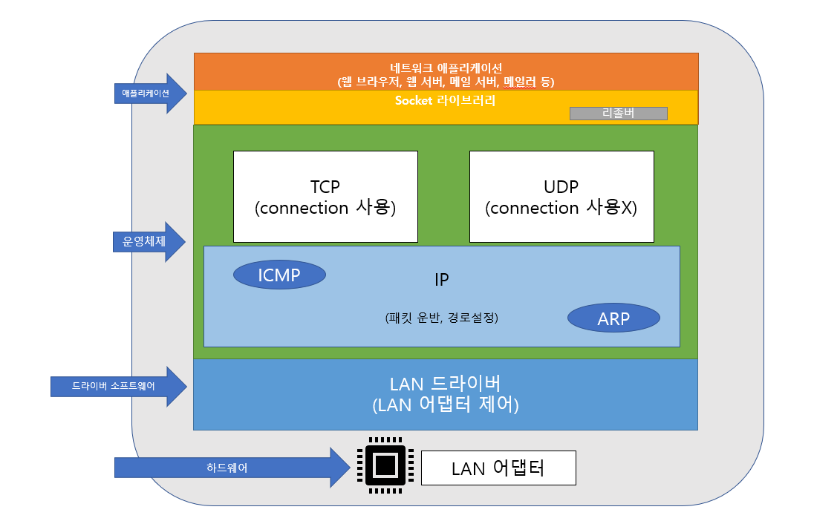
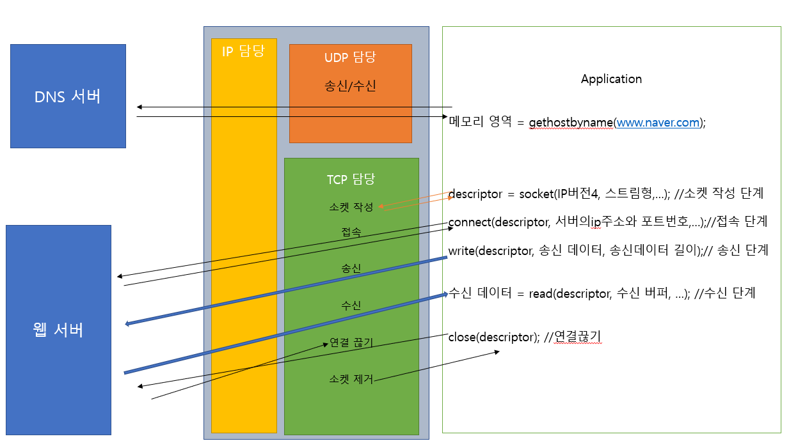
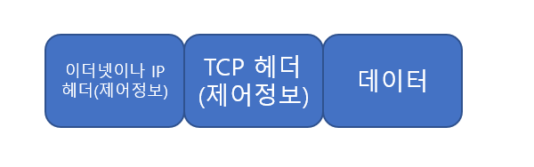
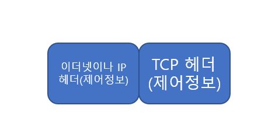
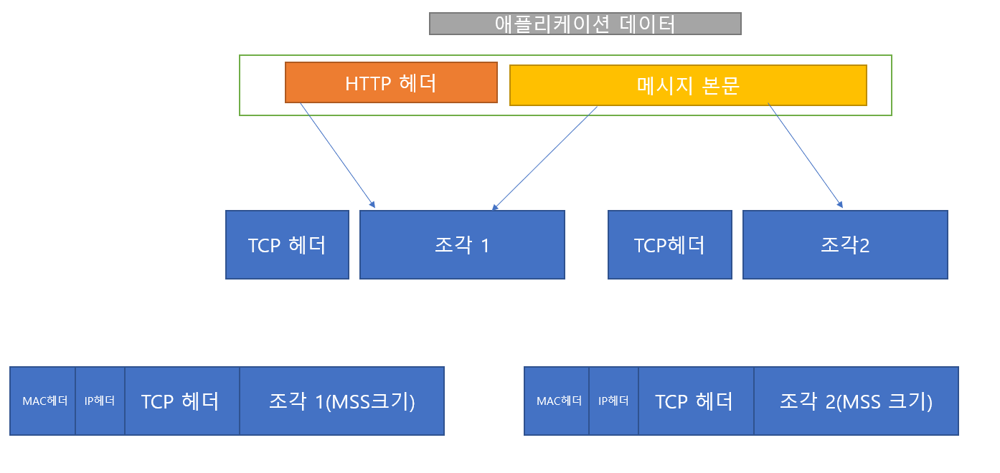
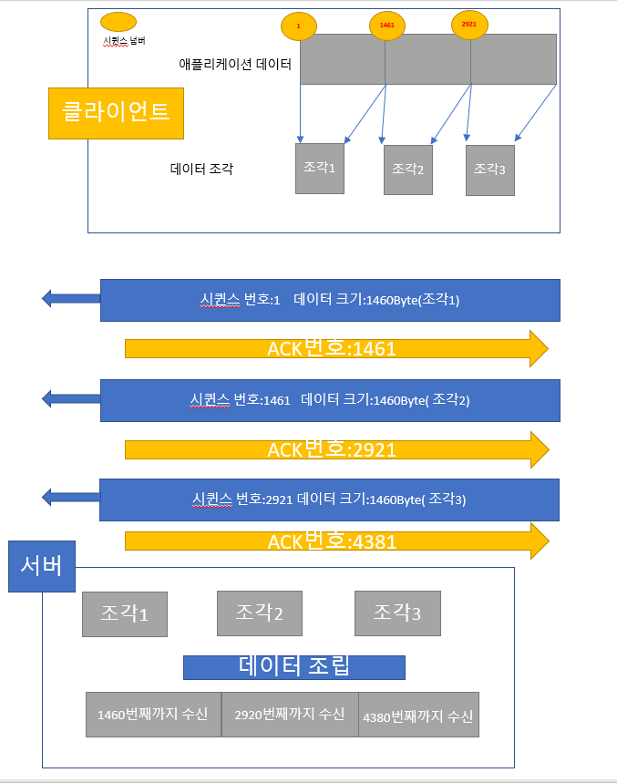
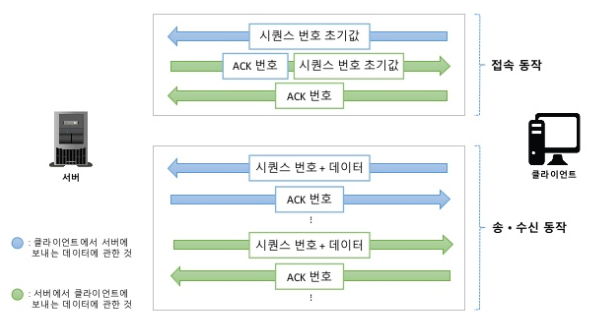
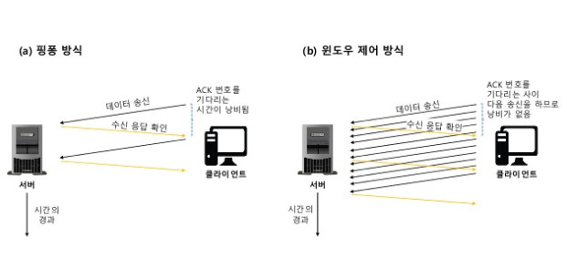

# Chapter02 TCP/IP의 데이터를 전기 신호로 만들어 보낸다.

[TOC]

## STORY 01 소켓을 작성한다.

 

> 프로토콜 스택의 내부 구성

- 프로토콜 스택이란 운영체제에 내장되어 있는 네트워크 제어용 SW 입니다.

- 운영체제 계층의 TCP 또는 UDP 프로토콜을 사용하여 데이터 송·수신을 합니다.

  보통, TCP는 브라우저 메일 등의 일반적인 애플리케이션의 데이터 송·수신할 경우 많이 쓰입니다.

   UDP는 조회 같은 짧은 제어용 데이터를 송·수신할 경우에 사용됩니다.

- IP 프로토콜은 **패킷 송·수신 동작을 제어**하는데 사용하는 프로토콜 입니다.

  ICMP는 패킷을 운반할 때, **발생하는 오류 및 제어용 메시지**를 통지할 때 사용됩니다.

  ARP는 IP 주소에 대응되는 이더넷의 **MAC 주소**를 알아볼 때 사용됩니다.

- LAN 드라이버는 LAN 어댑터의 하드웨어를 제어합니다.

- LAN 어댑터는 케이블에 데이터를 송·수신을 담당합니다.


> 소켓(통신 제어 정보)

- 프로토콜 스택은 데이터의 송·수신 및 제어 하기 위한 정보를 소켓에 저장 합니다.

  대표적인 정보로는

  - 상대의 IP 주소
  - PORT 번호
  - 통신 동작의 진행 상태

  위 와 같은 정보를 저장하고 그 외 부가적인 정보도 소켓에 저장되어 있습니다.

- 프로토콜 스택은 제어정보를 참조하면서 동작합니다.

  ex)

  1. 데이터 송신 시 소켓의 IP와 PORT 번호를 보고 데이터를 송신합니다.

  2. 데이터를 송신 한 후 일정시간 동안 응답이 오지 않으면 송신 동작을 재 실행합니다.

     이때, 송신 후, 어느 정도 시간이 지난지를 소켓에 저장해놓고 재전송을 결정합니다.


>socket 함수를 호출했을 때의 동작



- 브라우저가 socket, connect 함수를 호출하였을때 프로토콜 스택의 움직임은 다음과 같다.

  - **socket함수**를 통**해 소켓 생성을 의뢰하**면 프로토콜 스택은 하나의 **소켓을 메모리에 생성** 합니다.

    소켓의 처음 생성하는 작업은 차후에 제어 정보를 저장할 그릇을 만드는 과정 입니다. 때문에, 초기에 

    아무 정보가 없어서 쓰임이 없더라도 미래에 쓰임을 위해 준비하는 단계 입니다.

    소켓이 만들어지고 소켓을 식별하는 **디스크립터 번호**를  애플리케이션에게 알려줍니다.


## STORY 02 서버에 접속한다.

> 접속(준비)의 의미

1. 애플리케이션 계층에서, 서버의 IP주소나 PORT 번호를 프로토콜 스택에 알리는 동작을 의미한다.

2. 서버는 클라이언트가 접속할 때까지 상대측의 IP주소와 PORT 번호를 알 수 없다. 때문에, 클라이언트가 서버측에게 통신 동작의 개시를 전달하는것도 접속의 의미이다.

3. 통신 상대와 송·수신 제어정보(IP, PORT번호 등)를 주고 받고 해당 정보를 소켓에 저장한다. 

4. 데이터를 송·수신  동작을 할때 데이터를 일시적으로 저장하는 버퍼 메모리가 필요하다. 이 메모리 확보하는 동작도 접속의 의미이다.


>제어 정보

제어정보 종류(제어정보는 접속 동작, 데이터 송·수신, 연결 끊기 모든 동작에 필요한 정보 입니다.)

- 헤더에 기록되는 정보

- 소켓(프로토콜 스택의 메모리 영역)에 기록되는 정보


  

  ​                                                                  <TCP 헤더>

cf)이더넷헤더(=MAC헤더)


**(a) 데이터를 저장한 패킷**



**(b) 제어 정보만 있는 패킷**

접속 동작에서는 아직 데이터 송수신이 없기 때문에 패킷에 데이터 부분이 없다.




>접속 동작

**STEP01**

connect(디스크립터, 서버측 IP 주소와 port 번호,...) 호출(socket라이브러리=>프로토콜 스택의 TCP 담당부분)

**STEP02**

**클라이언트 측,** 프로토콜 스택의 TCP 담당 부분은 **서버 측,** 프로토콜 스택의 TCP 담당 부분과 제어 정보를 주고 받습니다.

<STEP02의 단계>

​    <CLIENT>

1. 데이터 송·수신 동작의 시작을 나타내는 **제어 정보를 기록한 헤더**를 만듭니다.

   이때 제어정보는 다양한 항목이 있지만, 이 단계의 핵심은 **클라이언트**와 **서버**의 **포트번호** 입니다.

   이를 통해, 클라이언트의 소켓과 서버의 소켓을 지정할 수 있습니다. 더불어, **컨트롤 비트 SYN**이라는 비트를 1로 만듭니다.(그 외에도, 시퀸스 번호와 윈도우에 적정 값을 설정합니다.)

   **=>TCP 헤더 만들기, 클라이언트와 서버의 각각의 소켓 지정하기**

2. IP 계층에 TCP 헤더 송신 의뢰하기(접속 단계 이기 때문에 패킷에 헤더만 있음)

3. 네트워크를 거쳐 서버의 IP 계층 까지 전송되면 이것을 서버의 TCP 계층에 전달 합니다.

   <SERVER>

4. 서버측 TCP 계층은 헤더 정보를 분석하면 **송신측(클라이언트) 포트 번호** **수신측(서버측) 포트 번호** 등의 제어 정보를 추출할 수 있습니다. 알아낸 정보를 통해서 수신측 포트 번호에 해당되는 소켓을 찾고 그 소켓에 제어 정보를 저장합니다. 더불어 서버는 **접속 진행중** 이라는 상태(6장에서 그 의미 설명)가 됩니다.

5. 서버측 역시, 제어 정보를 기록한 헤더(송신처·수신처 포트번호 , 컨트롤 비트 SYN, ACK 1로 설정 등)를 만듭니다.

   ```
   Sequence number (32 비트)
   SYN 플래그가 (1)로 설정된 경우, 이것은 초기 시퀀스 번호가 된다. 실제 데이터의 최초 바이트 값과 그에 상응하는 ACK 번호는 이 값에 1을 더한 값이 된다.(초기 시퀸스 번호 전달해주는 역할)
   SYN 플래그가 (0)으로 해제된 경우, 이것은 현재 세션의 이 세그먼트 데이터의 최초 바이트 값의 누적 시퀀스 번호이다.
   
   ```

6. 서버측 IP 계층에 TCP 헤더 송신 의뢰하기


 <CLIENT>

7. 클라이언트 IP 담당 부분을 경유하여 TCP 계층에 도착합니다.

8. TCP 헤더를 조사하여 서버측의 접속 동작이 성공했는지 여부를 조사합니다.

   조사 방법은 SYN 비트가 1이면 접속 성공을 의미 합니다.  그 이후 클라이언트 해당 소켓에 제어정보(포트번호, 서버 IP 주소, 접속 완료 정보 등)을 저장합니다.

9. 끝으로, 서버가 응답을 받을 것을 알릴때 ACK 비트를 1로 만들어서 보낸것 처럼 클라이언트는 ACK번호를 1로 만든 TCP 헤더를 반송합니다. 


=>STEP02의 절차가 끝나면, close 호출을 할 때 동안 해당 수신측과 송신측은 연결을 유지 합니다.

​     이러한 작업 거친후 상태를 소켓이 연결된 상태  **커넥션(세션)**이 이루어 졌다고 말합니다.


## STORY 03 데이터 송·수신 한다.

> Application에서 만든 HTTP 메시지를 프로토콜 스택에게(http messate=>protol stack)

현재 이 챕터에서 설명하는 동작은 **접속(connect)**이 이루어진 이후의 상태입니다.


어플리케이션 측에서, socket library **write 함수**를  통해 Http 메시지를 프로토콜 스택에 전달 합니다. 이때,

프로토콜 스택은 전달 받은 데이터를 바로 서버에 송신하지 않고 자체적으로 송신영 버퍼 메모리 영역에 저장합니다. 그 이유는 다음과 같습니다.

- 어플리케이션에서 프로토콜 스택에 건네주는 데이터의 길이는 어플리케이션의 종류나 방법에 따라 다릅니다.

  예를 들어, 어떤 어플리케이션은 한 번에 데이터를 보내고 반면, 다른 어플리케이션은 1바이트씩 또는 1행씩 데이터를 보냅니다. 이때, 받은 즉시 데이터를 보내게 되면 작은 패킷을 많이 보낼 수 있지만 **네트워크의 이용 효율**이 저하됩니다. 때문에 어느 정도 저장한 후 송신 합니다.

- 이때, 어느 정도 데이터가 쌓이면 보낼지에 대해서는 OS에 따라 다릅니다. 보통 다음과 같은 요소로 판단합니다.

  1. MTU의 MSS로 판단

     프로토콜 스택의 **MTU**(한 패킷에 저장할 수 있는 데이터 크기==패킷 한 개로 운반할  수 있는 디지털 데이터의 최대 길이)로 판단

     cf)

     MSS(MTU에서 헤더를 제외하고 한 개의 패킷으로 운반할 수 있는 TCP의 데이터의 최대 길이)

     ​    

     

     ​                                                              **MTU:Maximum Transmission Unit**

     ​                                                                  **MSS:Maximum Segment Size(Tcp Maximum Segment size)**

  2. 타이밍으로 판단

     MSS에 가깝게 데이터를 저장할 때까지 기다리면, 송신 데이터 시간이 지연 됩니다. 프로토콜 스택은 내부에 타이머가 있어서 이것으로 일정 시간(밀리 초)이 지나면 송신 버퍼의 데이터를 송신합니다.


  앞서 말한 것처럼 이것은 OS 종류나 버전에 따라 달라집니다.

  만약, 

  전자가 중요한 경우(데이터 크기 중시)

  - 장점:네트워크 이용 효율이 높다.

  - 단점:버퍼에 머무는 시간 만큼 송신 동작 지연


  후자가 중요한 경우(전송 지연 줄이기 중시)

  - 장점:네트워크 지연이 작아짐
  - 단점:네트워의 이용 효율이 낮음


  cf)

  어플리케이션에서 데이터를 전송할 때, 버퍼에 저장하지 않고 전송이라는 옵션을 줄 수 있음

  이러면 버퍼에 쌓지 않고 바로 전송함


  > 데이터가 클 때는 분할해서 보낸다

  보통, HTTP 메시지의 경우에 그렇게 데이터의 길이가 길지 않습니다. 그러나 form 태그를 사용하는 경우 데이터 양이 급증합니다.(블로그, 게시판의 긴 글 작성)


  이 경우, 송신 버퍼에 저장되는 데이터가 MSS의 길이를 초과 하므로 다음 데이터가 올 때까지 기다리지 않고 바로 데이터를 전송 합니다.

  1. 데이터를 맨 앞에서 부터 MSS 크기에 맞게 분할
  2. 분할된 데이터 조각에 헤더를 부가해서 전송됨


  

  ​        

> ACK 번호를 사용하여 패킷이 도착했는지 확인

TCP 는 신뢰성 있는 전송을 하기 때문에, 보낸 패킷이 서버에 잘 도착했는지 확인하고 전송이 되지 않으면 재전송하는 기능이 있습니다. (TCP는 데이터 송신후 바로 확인 동작)

데이터가 잘 도착했는지 확인하는 방법

- 시퀸스 번호
- 데이터 크기

```
Tcp계층에서 데이터를 조각낼 때, 몇 번째 바이트에 해당되는지 TCP 헤더에 기록합니다.
이것이 바로 시퀸스 번호 입니다. 서버측에서는 전달받은 데이터의 TCP헤더에서 시퀸스 번호를
알아냅니다. 그 후, 데이터 전체 크기 - TCP 헤더 = 데이터의 크기를 알아올 수 있습니다.
시퀸스 번호 + 데이터 크기가 바로, 다음에 수신 받을 시퀸스 번호입니다.
```

실제로는 시퀸스 번호는 1부터 시작하지 않고 난수로 시작합니다. 그 이유는 데이터의 시작이 1이라는 것을 알면 해커로 부터 악의적인 공격이 들어올 수 있기 때문에 시퀸스 번호의 시작은 난수를 바탕으로 산출됩니다.

그러나 이렇게 되면 서버측에서 시퀸스의 시작번호를 모르게 됩니다. 때문에, 우리는 이전 접속 단계에서 송신측은 

초기 시퀸스 번호를 서버에게 알려줍니다.




정리해보자면, **수신 측**은 데이터의 누락이 없는 것을 확인하면 이전에 수신한 데이터와 합쳐서 데이터를 몇 번째 바이트 까지 수신한 것인지 계산하고, 그 값을 TCP 헤더의 **ACK번호** 에 기록하여 **송신 측**에 알려줍니다.

cf)

ACK(수신 확인 응답)//송신 측은 ACK를 통해 수신측이 어디까지 데이터를 받았는지 알 수 있다.

(ACK번호를 통지할때 단순히 ACK 번호 값 설정 뿐만 아니라 제어 비트의 ACK 비트로 1로 설정함 ACK 비트 1로 설정의 의미는 ACK번호 필드가 유효하다는것을 나타냄)


지금까지 설명한 내용은, 클라이언트에서 서버에 데이터를 보내는 과정을 설명한 것 입니다. 그러나, TCP의 데이터의 흐름은 (송·수신) 양방향이기 때문에 클라이언트->서버 또는 서버->클라이언트라는 2가지 흐림이 있습니다.

웹의 경우 클라이언트가 서버에게 우선 데이터를 보내기때문에 다음과 같은 움직을 나타냅니다.

<접속단계>

1. 클라이언트는 시퀸스 번호의 초기값을 서버에게 전송합니다.
2. 서버는 전달받은 시퀸스 번호의 초기값을 통해 ACK 값을 구하고 ACK값과 더불어 서버측의 시퀸스 번호 초기값을 전송합니다.(ACK를 보내는 이유는 잘 받았는지를 송신 측에서 알게 하기 위해서 입니다.)
3. 클라이언트도 마찬가지로 서버측의 시퀸스 번호로 부터 ACK 값을 구하고 이에 대한 ACK를 보냅니다.


<송·수신 동작>

위에서 설명한 동작과 동일합니다.


TCP는 이러한 방식으로 통신합니다. TCP는 데이터를 보낼때 상대 측에서 받았다는 확인 메시지가 올때까지 송신한 패킷을 송신용 버퍼메모리에 저장 합니다. 만약 수신 측에서 ACK를 보내지 않으면 패킷을 다시 재전송 합니다.

이러한 구조를 따르면, 네트워크에 어디에서 오류가 발생하더라도 전부 검출하여 회복처리(패킷을 다시 보내는것)할 수 있습니다. 때문에, LAN 어댑터, 버퍼, 라우터 모두 회복 조치를 하지 않습니다. 그러나 TCP가 재전송을 아무리 해도 패킷이 전송되지 않는 경우가 있습니다. 케이블이 분리되거나 서버가 다운되는 등의 이유 입니다. 이때, TCP는 몇 번 재전송 후에 회복 전망이 없으면 데이터 송신 동작을 강제로 종료하고 애플리케이션에 오류를 통지합니다.





> Timeout 시간 조절

**Timeout** 값이란 ACK 번호가 돌아오는 것을 기다리는 시간을 의미합니다.

네트워크가 혼잡인 상태에서 ACK 번호가 돌아오는 시간이 지연됩니다. 

그렇기 때문에 송신 측에서는 Timeout 값 시간을 어떻게 설정한지에 대한 이슈가 발생합니다.

만약, 

**Timeout 시간이 짧은 경우**

ACK번호가 돌아오기 전에 다시 재전송 하는 문제가 발생합니다. 또한 재전송을 하면서네트워크가 혼잡인 상태를 더욱더 혼잡하게 만들 수 있습니다. 


**Timeout 시간이 긴 경우**

패킷을 너무 늦게 보내어 데이터를 보내는 속도가 느려지게 된다.(유저 입장에서는 원할한 소통 안됨, 답답함)


때문에, 대기시간은 너무 짧지도 길지도 않는 적절한 값을 설정해야 한다.

TCP는 이러한 이유로 **대기 시간을 동적**으로 변경합니다.

- ACK가 돌아오는 시간을 기준으로 대기 시간 판별
- 데이터 송신 동작을 할때, 항상 ACK번호가 돌아오는 시간을 계산 

​        만약, ACK가 돌아오는 시간이 지연되면 이것에 대응되는 시간을 늘림 반대로 ACK가 돌아오는 시간이 빠르면

​         대기시간을 줄임


> 윈도우 제어 방식(효율적인 ACK번호 관리)

패킷을 보내는 방식

<Ping Pong 방식>

한 개의 패킷을 보내고 ACK 번호를 기다렸다가 ACK번호가 오면 다음 패킷을 보내는 방식 입니다.

그러나, ACK번호가 돌아올 때 까지 기다리는것은 시간 낭비 입니다.


<Window 제어방식>

한 개의 패킷을 보낸 후 ACK 번호를 기다리지 않고 차례대로 연속해서 복수의 패킷을 보내는 방법 입니다.

그러면 ACK 번호가 돌아올때까지 기다리지 않으므로 시간 낭비를 줄일 수 있습니다.  그렇다면 window 제어 방식의 문제점은 무엇일까? 바로 ACK번호를 기다리 않고 차례로 패킷을 보내면 수신측의 능력을 초과하여 패킷을 보내는 경우가 발생합니다. 

구체적으로 상황을 설명 하자면

- 수신측 TCP는 패킷을 수신하면 일단 수신용 버퍼 메모리에 데이터를 임시 보관 합니다.

- TCP는 다음 ACK번호를 계산하거나 데이터의 조각을 연결하여 원래 데이터를 복원한 후에 애플리케이션에 수신 확인 응답메시지를 보냅니다.

- 그러나, 수신측의 처리가 끝나지 않은 상황에서 다음 패킷이 도착해도 문제가 없도록 수신 버퍼에 데이터를 쌓아놓는데 애플리케이션이 버퍼의 용량을 무시한채 계속 패킷을 보내게 되면 버퍼 오버플로우가 발생합니다.

  넘친 데이터는 없어져버리므로, 패킷이 도착해도 오류가 발생한 것처럼 동작하게 됩니다.

- 때문에, 수신 측에서 송신측에 수신 가능한 데이터 양을 통지하고, 수신측은 이 양을 초과하지 않도록 송신 동작을 실행합니다. 이것이 Window 제어 방식 입니다.

- 송신측은 TCP헤더의 윈도의 필드에 빈 버퍼의 크기를 알립니다.

- 수신가능한 데이터 양의 최대값을 **윈도우 사이즈**라함




위의 그림에서는 수신측의 버퍼가 꽉 찰때까지 수신측의 처리가 이루어 지지 않는 것처럼 보이지만 실제로는 그렇게 동작하지 않습니다. (그림은 수신측의 처리 속도가 느리고 버퍼에 패킷이 꽉 찼는데도 아직 최초의 수신 처리가 끝나지 않는 상황을 가정한것임) 

실제로는 시퀸스 번호와 ACK 번호가 양방향 대화가 이루어짐


>ACK번호와 Window Size

송신과 수신 동작의 효율성을 높이기 위해서는 ACK번호와 Window 크기를 통지하는 타이밍을 고려해야 합니다.

우선 

<window 크기를 통지하는 경우>

- 수신용 버퍼 메모리 영역을 처리한후 수신측 애플리케이션에 건네 주었을때  송신측에 알려 다음 패킷을 보낼 수 있도록 통지해야 합니다.


<Ack 번호를 통지하는 경우>

- 수신측이 데이터를 수신한 후 즉시 보냄


=> 이 둘을 따로 따로 보내면 수신측에서 송신측에 보내는 패킷이 많아 효율성이 떨어집니다.

​      (네트워크는 한 번에 많은 정보를 보내는게 효율적 )


위와 같은 이유로 이러한 동작방식을 취합니다.

- ACK 번호와 윈도우를 통지할 때 바로 보내지 않고 일정 시간 기다린 후에 ACK 번호와 윈도우를 한 개의 패킷으로 묶어서 보냅니다.(패킷의 수를 줄임)

cf)

데이터 패킷이 여러개 올때 다음 ACK 번호는 최종으로 받은 것만 통지하면 된다.


