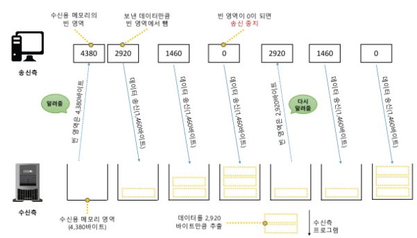
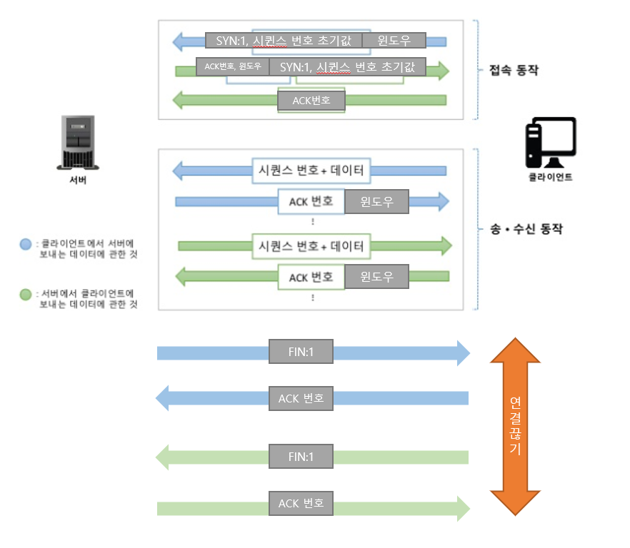
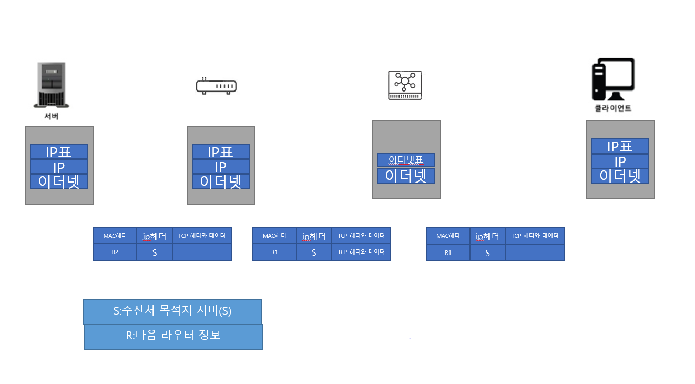
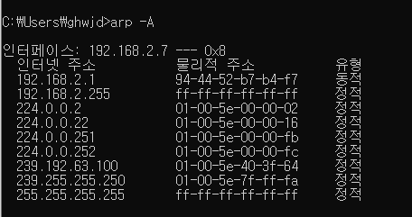
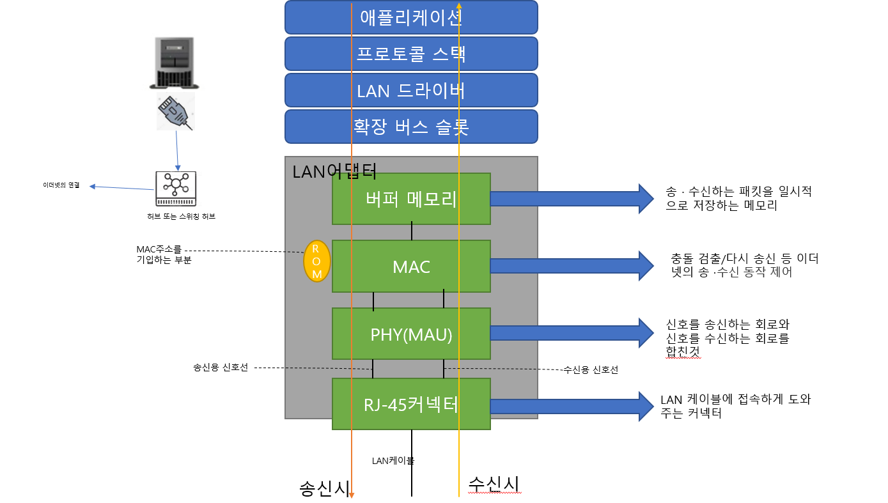

# Chapter02 TCP/IP의 데이터를 전기 신호로 만들어 보낸다.

[TOC]

## STORY 01 소켓을 작성한다.

 

> 프로토콜 스택의 내부 구성

- 프로토콜 스택이란 운영체제에 내장되어 있는 네트워크 제어용 SW 입니다.

- 운영체제 계층의 TCP 또는 UDP 프로토콜을 사용하여 데이터 송·수신을 합니다.

  보통, TCP는 브라우저 메일 등의 일반적인 애플리케이션의 데이터 송·수신할 경우 많이 쓰입니다.

   UDP는 조회 같은 짧은 제어용 데이터를 송·수신할 경우에 사용됩니다.

- IP 프로토콜은 **패킷 송·수신 동작을 제어**하는데 사용하는 프로토콜 입니다.

  ICMP는 패킷을 운반할 때, **발생하는 오류 및 제어용 메시지**를 통지할 때 사용됩니다.

  ARP는 IP 주소에 대응되는 이더넷의 **MAC 주소**를 알아볼 때 사용됩니다.

- LAN 드라이버는 LAN 어댑터의 하드웨어를 제어합니다.

- LAN 어댑터는 케이블에 데이터를 송·수신을 담당합니다.


> 소켓(통신 제어 정보)

- 프로토콜 스택은 데이터의 송·수신 및 제어 하기 위한 정보를 소켓에 저장 합니다.

  대표적인 정보로는

  - 상대의 IP 주소
  - PORT 번호
  - 통신 동작의 진행 상태

  위 와 같은 정보를 저장하고 그 외 부가적인 정보도 소켓에 저장되어 있습니다.

- 프로토콜 스택은 제어정보를 참조하면서 동작합니다.

  ex)

  1. 데이터 송신 시 소켓의 IP와 PORT 번호를 보고 데이터를 송신합니다.

  2. 데이터를 송신 한 후 일정시간 동안 응답이 오지 않으면 송신 동작을 재 실행합니다.

     이때, 송신 후, 어느 정도 시간이 지난지를 소켓에 저장해놓고 재전송을 결정합니다.


>socket 함수를 호출했을 때의 동작


- 브라우저가 socket, connect 함수를 호출하였을때 프로토콜 스택의 움직임은 다음과 같다.

  - **socket함수**를 통**해 소켓 생성을 의뢰하**면 프로토콜 스택은 하나의 **소켓을 메모리에 생성** 합니다.

    소켓의 처음 생성하는 작업은 차후에 제어 정보를 저장할 그릇을 만드는 과정 입니다. 때문에, 초기에 

    아무 정보가 없어서 쓰임이 없더라도 미래에 쓰임을 위해 준비하는 단계 입니다.

    소켓이 만들어지고 소켓을 식별하는 **디스크립터 번호**를  애플리케이션에게 알려줍니다.


## STORY 02 서버에 접속한다.

> 접속(준비)의 의미

1. 애플리케이션 계층에서, 서버의 IP주소나 PORT 번호를 프로토콜 스택에 알리는 동작을 의미한다.

2. 서버는 클라이언트가 접속할 때까지 상대측의 IP주소와 PORT 번호를 알 수 없다. 때문에, 클라이언트가 서버측에게 통신 동작의 개시를 전달하는것도 접속의 의미이다.

3. 통신 상대와 송·수신 제어정보(IP, PORT번호 등)를 주고 받고 해당 정보를 소켓에 저장한다. 

4. 데이터를 송·수신  동작을 할때 데이터를 일시적으로 저장하는 버퍼 메모리가 필요하다. 이 메모리 확보하는 동작도 접속의 의미이다.


>제어 정보

제어정보 종류(제어정보는 접속 동작, 데이터 송·수신, 연결 끊기 모든 동작에 필요한 정보 입니다.)

- 헤더에 기록되는 정보

- 소켓(프로토콜 스택의 메모리 영역)에 기록되는 정보


  

  ​                                                                  <TCP 헤더>

cf)이더넷헤더(=MAC헤더)


**(a) 데이터를 저장한 패킷**


**(b) 제어 정보만 있는 패킷**

접속 동작에서는 아직 데이터 송·수신이 없기 때문에 패킷에 데이터 부분이 없다.


>접속 동작

**STEP01**

connect(디스크립터, 서버측 IP 주소와 port 번호,...) 호출(socket라이브러리=>프로토콜 스택의 TCP 담당부분)

**STEP02**

**클라이언트 측,** 프로토콜 스택의 TCP 담당 부분은 **서버 측,** 프로토콜 스택의 TCP 담당 부분과 제어 정보를 주고 받습니다.

<STEP02의 단계>

​    <CLIENT>

1. 데이터 송·수신 동작의 시작을 나타내는 **제어 정보를 기록한 헤더**를 만듭니다.

   이때 제어정보는 다양한 항목이 있지만, 이 단계의 핵심은 **클라이언트**와 **서버**의 **포트번호** 입니다.

   이를 통해, 클라이언트의 소켓과 서버의 소켓을 지정할 수 있습니다. 더불어, **컨트롤 비트 SYN**이라는 비트를 1로 만듭니다.(그 외에도, 시퀸스 번호와 윈도우에 적정 값을 설정합니다.)

   **=>TCP 헤더 만들기, 클라이언트와 서버의 각각의 소켓 지정하기**

2. IP 계층에 TCP 헤더 송신 의뢰하기(접속 단계 이기 때문에 패킷에 헤더만 있음)

3. 네트워크를 거쳐 서버의 IP 계층 까지 전송되면 이것을 서버의 TCP 계층에 전달 합니다.

   <SERVER>

4. 서버측 TCP 계층은 헤더 정보를 분석하면 **송신측(클라이언트) 포트 번호** **수신측(서버측) 포트 번호** 등의 제어 정보를 추출할 수 있습니다. 알아낸 정보를 통해서 수신측 포트 번호에 해당되는 소켓을 찾고 그 소켓에 제어 정보를 저장합니다. 더불어 서버는 **접속 진행중** 이라는 상태(6장에서 그 의미 설명)가 됩니다.

5. 서버측 역시, 제어 정보를 기록한 헤더(송신처·수신처 포트번호 , 컨트롤 비트 SYN, ACK 1로 설정 등)를 만듭니다.

   ```
   Sequence number (32 비트)
   SYN 플래그가 (1)로 설정된 경우, 이것은 초기 시퀀스 번호가 된다. 실제 데이터의 최초 바이트 값과 그에 상응하는 ACK 번호는 이 값에 1을 더한 값이 된다.(초기 시퀸스 번호 전달해주는 역할)
   SYN 플래그가 (0)으로 해제된 경우, 이것은 현재 세션의 이 세그먼트 데이터의 최초 바이트 값의 누적 시퀀스 번호이다.
   
   ```

6. 서버측 IP 계층에 TCP 헤더 송신 의뢰하기


 <CLIENT>

7. 클라이언트 IP 담당 부분을 경유하여 TCP 계층에 도착합니다.

8. TCP 헤더를 조사하여 서버측의 접속 동작이 성공했는지 여부를 조사합니다.

   조사 방법은 SYN 비트가 1이면 접속 성공을 의미 합니다.  그 이후 클라이언트 해당 소켓에 제어정보(포트번호, 서버 IP 주소, 접속 완료 정보 등)을 저장합니다.

9. 끝으로, 서버가 응답을 받을 것을 알릴때 ACK 비트를 1로 만들어서 보낸것 처럼 클라이언트는 ACK번호를 1로 만든 TCP 헤더를 반송합니다. 


=>STEP02의 절차가 끝나면, close 호출을 할 때 동안 해당 수신측과 송신측은 연결을 유지 합니다.

​     이러한 작업 거친후 상태를 소켓이 연결된 상태  **커넥션(세션)**이 이루어 졌다고 말합니다.


## STORY 03 데이터 송·수신 한다.

> Application에서 만든 HTTP 메시지를 프로토콜 스택에게(http messate=>protol stack)

현재 이 챕터에서 설명하는 동작은 **접속(connect)**이 이루어진 이후의 상태입니다.


어플리케이션 측에서, socket library **write 함수**를  통해 Http 메시지를 프로토콜 스택에 전달 합니다. 이때,

프로토콜 스택은 전달 받은 데이터를 바로 서버에 송신하지 않고 자체적으로 송신영 버퍼 메모리 영역에 저장합니다. 그 이유는 다음과 같습니다.

- 어플리케이션에서 프로토콜 스택에 건네주는 데이터의 길이는 어플리케이션의 종류나 방법에 따라 다릅니다.

  예를 들어, 어떤 어플리케이션은 한 번에 데이터를 보내고 반면, 다른 어플리케이션은 1바이트씩 또는 1행씩 데이터를 보냅니다. 이때, 받은 즉시 데이터를 보내게 되면 작은 패킷을 많이 보낼 수 있지만 **네트워크의 이용 효율**이 저하됩니다. 때문에 어느 정도 저장한 후 송신 합니다.

- 이때, 어느 정도 데이터가 쌓이면 보낼지에 대해서는 OS에 따라 다릅니다. 보통 다음과 같은 요소로 판단합니다.

  1. MTU의 MSS로 판단

     프로토콜 스택의 **MTU**(한 패킷에 저장할 수 있는 데이터 크기==패킷 한 개로 운반할  수 있는 디지털 데이터의 최대 길이)로 판단

     cf)

     MSS(MTU에서 헤더를 제외하고 한 개의 패킷으로 운반할 수 있는 TCP의 데이터의 최대 길이)

     ​    

     

     ​                                                              **MTU:Maximum Transmission Unit**

     ​                                                                  **MSS:Maximum Segment Size(Tcp Maximum Segment size)**

  2. 타이밍으로 판단

     MSS에 가깝게 데이터를 저장할 때까지 기다리면, 송신 데이터 시간이 지연 됩니다. 프로토콜 스택은 내부에 타이머가 있어서 이것으로 일정 시간(밀리 초)이 지나면 송신 버퍼의 데이터를 송신합니다.


  앞서 말한 것처럼 이것은 OS 종류나 버전에 따라 달라집니다.

  만약, 

  전자가 중요한 경우(데이터 크기 중시)

  - 장점:네트워크 이용 효율이 높다.

  - 단점:버퍼에 머무는 시간 만큼 송신 동작 지연


  후자가 중요한 경우(전송 지연 줄이기 중시)

  - 장점:네트워크 지연이 작아짐
  - 단점:네트워의 이용 효율이 낮음


  cf)

  어플리케이션에서 데이터를 전송할 때, 버퍼에 저장하지 않고 전송이라는 옵션을 줄 수 있음

  이러면 버퍼에 쌓지 않고 바로 전송함


  > 데이터가 클 때는 분할해서 보낸다

  보통, HTTP 메시지의 경우에 그렇게 데이터의 길이가 길지 않습니다. 그러나 form 태그를 사용하는 경우 데이터 양이 급증합니다.(블로그, 게시판의 긴 글 작성)


  이 경우, 송신 버퍼에 저장되는 데이터가 MSS의 길이를 초과 하므로 다음 데이터가 올 때까지 기다리지 않고 바로 데이터를 전송 합니다.

  1. 데이터를 맨 앞에서 부터 MSS 크기에 맞게 분할
  2. 분할된 데이터 조각에 헤더를 부가해서 전송됨


  

  ​        

> ACK 번호를 사용하여 패킷이 도착했는지 확인

TCP 는 신뢰성 있는 전송을 하기 때문에, 보낸 패킷이 서버에 잘 도착했는지 확인하고 전송이 되지 않으면 재전송하는 기능이 있습니다. (TCP는 데이터 송신후 바로 확인 동작)

데이터가 잘 도착했는지 확인하는 방법

- 시퀸스 번호
- 데이터 크기

```
Tcp계층에서 데이터를 조각낼 때, 몇 번째 바이트에 해당되는지 TCP 헤더에 기록합니다.
이것이 바로 시퀸스 번호 입니다. 서버측에서는 전달받은 데이터의 TCP헤더에서 시퀸스 번호를
알아냅니다. 그 후, 데이터 전체 크기 - TCP 헤더 = 데이터의 크기를 알아올 수 있습니다.
시퀸스 번호 + 데이터 크기가 바로, 다음에 수신 받을 시퀸스 번호입니다.
```

실제로는 시퀸스 번호는 1부터 시작하지 않고 난수로 시작합니다. 그 이유는 데이터의 시작이 1이라는 것을 알면 해커로 부터 악의적인 공격이 들어올 수 있기 때문에 시퀸스 번호의 시작은 난수를 바탕으로 산출됩니다.

그러나 이렇게 되면 서버측에서 시퀸스의 시작번호를 모르게 됩니다. 때문에, 우리는 이전 접속 단계에서 송신측은 

초기 시퀸스 번호를 서버에게 알려줍니다.


정리해보자면, **수신 측**은 데이터의 누락이 없는 것을 확인하면 이전에 수신한 데이터와 합쳐서 데이터를 몇 번째 바이트 까지 수신한 것인지 계산하고, 그 값을 TCP 헤더의 **ACK번호** 에 기록하여 **송신 측**에 알려줍니다.

cf)

ACK(수신 확인 응답)//송신 측은 ACK를 통해 수신측이 어디까지 데이터를 받았는지 알 수 있다.

(ACK번호를 통지할때 단순히 ACK 번호 값 설정 뿐만 아니라 제어 비트의 ACK 비트로 1로 설정함 ACK 비트 1로 설정의 의미는 ACK번호 필드가 유효하다는것을 나타냄)


지금까지 설명한 내용은, 클라이언트에서 서버에 데이터를 보내는 과정을 설명한 것 입니다. 그러나, TCP의 데이터의 흐름은 (송·수신) 양방향이기 때문에 클라이언트->서버 또는 서버->클라이언트라는 2가지 흐림이 있습니다.

웹의 경우 클라이언트가 서버에게 우선 데이터를 보내기때문에 다음과 같은 움직을 나타냅니다.

<접속단계>

1. 클라이언트는 시퀸스 번호의 초기값을 서버에게 전송합니다.
2. 서버는 전달받은 시퀸스 번호의 초기값을 통해 ACK 값을 구하고 ACK값과 더불어 서버측의 시퀸스 번호 초기값을 전송합니다.(ACK를 보내는 이유는 잘 받았는지를 송신 측에서 알게 하기 위해서 입니다.)
3. 클라이언트도 마찬가지로 서버측의 시퀸스 번호로 부터 ACK 값을 구하고 이에 대한 ACK를 보냅니다.


<송·수신 동작>

위에서 설명한 동작과 동일합니다.


TCP는 이러한 방식으로 통신합니다. TCP는 데이터를 보낼때 상대 측에서 받았다는 확인 메시지가 올때까지 송신한 패킷을 송신용 버퍼메모리에 저장 합니다. 만약 수신 측에서 ACK를 보내지 않으면 패킷을 다시 재전송 합니다.

이러한 구조를 따르면, 네트워크에 어디에서 오류가 발생하더라도 전부 검출하여 회복처리(패킷을 다시 보내는것)할 수 있습니다. 때문에, LAN 어댑터, 버퍼, 라우터 모두 회복 조치를 하지 않습니다. 그러나 TCP가 재전송을 아무리 해도 패킷이 전송되지 않는 경우가 있습니다. 케이블이 분리되거나 서버가 다운되는 등의 이유 입니다. 이때, TCP는 몇 번 재전송 후에 회복 전망이 없으면 데이터 송신 동작을 강제로 종료하고 애플리케이션에 오류를 통지합니다.


> Timeout 시간 조절

**Timeout** 값이란 ACK 번호가 돌아오는 것을 기다리는 시간을 의미합니다.

네트워크가 혼잡인 상태에서 ACK 번호가 돌아오는 시간이 지연됩니다. 

그렇기 때문에 송신 측에서는 Timeout 값 시간을 어떻게 설정한지에 대한 이슈가 발생합니다.

만약, 

**Timeout 시간이 짧은 경우**

ACK번호가 돌아오기 전에 다시 재전송 하는 문제가 발생합니다. 또한 재전송을 하면서네트워크가 혼잡인 상태를 더욱더 혼잡하게 만들 수 있습니다. 


**Timeout 시간이 긴 경우**

패킷을 너무 늦게 보내어 데이터를 보내는 속도가 느려지게 된다.(유저 입장에서는 원할한 소통 안됨, 답답함)


때문에, 대기시간은 너무 짧지도 길지도 않는 적절한 값을 설정해야 한다.

TCP는 이러한 이유로 **대기 시간을 동적**으로 변경합니다.

- ACK가 돌아오는 시간을 기준으로 대기 시간 판별
- 데이터 송신 동작을 할때, 항상 ACK번호가 돌아오는 시간을 계산 

​        만약, ACK가 돌아오는 시간이 지연되면 이것에 대응되는 시간을 늘림 반대로 ACK가 돌아오는 시간이 빠르면

​         대기시간을 줄임


> 윈도우 제어 방식(효율적인 ACK번호 관리)

패킷을 보내는 방식

<Ping Pong 방식>

한 개의 패킷을 보내고 ACK 번호를 기다렸다가 ACK번호가 오면 다음 패킷을 보내는 방식 입니다.

그러나, ACK번호가 돌아올 때 까지 기다리는것은 시간 낭비 입니다.


<Window 제어방식>

한 개의 패킷을 보낸 후 ACK 번호를 기다리지 않고 차례대로 연속해서 복수의 패킷을 보내는 방법 입니다.

그러면 ACK 번호가 돌아올때까지 기다리지 않으므로 시간 낭비를 줄일 수 있습니다.  그렇다면 window 제어 방식의 문제점은 무엇일까? 바로 ACK번호를 기다리 않고 차례로 패킷을 보내면 수신측의 능력을 초과하여 패킷을 보내는 경우가 발생합니다. 

구체적으로 상황을 설명 하자면

- 수신측 TCP는 패킷을 수신하면 일단 수신용 버퍼 메모리에 데이터를 임시 보관 합니다.

- TCP는 다음 ACK번호를 계산하거나 데이터의 조각을 연결하여 원래 데이터를 복원한 후에 애플리케이션에 수신 확인 응답메시지를 보냅니다.

- 그러나, 수신측의 처리가 끝나지 않은 상황에서 다음 패킷이 도착해도 문제가 없도록 수신 버퍼에 데이터를 쌓아놓는데 애플리케이션이 버퍼의 용량을 무시한채 계속 패킷을 보내게 되면 버퍼 오버플로우가 발생합니다.

  넘친 데이터는 없어져버리므로, 패킷이 도착해도 오류가 발생한 것처럼 동작하게 됩니다.

- 때문에, 수신 측에서 송신측에 수신 가능한 데이터 양을 통지하고, 수신측은 이 양을 초과하지 않도록 송신 동작을 실행합니다. 이것이 Window 제어 방식 입니다.

- 송신측은 TCP헤더의 윈도의 필드에 빈 버퍼의 크기를 알립니다.

- 수신가능한 데이터 양의 최대값을 **윈도우 사이즈**라함




위의 그림에서는 수신측의 버퍼가 꽉 찰때까지 수신측의 처리가 이루어 지지 않는 것처럼 보이지만 실제로는 그렇게 동작하지 않습니다. (그림은 수신측의 처리 속도가 느리고 버퍼에 패킷이 꽉 찼는데도 아직 최초의 수신 처리가 끝나지 않는 상황을 가정한것임) 

실제로는 시퀸스 번호와 ACK 번호가 양방향 대화가 이루어짐


>ACK번호와 Window Size

송신과 수신 동작의 효율성을 높이기 위해서는 ACK번호와 Window 크기를 통지하는 타이밍을 고려해야 합니다.

우선 

<window 크기를 통지하는 경우>

- 수신용 버퍼 메모리 영역을 처리한후 수신측 애플리케이션에 건네 주었을때  송신측에 알려 다음 패킷을 보낼 수 있도록 통지해야 합니다.


<Ack 번호를 통지하는 경우>

- 수신측이 데이터를 수신한 후 즉시 보냄


=> 이 둘을 따로 따로 보내면 수신측에서 송신측에 보내는 패킷이 많아 효율성이 떨어집니다.

​      (네트워크는 한 번에 많은 정보를 보내는게 효율적 )


위와 같은 이유로 이러한 동작방식을 취합니다.

- ACK 번호와 윈도우를 통지할 때 바로 보내지 않고 일정 시간 기다린 후에 ACK 번호와 윈도우를 한 개의 패킷으로 묶어서 보냅니다.(패킷의 수를 줄임)

cf)

데이터 패킷이 여러개 올때 다음 ACK 번호는 최종으로 받은 것만 통지하면 된다.


## STORY 04 서버에서 연결을 끊어 소켓을 말소한다.

> 송·수신 동작 완료후 연결 끊기

이 단계는, 송신측과 수신측의 데이터 송·수신이 완려된 이후에 프로토콜 스택의 움직임에 대하여 소개하겠습니다.


송·수신 동작의 완료란, 웹의 경우 브라우저에서 웹 서버의 request 메시지를 보내고 서버가 이것에 응답하여 response 메시지를 보낸 상태를 의미합니다.

(이 경우는 HTTP1.0프로토콜을 의미, HTTP1.1에서부터는 서버가 응답 메시지를 보낸 후 계속 클라이언트가 다음 리퀘스트 메시지를 보낼 수 있도록 되어 있음. 이때, 리퀘스트 메시지를 보내지 않을 때 클라이언트 측에서 먼저 연결 끊기에 들어갈 수 있습니다.)


이후 부터 설명은 데이터 송·수신 완료 후 **서버측에서 먼저 연결 끊기 단계**에 들어간다고 설명하겠습니다.


<server>

1. close(소켓 라이브러리)함수 호출//server application계층에서 호출
2. 프로토콜 스택의 TCP 계층에서 TCP헤더에 FIN비트 1로 설정하고 IP 계층에 다음 작업 의뢰와 서버측의 소켓에 연결 끊기 동작이 들어 갔음을 기록


<client>

1. 컨트롤 비트 FIN 비트가 1인 TCP 헤더가 도착하면 클라이언트 소켓에 연결 끊기 동작에 들어갔다는것을 기록합니다.

2. 더불어, FIN 비트를 받았다는 사실을 알리기 위해 서버에게 ACK번호를 서버에게 보냅니다.

3. 클라이언트의 애플리케이션이 read를 호출하여 데이터를 가지고 옵니다.

   (그 이유는, 서버에서 보낸 FIN 비트가 1인 패킷이 오기 전에  서버로부터 데이터를 요청하는 패킷에 대한 응답이 아직 오지 않았을 경우 그 데이터를 모두 취해야하기 때문입니다.)

4. 그 이후 프로토콜 스택은 서버에서 보낸 데이터를 수신했다는 사실을 브라우저에게 알립니다.

5. close(소켓 라이브러리)함수 호출//client application계층에서 호출

6. 프로토콜 스택의 TCP 계층에서 TCP헤더에 FIN비트 1로 설정하고 IP 계층에 다음 작업 의뢰와 클라이언트의 소켓에 연결 끊기 동작이 들어 갔음을 기록

7. 서버에서 ACK 메시지가 오면 끝


> 소켓 말소

서버에서 데이터를 받자마자 바로 말소하지않는 이유는 다음과 같습니다.

우선, 클라이언트에서 먼저 연결을 끊는 상황을 생각해봅시다.

1. 클라이언트가 FIN 송신
2. 서버가 ACK 번호 송신
3. 서버가 FIN 송신
4. 클라이언트가 ACK 번호 송신


이 때 4번 과정의 클라이언트의 ACK 번호가 소실된 상황을 가정해보자

그러면 서버는 다시 FIN 송신을 합니다. 그러나 클라이언트가 소켓이 만료(제어정보가 모두 제거된 상태)되어 있는 상태에서 클라이언트 애플리케이션에서 새로운 소켓을 작성하여 새 소켓과 만료된 소켓의 포트가 같다고 가정해 봅시다. FIN 송신을 받은 새로운 클라이언트는 바로 연결 종료 동작을 실행합니다. 이러한 오작동 때문에 소켓을 즉시 말소하지 않고 잠시 기다리게 됩니다.




## STORY 05 IP와 이더넷의 패킷  송·수신 동작

> 패킷의 기본

이 장에서는, 프로토콜 스택의 IP 담당 부분에서 패킷을 어떻게 송신하는지에 대하여 설명하겠습니다.

패킷은 기본적으로 헤더와 데이터로 구성되어 있습니다.


**| IP헤더 | TCP 헤더 | 데이터 조각** (IP의 패킷)

**|MAC헤더 | IP헤더 | TCP 헤더 | 데이터 조각** (이더넷의 패킷)


보통 패킷이 전송되는 과정은 다음과 같습니다.

1. 송신처에서 패킷을 만듭니다.

2. 가장 가까운 중계 장치에 패킷을 보냅니다.

3. 패킷의 헤더 기록되어 잇는 수신처와 중계 장치의 기록표를 대조하여 다음 중계장치를

   찾고 그곳에 패킷을 전송합니다.

4. 이와 같은 절차를 반복하면 수신처에 패킷이 도착하게 됩니다.

cf)

송신처와 수신처 기기는 송신처가 될 수 있고 수신처가 될 수 있으므로 **엔드 노드**라고 부릅니다.


패킷은 허브와 라우터를 통계 전송 됩니다.

**라우터**

- 라우터는 전달 받은 packet과 라우팅 경로표를 사용하여 다음 라우터를 찾습니다.(찾기만 전송의 허브)

- IP를 통해 다음 중계 장치를 찾습니다. 


**허브**

- 서브넷 안에 패킷을 운반하여 다음 라우터에 전송 합니다. 




위 그림은 TCP/IP 네트워크에서 패킷을 목적지까지 전달하는 전체 모습 입니다. 이더넷의 부분을 무선 LAN, ADSL, FTTH 등 IP의뢰를 받아 패킷을 운반할 수 있는 것이면 무엇이던지 이더넷 대신 사용할 수 있습니다. 


> 패킷 송·수신의 동작

프로토콜 스택의 IP는 상대 측에게 송출만 하는 역할만 합니다. 실제로 패킷을 운반하는 것은 허브나 라우터 같은 네트워크 기기가 담당 합니다. 그렇지만, 송출하기 위한 일정한 단계를 거치는데 그 움직임에 대하여 설명하겠습니다.


우선, IP 부분은 TCP 헤더로 부터 송신 의뢰를 받으면 두 개의 헤더를 덧 붙입니다.

- MAC 헤더(이더넷용 헤더, MAC 주소를 씁니다.)

  ```
  이더넷 등의 LAN을 사용하여 가장 가까운 라우터까지 패킷을 운반할 때 사용하는 제어 정보를 기록한 것 입니다.
  ```


- IP 헤더(IP용 헤더, IP주소를 씁니다.)

  ```
  IP 프토토콜에 규정된 규칙에 따라 ip 주소가 표시된 목적지까지 패킷을 전달할 때 사용하는 제어 정보를 기록한것 입니다.
  ```


IP 계층은 두 개의 헤더를 붙은 패킷을 네트워크용 하드웨어(이더넷 또는 무선LAN)에게 전송합니다. 

LAN 어댑터에 건내줄 때의 패킷의 모습은 2진 디지털 데이터 입니다.  LAN 어댑터에 의해 전기나 빛의 

신호 상태로 바뀌어 케이블에 송출 됩니다. 송출된 신호는 허브나 라우터 중계 장치를 거쳐거쳐 목적지에 

도착하게 됩니다.

=>네트워크용 하드웨어를 부르는 호칭이 다양하니 LAN 어댑터라고 통칭


> IP헤더


IP헤더의 헥심은 Source IP Address와 Destination IP Address 입니다.

<Source IP Address>

- 이 ip주소는 어플리케이션 계층에서 알려준 IP 주소 입니다.
- 이 IP가 유효한지 유효하지 않는지는 IP 계층에서 판별할 수 없습니다.

```
TCP 접속 동작에서 최초로 SYN 비트를 1로 설정한 패킷을 보낼 때 만약 문제가 없으면 ip 주소가 유효한 것 입니다. 즉, TCP 접속 동작이 끝났으면 IP가 문제가 되는 상황은 일어나지 않습니다.
```


<Destination IP Address>

- ip 주소는 pc에 할당된 것이 아니라 LAN 어댑터에 할당된 것 입니다.
- 한 PC에 복수의 LAN 어댑터가 있을 때 각기 다른 IP를 가지게 됩니다.
- 따라서 Destination IP Address 설정은 어떤 LAN 어댑터를 사용할지 판단하게 해줍니다.


다음 패킷을 보내는 대상을 찾는 과정

http://reboot.co.kr/13.html


> MAC 헤더

이더넷은 TCP/IP 개념이 통용되지 않습니다. 이더넷은 TCP/IP와 다른 구조로 패킷의 수신처를 판단합니다. 

이더넷의 수신처 판단 구조로 사용하는것이 MAC 헤더 입니다.

<이더넷 헤더>

**수신처 MAC 주소(6Byte)**

```
LAN에서 패킷 배송은 이 주소를 바탕으로 수행됨
```

**송신처 MAC 주소(6Byte)**

```
송신처의 LAN 어댑터의 MAC 주소를 설정한다.
```

**이더 타입(2Byte)**

```
사용하는 프로토콜 종류를 나타냅니다.
IPV6, IP프로토콜
ARP 프로토콜, 0800등
```


cf)

**송신처의 MAC 주소**는 LAN 어댑터를 제조할 때 그 안에 있는 ROM에 기록되므로 여기에 기록되어 있는 값을 읽어와서 MAC 헤더로 설정


**수신처의 MAC 주소**는 아래의 방식을 따릅니다.


> ARP로 수신처의 MAC주소를 알아낸다.

이더넷에는 연결되어 있는 기기 전체에게 패킷을 전달하는 브로트캐스트 구조가 있습니다. 이를 통하여 

xxxx.xxxx.xxxx.xxxx ip를 가진 요소가 있는 기기는 그 IP에 해당되는 MAC 주소를 알려줍니다.


정리하자면 수신처의 MAC 주소를 알아오기 위해서는 ARP 프로토콜을 사용합니다.

그러나 패킷을 보낼때마다 이 동작을 하면 비효율적이기 때문에 ARP 캐시라는 메모리 영역에 보존합니다.

아래와 같은 절차를 따릅니다.

1. ARP 캐시 메모리에 IP에 해당하는 MAC 주소 있어?
2. 있으면 주고 없으면 ARP함


cf)

ARP 캐시 내용이 시간에 따라서 유효하지 않을 수 있기 때문에 매 분마다 보통 ARP캐시 내용을 초기화 합니다.




cf)

프로토콜 스택의 IP 담당 부분은 IP헤더와 MAC헤더를 만드는 일을 담당합니다.


> 이더넷의 기본

이더넷이란, 다수의 컴퓨터가 여러 상대와 자유롭게 적은 비용으로 통신하기 위해 고안된 통신 기술 입니다.

<이더넷의 성질>

- 수신처 MAC 주소에 해당하는 기기에게 패킷이 전송됨
- 송신처 MAC 주소는  송신처 기기를 나타냄
- 이더 타입은 패킷의 내용물을 어떤것인지를 나타냄

cf)

무선 LAN도 이와같은 성질을 가지고 있음 그러나 무선 lan은 이더 타입이 없지만 같은 역할을 가진 정보가 있기 때문에 이더넷 대신 무선 LAN을 사용할 수 있음


> IP 패킷을 전기나 빛의 신호로 변환하여 송신

IP 보낸 패킷은 디지털 데이터이기 때문에 이것을 그대로 상대에게 보낼 수 없습니다. 그래서 디지털 데이터를 전기나 빛의 신호로 변환하여 네트워크 케이블에 송출 합니다. 이제 그 과정에 대해서 설명하겠습니다.

이 동작을 실행하는 것이 바로 **LAN 어댑터** 입니다. LAN 어댑터는 단독으로 동작하지 못하고 LAN 드라이버를 통해 동작하게 됩니다.



cf)

LAN 어댑터 초기화 동작

- LAN 어댑터를 사용하기 위해서는 초기화 작업이 필요하다.

  (전원공급시 OS를 동작 시킬 때 LAN 드라이버가 하드웨어 초기화 작업 수행)

- 이더넷의 송·수신 동작을 제어하는 MAC라는 회로에 MAC 주소 설정

- LAN 어댑터의 ROM에는 전 세계에서 중복되지 않도록 일원화 되어 관리되는 MAC 주소가 제조할 때 기록되어 있습니다.

- LAN 어댑터에 기록된 MAC 주소는 LAN 드라이버가 MAC 회로에 설정 합니다.


> 패킷에 3개의 제어용 데이터를 추가한다.

이 상황은 패킷을 전기 신호로 변환하여 실제로 케이블에 송출하는 모습을 설명하겠습니다. 

1. IP 담당 부분에서 패킷을 받으면 그것을 LAN 어댑터의 버퍼 메모리에 복사 합니다.

2. 복사를 마친후 패킷을 보내도록 MAC 회로에 명령을 보내면 MAC 회로 작업이 시작 됩니다.

3. MAC 회로는 버퍼메모리에서 송신 패킷을 추출하고 데이터를 부가합니다.

   <맨 앞 부분>

   - Preamble(프리앰블)
   - Start Frame Delimiter (스타트 프레임 딜리미터)

   <맨 뒤 부분>

   - FCS(프레임 체크 시퀸스)//오류 검출용 데이터 

   

   

< LAN 어댑터에서 송출하는 패킷>//이더넷에서는 이 계층의 패킷을 프레임이라고 부른다.(같은 말이다.)

```
-프리앰블:송신하는 패킷을 읽을 때의 타이밍을 잡기 위해서 사용된다.(56비트==7Byte)
-스타트 프레임 딜리미터: 패킷의 시작에 대한 표시(8비트==1Byte)
-FCS:패킷 운반하는 도중에 잡은 드으이 여향으로 파형이 흐트러져 데이터가 변한 경우 이것을 검출하기 
     위해서 사용된다.(32비트==4Byte)
     
```


> 허브를 향해 패킷을 송신한다.

위에 부분에서, 케이블에 송출하는 패킷이 완성됩니다. 신호를 송신하는 동작을 설명하겠습니다.

이 중에서

- 리피터 허브를 사용했을 때의 반이중 모드

   ```
  반이중 모드:신호의 충돌을 피하기 위해 케이블에 다른 기기가 송신한 신호가 흐르고 있는지 조사하고, 신호가 흐르고 있으면 그것이 끝날 때까지 기다립니다. 신호가 흐르고 있을 때 송신 동작을 시작하면 신호가 충돌하기 때문입니다. 
  신호가 흐르고 있지 않은것을 확인하면 다음과 같은 절차로 동작 합니다.
  1.MAC회로가 프리앰블의 맨 앞부터 1비트씩 차례로 디지털 데이터를 전기신호로 변환 합니다.
  2.이것을 PHY 또는 MAU 송·수신 부분에 보냅니다.
     (이더넷의 신호 방식에 따라 MAU,PHY라고 불림)
     
  3.PHY(MAU)는 케이블에 송출하는 형식으로 변환하여 송신
    (이더넷은 케이블의 종류나 전송 속도에 따라 신호형식이 규정되어 있으므로 이에 따라 변환)
  //LAN어댑터의 MAC 회로가 공통 형식의 신호를 만들고 PHY(MAU)회로가 케이블에 송출하는 형식으로 변환하여 케이블에 송신함
  
  cf)//반이중 모드에서의 충돌
  신호를 송신하고 있는 사이에 수신 신호가 들어오지 않으면 되는데, 흘러들어는 경우가 있습니다.
  잘 일어나지 않지만 이러한 일이 발생하면 기기가 보낸 신호가 수신 신호선으로 흘러들어 옵니다.
  리피터 허브를 사용한 반이중 모드의 경우 서로의 신호가 섞여 충돌이 발생합니다. 
  이렇게 되면 송신을 계속해도 의미가 없으므로 송신 동작을 중지합니다. 그리고 충돌이 일어난 사실을 다른 기기에게 알리기 위한 재밍 신호를 잠시 동안 흘리고 나서 송신 동작을 멈추고 잠시 기달렸다가 다시 한 번 송신 동작을 수행 합니다.
  
  이때 대기시간은 MAC 주소를 바탕으로 난수를 통해 계산합니다.
  이더넷은 충돌이 발생할 때마다 대기 시간을 2배로 늘립니다. 열 번째까지 다시 보냈는데도 해결되지 않으면 오류로 판단합니다.
  ```

  

- 스위칭 허브를 사용한 전이중 모드

  ```
  3장에서 설명, 충돌이 일어나나지 않는다.
  ```

  

  

> 돌아온 패킷을 받는다.

이번에는 패킷을 수신하는 동작을 설명하겠습니다.

리피터 허브를 이용한 반이중 동작의 이더넷에서는 1대가 송신한 신호가 리피터 허브에 접속된 케이블 전부에게 흘러들어 갑니다.

1. 신호의 맨 앞에는 프리앰블이 있으므로 파형에서 타이밍을 계산하여 스타트 프레임 딜리미터가 나오면  그 다음 비트부터 디지털 데이터로 변환하여 동작을 개시 합니다.

2. PHY(MAU)회로에서 신호를 공통 형식으로 변환하여 MAC 회로에 보냅니다.

3. MAC 회로에서 신호를 맨 앞부터 차례대로 디지털 데이터로 변환하여 버퍼 메모리에 저장 합니다.

   - 저장 하기 전에, 패킷의 맨 앞부터 계산식을 적용하여 FCS 값을 계산하고 이를 패킷의 끝의 FCS와 값을 비교합니다. 둘이 값이 일치하지 않으면 정상이 아니므로 폐기합니다.

   - 정상 패킷이면, **MAC 헤더**의 수신처 MAC 주소를 조사하여 LAN 어댑터를 초기화할 때 설정한 자체의 MAC 주소와 비교한 후 이것이 자신에게 오는것인지 판단 합니다. 만약, 나에게 온 패킷이 아니면 이 패킷을 폐기합니다.

4. 이 모든 절차가 정상 패킷이면 버퍼 메모리에 저장하고 MAC 회로가 할 일이 끝나면 패킷을 수신한 사실을 컴퓨터 본체에 통지 합니다.   

5. 이 통지는 인터랍트라는 구조를 사용합니다. 

   ```
   LAN 어댑터가 패킷의 송 수신 동작을 실행하고 있는 사이에 컴퓨터 본체는 LAN 어댑터의 움직임을 감시하는 것이 아니라 다른 작업을 실행하고 있습니다. 또한, LAN 어댑터 측에서 알려주지 않으면 PC는 패킷이 도착함을 알 수 없습니다. LAN 드라이버도 PC에서 동작하는 프로그램이므로 패킷의 도착을 알지 못합니다. 오직 인터랍트를 통해 PC에게 알릴 수 잇습니다.
   
   인터랍트 절차는 다음과 같습니다.
   1. LAN 어댑터가 확장 버스 슬롯 부분에 있는 인터럽트 신호선에 신호를 보냅니다.
      (이 신호선은, 컴퓨터 본체의 인터럽트 컨트롤러 통해 cpu에 연결되어 있음)
      
   2. cpu는 인터랍트 신호를 받으면 os 내부의 인터럽트 처리용 프로그램을 실행합니다.   
   3. 이 때 LAN 드라이버가 호출되어 LAN어댑터를 제어하면서 송 수신 동작을 실행합니다.
   4. LAN 드라이버는 LAN 어댑터의 버퍼 메모리에서 수신한 패킷을 추출하고 해당 프로토콜 타입에 
      맞는 프로토콜 스택에 패킷을 건네줍니다.
   ```

​        


> 서버 응당 패킷을 IP에서 TCP로 넘긴다.

LAN 드라이버에서 MAC 헤더의 타입을 보고 0800(16진수) 이면 TCP/IP 프로토콜 이므로 TCP/IP 프로토콜 스택에 패킷을 전달 합니다.

**IP 담당부분은**

1. IP 헤더 부분부터 조사하여 형식에 문제가 없는지를 확인합니다.

2. 그 후 수신처의 IP 주소슬 조사합니다. 수신처 IP 주소와 LAN 어댑터의 할당된 IP 주소를 비교합니다.

   만약, 수신처 IP 주소가 자신이 주소와 다르면 오류가 발생한 것 입니다. 이 때 IP 담당 부분은 ICMP 라는 메시지를 사용하여 통신 상대에게 오류를 통지합니다. 

   ICMP는 다양한 메시지가 있습니다.

   

   

   cf)

 IP 프로토콜에는 Fragmentation(조각 나누기) 기능이 있습니다. 

예를 들어, 패킷을 운반하는 도중에 있는 **통신 회선**이나 **LAN** 중에는 짧은 패킷만 다룰 수 있는것이 있습니다. 

그니까 애네들은 짧은 패킷만 담당함

때문에, 송신측에서는 패킷을 짧게 하기 위해 하나의 **패킷**을 **여러 개로 분할** 하게 됩니다.  만약, 수신한 패킷이 분할 된 것이면 IP 담당 부분은 그것을 원래 패킷으로 되돌립니다. **분할된 패킷을 확인하는 방법**은 IP 헤더에 **플래그**라는 항목을 보면 알 수 있습니다. 만약 분할된 패킷이면, IP 담당 부분에 내부의 메모리에 저장 합니다. 그리고 IP 헤더에 있는 **ID 정보**에 같은 값을 가진 패킷이 도착하기를 기다립니다. 그 후 fragment offset(플래그 먼트 오프셋)    이라는 항목을 통하여 해당 패킷이 원래 패킷의 어느 위치에 있었는지를 알 수 있으므로 이를 통하여 reassembling(리어셈블링)과정을 통하여 패킷이 원래의 모습으로 돌아오게 됩니다.


3. IP 담당 부분이 끝이나면 패킷을 TCP 담당 부분에 전달합니다.


**TCP 담당부분은**

- IP헤더에 기록된 **수신처 IP주소**, **송신처 IP주소**, tcp 헤더에 기록된 **수신처** **포트번호** 및 **송신처** **포트번호**를  조사하여 해당 소켓을 찾습니다.
- 해당하는 소켓을 찾은 후 통신의 진행 상태에 따라 적절한 동작을 취합니다.
  - <애플리케이션의 데이터를 넣은 패킷이 있는 경우>
    - 수신 확인 패킷(ACK) 반송 후 데이터를 수신 버퍼에 저장하고 애플리케이션이 가지러 오기를 기다림
  - <접속이나 연결 끊기 단계의 제어용 응답 패킷>
    - 수신 확인 패킷(ACK) 반송 후 접속 및 연결 끊기 동작의 상황을 애플리케이션에게 통지