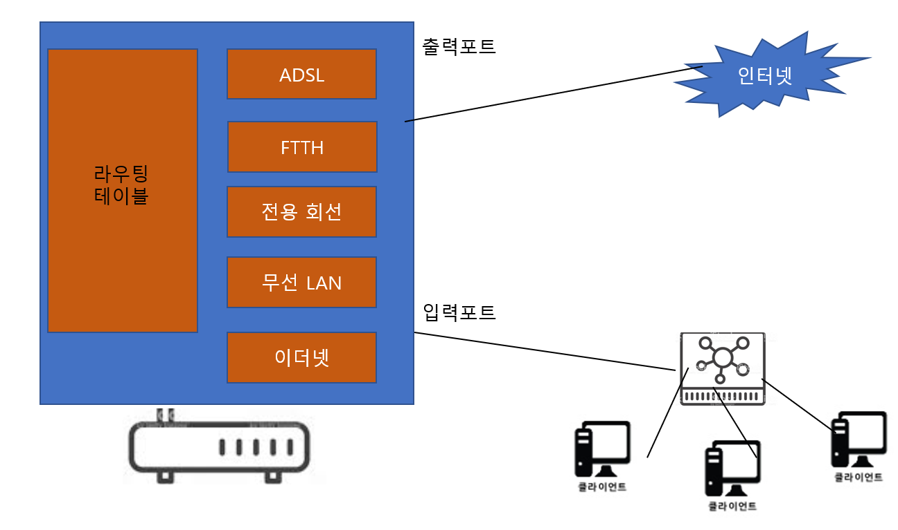
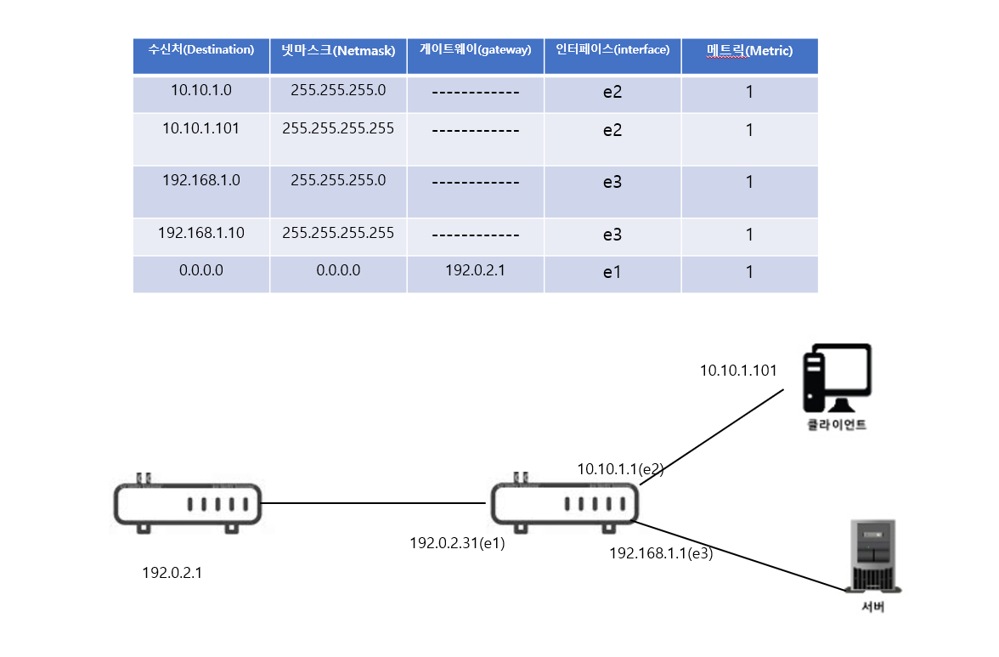
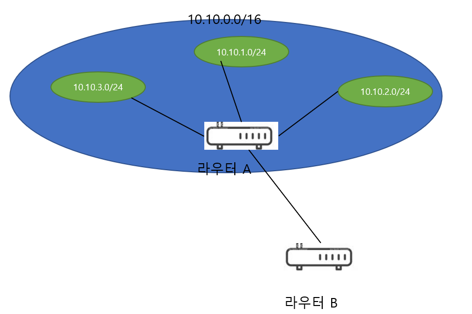
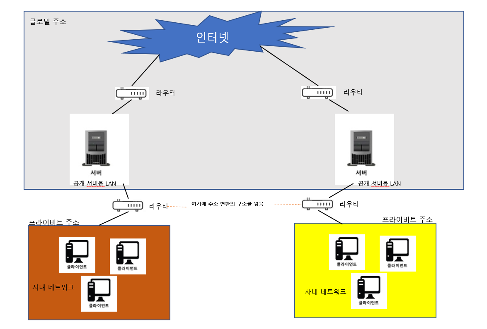
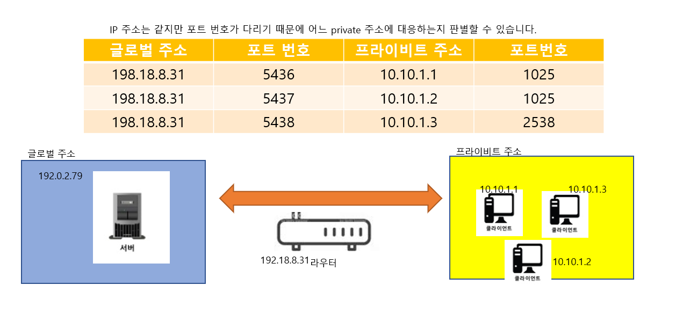
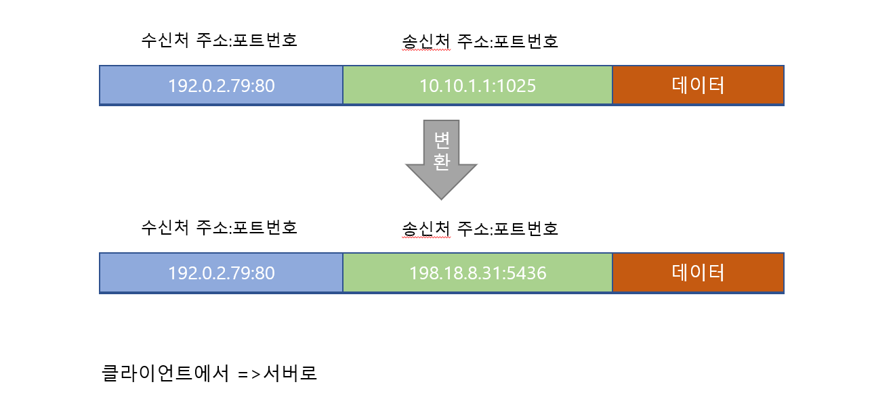
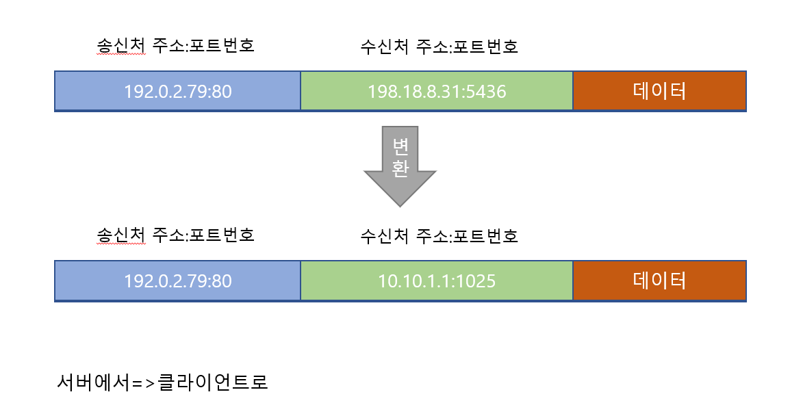

# Chapter03 케이블의 앞은 LAN 기기였다.

[TOC]

## STORY 01 케이블과 리피터 허브속에 신호가 흘러간다

> 중계 장치

이 장의 상황은 클라이언트의 LAN어댑터에서 패킷이 나가는 상황 입니다. 패킷은 허브, 라우터(중계장치)를 거쳐서 원하는 목적지에 패킷이 도착합니다.


cf)

보통, 리피터 허브 또는  스위칭 허브가 내장된 라우터를 사용 합니다. 그러나 단일 기능의 기기 하나 하나 살펴보며 설명하겠습니다.


> LAN 케이블의 신호

이 장의 상황은 클라이언트의 LAN어댑터에서 패킷이 나가는 상황 입니다.

(LAN 어댑터의 PHY(MAU) 회로에서 전기 신호로 형태를 바꾼 패킷이 RJ-45 커넥터를 통해 트위스트 페어 케이블에 흘러 들어가게 됩니다. 더불어, 이더넷의 신호는 +, -의 전압 입니다.)


- RJ-45커넥터에서 송출된 신호는 케이블을 통과하는 사이에 신호의 에너지가 조금씩 떨어집니다.

  (즉, 케이블의 길이가 길어질수록 신호가 약해 집니다.)

- 주파수가 높을 수록(송신측의 원래 신호에서 각진 부분은 주파수가 높음) 에너지가 떨어지는 성질 때문에 해당 부분이 뭉개짐

- 잡음이 없는 경우에도 신호가 변형되는데 잡음의 영향까지 더해지면 더욱 신호가 약해져 0과 1을 잘못 판독할  있게 되어 이것이 통신 오류의 원인이 됩니다.


> '꼼'을 통한 잡음 방지

우선, 잡음이 발생하는 원인은 다음과 같습니다.

- 신호선은 금속(도전체) 으로 만들어 졌다.

- 잡음의 원인은 케이블 주위에 발생하는 전자파 입니다.
- 금속 등의 도전체(전기가 통하기 쉬은 재료)  주위에 전자파가 있으면 신호(송·수신측이 보내는 신호)와는 다른 전류가 케이블안에 흐르게 됩니다.
- 신호도 전압에 의해 생기는 일종의 전류
- 신호와 잡음의 전류(전자파)가 뒤썩여서 신호의 파형이 변형 됩니다. 이것이 잡음 입니다.


**외부에서 오는 전자파**

- 모터, 형광등, CRT 모니터 같은 기기에서 누설되는 전자파

- 위와 같은 전자파는 케이블의 밖에서 오는 것 입니다.
- 트위스트 페어 케이블을 ''꼼"을 통해 해결할 수 있습니다.
- 신호선은 금속으로 만들어 졌고 전자파가 닿으면 전자파의 진행 방향의 오른쪽으로 전류가 생깁니다. 이 전류가 파형을 무너뜨리는 원인이 됩니다.
- 신호선을 마주 꼬면 나선형이 되어 꼰 옆의 선에서 전류가 흐르는 방향이 반대가 됩니다.
- 그 결과, 잡음에서 생긴 전류가 서로 상쇄되어 잡음에 의한 전류는 약해 집니다.


**내부에서 오는 전자파**

- 신호선 안에는 신호라는 전류가 흐르므로 전류에 의해 주위에 전자파가 생깁니다. 이것이 신호선에 대한 잡음이 됩니다. 이러한 잡음을 **크로스토크(crosstalk)**라 합니다.
- 이 잡음은 강한 것은 아니지만 거리가 가까우면 문제가 됩니다. 
- 전자파는 발생 근원에서 떨어지면 확산되어 약해지는데 한 개의 케이블 안에 있는 신호선은 거리가 가까우므로 전자파가 약해지기 전에 인접 신호선에 도달해 버립니다.
- 신호선에서 나오는 약간의 전자파가 주위의 신호선에 닿아 여기에서 전류를 발생시킴
- 이것도 신호선의 꼬는 간격을 미묘하게 변화시켜 해결할 수 있습니다.


> 리피터 허브는 연결되어 있는 전체 케이블에 신호를 송신한다.

신호가 리피터 허브에 도달하면 LAN 전체에 신호가 전달 됩니다. 

이것은 리피터 허브 이더넷의 기본원리(전체에 패킷의 신호를 뿌리고 mac 주소에 해당하는 기기만 패킷을 수신한다.)를 실현한 것입니다. (그림p198 참조)


리피터 회로의 기본 성질을 정리하자면,

- 신호를 그대로 뿌려주는 역할만 함 
- 잡음의 영향을 받은 신호도 그대로 흘려보냄
- 다음 기기(스위칭 허브, 라우터 서버 등)에 도착하여 FCS를 검사하는 곳에세 데이터가 변화가 판명된 패킷을 폐기 시킴


## STORY 02 스위칭 허브의 패킷 중계 동작

> 스위칭 허브는 주소 테이블로 패킷을 중계

스위칭 허브는 이더넷의 패킷을 그대로 목적지를 향해 전달 합니다.

<스위칭 허브의 동작>

**스위칭 허브에 리피터 허브가 접속된 경우**(현재는 이 방식 사용 안함,현재 방식 반이중 모드)

1. 스위칭 허브에 신호가 들어오면 PHY(MAU) 회로에서는 케이블의 흐르는 신호의 형식을 공통의 신호 형식으로 변환한 후에 MAC 회로로 전달한다.

2. MAC 회로에서 디지털 데이터로 변환한 후 패킷의 맨 긑에 있는 FCS를 대조하여 오류의 유무를 검사하고 오류가 발생하면 패킷을 버립니다.  오류가 발생하지 않으면 버퍼 메모리에 디지털 데이터를 저장합니다.

   (LAN 어댑터와 유사)

3. MAC 주소표를 통하여 수신한 패킷의 MAC 주소와 일치한 행을 찾고 해당 PORT 번호로 패킷을 전송해 줍니다.

   전송 전에 이더넷의 규칙을 적용하여 신호 송 수신 회로의 수신 부분에 신호가 흘러들어 오는지 아닌지 확인 합니다. 만약, 아무도 송신하지 않으면 디지털 데이터에서 신호로 변환하여 송신 합니다. 만약, 송신 동작 중에 다른 기기가 보낸 신호가 수신측에 들어오면 패킷이 충돌하므로 재밍 신호를 보낸 후 송신 동작을 중지하고 잠시 기다렸다가 패킷을 다시 전송합니다.

   


스위칭 허브 커넥터 안쪽에 있는 회로 부분을 **포트**라고 부릅니다.

- 스위칭 허브는 수신처 MAC 주소를 검사하지 않고 모든 패킷을 수신하여 버퍼 메모리에 저장합니다.
- LAN 어댑터는 MAC주소가 할당되어 있어서 수신한 패킷의 수신처 MAC 주소가 자신에게 해당하지 않는 경우에는 패킷을 폐기 합니다.
- 스위칭 허브의 포트에는 LAN어댑터와 달리 MAC 주소가 할당되어 있지 않습니다.

cf)

관리 기능 등을 수행하기 위해 프로세서를 내장한 스위칭 허브는 스위칭 허브와 컴퓨터가 들어 있어서 MAC과 IP주소가 할당되어 있습니다.

cf)

PC에 아래 같이 3가지 조건을 맞추면 스위칭 허브가 된다.

- 다수의 LAN 어댑터 장착
- 모든 패킷을 수신하는 특수한 동작 모드인 promiscuous mode(프로미스큐어스 모드)로 동작함
- 스위칭 허브와 같이 패킷을 중계하는 소프트웨어 실행


정리하자면, 스위칭 허브는 MAC 주소표에서 MAC 주소를 조사하고 해당하는 포트에서 신호를 송신 합니다.


> MAC 주소 테이블 등록 및 갱신

스위칭 허브는 패킷을 중계할 때 다음과 같은 작업을 수행 합니다.


**갱신 동작(1)**

MAC주소 테이블 등록

```
패킷을 전달 받을 때, 송신처(보낸 사람) MAC주소와 입력 포트 번호를 MAC 주소표에 등록합니다.
-송신처 MAC 주소(보낸이의 주소)
-입력 포트 번호

```


**갱신 동작(2)**

MAC주소 테이블 삭제

```
자신의 책상에서 사용하고 있던 노트북 PC를 다른 장소로 이동하여 사용한다고 가정해봅시다.
스위칭 허브에 접속된 노트북 PC는 더 이상 해당 허브에 연결되어 있지 않는 상황 입니다.
이 상태에서 누군가 노트북에게 패킷을 보낸다면 보낼 수 없게 됩니다.(해당 포트에 없으니까)
따라서, 스위칭 허브는 MAC 주소표에 등록한 정보는 그대로 두는 것이 아니라 일정 시간이 지나면 삭제 합니다.
```


>예외동작

P214 질문

주소표에 등록되어 있는 송신포트(보낸 사람 포트) 패킷을 수신한 포트가 같음

주소표에 등록되어 있는 

송신 포트 == 패킷을 수신한 포트

(보낸 사람의 포트)


어느정도 시간이 지나서 MAC 주소표에서 **삭제된 경우**와 해당 주소의 기기가 스위칭 허브에 **한 번도 패킷을 보낸지 없는** 경우 어느 포트로 전송해야 할지 모르는 상황이 옵니다.

이 때 다음과 같은 동작을 합니다.

- 패킷을 수신한 포트 이외의 전체 포트에서 패킷을 송신 합니다.(브로드 캐스트)

  (수신처 패킷은 어딘가 존재할 것이므로 이 방법을 통해 패킷이 도착 합니다.


cf)

수신처 MAC 주소가 브로드캐스트 주소인 경우에도 수신 포트를 제외하고 모든 포트에서 패킷을 송신 합니다.

브로드캐스트란, 주소를 수신처 주소로 지정하여 패킷을 보내면 네트워크에 접속된 모든 기기에 패킷이 도착한다믄 특별한 주소입니다. LAN에서 사용하는 MAC 주소는 FF:FF:FF:FF:FF:FF(255.255.255.255.255)가 브로드캐스트 주소가 됩니다.


> 전이중 모드

스위칭 허브

- 송신과 수신을 동시에 수행할 수 있습니다.(리피터 허브는 불가능)
- 전이중 모드는 송신할 때 신호가 흐르고 있어도 이것이 끝나기를 기다릴 필요가 없으므로 반이중 모드 보다 빠릅니다.
- 이더넷 자체는 다른 누군가가 신호를 보낼때 보내면 안되는 규칙이 있습니다. 그러나 전이중 모드는 이것을 위배하고 있습니다. 그래서 이더넷 규칙을 개정하여 신호가 흐르고 있어도 상관하지 않고 송신해도 좋다는 동작 모드를 새로 추가하였습니다.


## STORY 03 라우터의 패킷 중계 동작

> 라우터의 기본

라우터 내부는 기본적으로 **중계 부분**과 **포트 부분**으로 나누어 집니다.

- 중계부분: 패킷의 중계 대상을 판단하는 동작을 담당합니다.(프로토토콜 스택의 IP 담당 역할과 같다.)

- 포트부분: 패킷을 송ㆍ수신하는 동작을 담당합니다.(프로토콜 스택의 LAN 어댑터와 역할이 같다.)

  - 라우터의 포트 부분은 LAN 이외에도 ADSL, FTTH 등과 같은 광대역 회선과 전용선도 지원함





> 경로표에 등록된 정보



스위치는 MAC 헤더에 기록되어 있는 수신처(패킷을 받는 대상) MAC 주소로 중계 대상을 판단합니다.

라우터는 IP헤더에 기록되어 있는 수신처(패킷을 받는 대상) IP 주소로 중계 대상을 판단합니다.

<라우팅 테이블(경로표)>

- **수신처(Destination):** 서브넷 자체를 나타내는 주소, 즉 네트워크 번호 부분의 비트에만 값이 있고 

  ​                                     호스트 번호 부분의 비트 값이 0으로 되어 있는 ip주소

- **넷마스크(Netmast):** 네트워크 번호의 비트 수를 판단할 때 사용(네트워크 번호가 어디까지 인지를 파악)

- **게이트웨이(Gateway), 인터페이스(Interface)**:

  ```
  패킷의 중계 대상을 나타냅니다.  수신처, 넷마스크 항목을 통하여  해당 행을 찾아내면 인터페이스(포트)에서 게이트웨이 항목에 등록되어 있는 IP 주소를 가진 라우터에 대해 패킷을 중계 합니다.
  ```

- **메트릭(Metric)**: 

  ```
  수신처 IP 주소에 기록되어 있는 목적지가 가까운지 먼지를 나타냅니다. 값이 작을 수록 목적지에 가까이에 있습니다.
  ```

  ​                               

cf)

인터페이스와 포트는 같은 말


cf)

스위치는 패킷을 중계할 때마다 경로표를 갱신하지만, 라우터의 경우 패킷을 중계할 때 경로표의 내용에 손대지 않습니다. 즉, 중계와 테이블 갱신은 별도의 동작 입니다.

라우팅 경로표를 갱신하는 방법은 크게 두 가지 입니다.

(a) 사람이 수동으로 경로 정보를 등록/갱신

(b) 라우팅 프로토콜이라는 구조를 사용하여 라우터들끼리 경로 정보를 교환하고 라우터 자체에서 경로표에 등록

​      (라우팅 프로토콜 종류:RIP, OSPF, BGP등)ㅑcf)

라우팅 테이블의 **수신처**(Destination)  항목에 서브넷을 나타내는 ip 주소가 기록되어 있습니다. 

그러나, **실제로** <u>서브넷에 할당된 넷마스크의 값</u>과  <u>경로표에 등록된 넷마스크의 값</u>이 다를 수 도 있습니다.

**주소 집약**이라는 개념을 사용하면 몇 개의 서브넷을 모아서 한 개의 서브넷으로 간주한 후 묶은 서브넷을

경로표에 등록할 수 있습니다.

- 10.10.3.0/24 , 10.10.1.0/24 10.10.2.0/24  와 같이 3개의 서브넷에, 라우터 B에서 패킷을 건네주는 상황을 고려해 봅시다. 

- 이때, 라우터 B의 라우팅 테이블에 3개의 서브넷 주소를 "수신처" 항목에 원칙적으로 저장하는것이 맞습니다.

  그러나, 아래와 그림과 같이 라우터 A에서 패킷을 중계하는것이 바뀌지 않기 때문에 3개의 서브넷을 일괄적으로 통합한 10.10.0.0/16이라는 주소만을 라우터 B의 라우팅 테이블에 기록하는것을 주소 집약이라고 합니다.

- 이를 통하여, 라우팅 테이블에 등록하는 건수를 줄일 수 있습니다. 

- 정리하자면, 복수의 서브넷을 하나인 것으로 간주하기 위해 넷마스크 값을 변경하여 라우팅 테이블의 '수신처' 항목에 기록합니다.




> 라우터의 패킷 수신 동작

- 라우터의 이더넷 포트 부분의 구조는 PC의 LAN 어댑터와 거의 동일하다.

  - 신호가 커넥터 부분에 도착하면 PHY(MAU) 회로와 MAC회로에서 신호를 디지털 신호로 변환한다.

  ​       더불어 패킷 끝부분의 FCS를 대조하여 오류의 유무를 판단하고 정상이면 MAC 헤더의 수신처 MAC 주소       

  ​       가 자신에 해당하는지 판단하고 자신에 해당되지 않으면 패킷을 폐기한다.

  - 라우터의 포트에는 MAC 주소가 할당되어 있으며, 라우터는 자신의 주소에 해당하는 패킷만 수신하고 해당하지 않은 패킷은 폐기한다.


> 경로표를 검색하여 출력 포트를 발견한다.

1. 라우터는 패킷 수신 동작이 끝나면 맨 앞으 MAC헤더를 폐기한다.

   - MAC 헤더의 역할은 이 라우터에 패킷을 건네주는 것입니다.

   - 라우터 PORT에 할당된 MAC 주소와 도착한 패킷의 MAC 주소의 비교를 통해 나에 해당되는 패킷인지를 파악할 수 있습니다.

   - 라우터에서 중계하는 패킷의 수신처 MAC 주소에는 라우터의 포트에 할당된 MAC 주소가 기록되어 있습니다.

     

2. MAC 헤더 뒤에 잇는 IP 헤더의 내용을 보고 패킷 중계 동작에 들어간다.

   - 경로표에서 중계 대상을 조사합니다.
     - 수신처 IP에 대하여 넷마스크를 적용하여 도출낸 IP 주소를 송신처 항목이랑 비교합니다. 이때 복수의 송신처 항목이 나올 수 있습니다. 그럴때는 네트워크 번호의 비트 수가 많은 항목을 선택하게 됩니다. 그 이유는 네트워크 비트 수가 많다는 것은 호스트 개수가 작다는 것을 의미합니다. 따라서, 네트워크 비트 수가 많은 것을 선택하여 중계 대상을 명확하게 판단할 수 있기 때문입니다.
     - 또한, 네트워크 번호의 길이가 같은 것이 여러 행 존재하는 경우도 있습니다. 라우터의 고장이나 케이블의 단선 등을 고려하여 우회로는 두는 경우가 해당됩니다. 이러한 경우는 메트릭 값이 작은 쪽을 선택하게 됩니다.
     - 만약, 해당하는 행이 존재하지 않는 경우 라우터는 패킷을 폐기하고 ICMP 메시지로 송신처에 이 사실을 통지합니다. 이것이 스위칭 허브와 다른 점입니다. 스위칭 허브는 많아봐야 수천 대 정도의 그다지 크지 않은 네트워크를 가정하여 만든 것입니다.(인터넷에서만) 중계 대상이 발견되지 않으면 모든 포트에 패킷을 뿌리는 거친 방법으로도 문제를 일으키지 않습니다. 그러나 라우터가 가정하는 네트워크 즉, 인터넷은 규모를 헤아릴 수 없을정도로 크기 때문에 중계 대상을 모르는 패킷을 뿌릴 경우에 대량의 패킷이 뿌려져 네트워크가 혼잡해집니다. 이 때문에, 분명하지 않은 패킷을 폐기하는 것 입니다.

   cf) ICMP

   ​     패킷을 운반할 때 발생하는 오류를 통지하거나 제어용 메시지를 보낼 때 이용 합니다.


> 해당하는 경로가 없는 경우에 선택하는 기본 경로

해당 라우터에서 중계 대상을 전부 등록해야 하는 상황이 발생합니다. 바로 회사나 가정의 LAN이 아닌 인터넷으로 나가는 패킷을 의미 합니다. 라우팅 테이블에 인터넷에 해당하는 IP 주소를 모두 저장하는것은 불가능 하기 때문에 다음과 같은 방법을 사용합니다.

<라우팅 테이블>

수신처                                            넷마스크                     게이트웨이

0.0.0.0                                              0.0.0.0                          192.0.2.1


넷마스크 항목을 모두 0.0.0.0 을 하게 되면 모든 주소에 일치하게 됩니다. 따라서,  이 행의 게이트 웨이 항목에 인터넷으로 나가는 라우터를 등록해 두면 다른 행에 해당하는 것이 없는 경우에는 패킷을 그곳으로 중계합니다.

(넷마스크 항목이 0.0.0.0인 행은 우선 순위가 가장 낮습니다. 따라서 마지막에 검사하게 됩니다.)

위와 같은 행을 **기본 경로**라하고, 여기에 등록한 라우터를 **기본 게이트웨이** 라고 합니다.


> 패킷은 유효 기간이 있다.

IP 헤더 필드에 TTL(Time To Live, 생존 기간)이라는 필드가 있습니다. 이는 패킷의 생존 기간을 의미합니다. 라우터를 경유할 때마다 이 값을 1씩 줄이다가 이 숫자가 0이되면 패킷의 생존 기간이 만료되는 것으로 간주하고 패킷을 파괴합니다. TTL이 존재하는 이유는 패킷이 같은 장소를 뱅글뱅글 순환하는 사태를 막기 위해서 입니다. 경로표가 올바르면 관계 없지만, 경로표에 등록된 정보에 오류가 있거나 기기의 고장 등으로 우회로로 전환될 때 일시적으로 혼란에 빠지면 이러한 사태가 발생합니다.


> 큰 패킷은 조각 나누기 기능으로 분할한다.

라우터의 포트 부분은 이더넷뿐만 아니라 이더넷 이외에 무선 LAN, ADSL, FTTH등으로 달라질 수 있습니다.

포트 부분의 종류에 따라, 입력 측 패킷 최대 길이 보다 출력 측 패킷 최대길이가 작아 패킷을 송신할 수 없을 수 있습니다.(출력측의 패킷 최대 길이를 초과하면 그대로는 패킷을 송신할 수 없다.) 

대표적인 예로, ASDL, FTTH등 이른바 광대역 액세스 회선에 PPPoE 프로토콜을 이용하는 경우가 그 예 입니다.


이 경우에는 IP 프로토콜에 규정된 조각 나누기(fragmentation)라는 방법을 사용하여 패킷을 분할하고, 패킷의 길이를 짧게 만든 후 중계합니다. 또한, **조각 나누기는 2장에서 TCP가 데이터를 조각으로 분할하는 것과는 다릅니다.** TCP의 데이터 분할은 패킷에 데이터를 저장하기 전에 이루어집니다. 즉, 분할한 데이터 조각을 한 개의 패킷에 저장합니다. 반면, 조각 나누기는 패킷이 만들어진 후에 패킷을 분할하는 것을 나타냅니다.

<fragement 동작>

1. 출력측의 MTU(IP헤더~데이터 까지)를 조사합니다. (중계하는 패킷을 그대로 출력측에 보낼 수 있는지 여부 파악)

2. 패킷의 최대 길이는 포트 종류에 따라 다르기 때문에 전체 패킷에서 - 헤더의 길이(MAC과 IP)를 빼서 MTU를 구합니다.

3. 만약, 

   <송신 측의 MTU<=출력 측의 MTU>

   분할하지 않고 그대로 보냄

   

   <송신 측의 MTU>출력 측의 MTU>

   먼저, IP 헤더의 플래그 필드를 조사하여 패킷을 분할해도 좋을지 확인합니다.

   보통은 분할 가능하지만 송신처의 애플리케이션 등이 패킷을 분할 불가로 지정한 경우 또는 조각 나누기 기능에 의해 이미 패킷이 분할되어 있는 경우에는 분할할 수 없습니다.

   

   - 플래그 필드가 분할 불가일 경우

     플래그 필드가 분할 불가로 되어 있으면 분할할 수 없으므로 패킷을 폐기하고 ICMP 메시지로 송신처에 통지 합니다.

   - 플래그 필드가 분할 가능할 경우

     출력측의 MTU에 맞춰서 데이터 부분을 맨 앞부분부터 차례대로 잘라냅니다. 이때 TCP헤더 이후의 부분을 분할 대상으로 간주합니다. IP 입장에서는 TCP에서 송신을 의뢰받은 부분이기 때문에 데이터에 해당됩니다. 이렇게 해서 데이터가 분할 되면 분할된 패킷에 IP헤더를 덧붙입니다. 이때 IP헤더는 나눠지기 전 IP헤더와 똑같은데 부가적으로 조각 나누기로 분할한 핵심 정보를 기록하기 위해 일부 ip 헤더 필드를 수정하여 기록 합니다.

   

   

   

   > 라우터의 송신 동작

   위의 동작이 끝나게 되면 라우터는 해당 포트로 패킷을 내보냅니다. 이때, 출력 포트의 종류에 따라서 규칙에 따라 신호를 변경하여 통신회선을 통해 전송됩니다.

   만약,가정용 LAN에서 인터넷으로 패킷을 보낸다고 하였을 때 라우터 쪽은 ASDL 등의 통신 회선을 경유하여 인터넷에 연결되어 있으므로 송신 동작이 복잡합니다. 이에 대해서는 chapter04에서 설명하겠습니다.

   현재 가정하는 상황은, **회사 등의 LAN에 사용하는 라우터**를 가정하고 **출력측의 포트가 이더넷**인 경우 입니다.

   우선 라우터가 패킷을 송출하는 절차는 다음과 같습니다.

   

   1. 수신처 MAC 주소 필드에 값을 설정하기 위해 경로표의 '게이트 웨이'항목에서 패킷을 건네줄 상대를 판단합니다.

   2. 게이트웨이 항목에 IP 주소가 써있는 경우

      =>그 IP 주소가 건네줄 상대 입니다.

      게이트웨이 항목이 공란인 경우

      =>IP헤더의 수신처 IP 주소가 건네줄 상대 입니다.

   3. ip 주소가 결정되면 라우터 ARP 캐시가 있으므로 먼저 ARP캐시를 찾아보고 해당하는 것이 없으면  ARP 프로토콜로 IP주소에서 수신처의 MAC주소를 알아냅니다. 그 결과를 수신처의 MAC 주소로 설정 합니다. 

   4. 송신처의 MAC 주소 필드는 출력측의 포트에 할당된 MAC주소를 설정 합니다. 그리고 타입 필드에 0800

      (16진수)을 설정 합니다.

   5. 송신 패킷이 만들어지면 이를 전기 신호로 변환하여 포트로 송신 합니다.  예를 들어이더넷의 반이중 모드라면 케이블에 신호가 흐르지 않는 것을 확인한 후 신호를 송출하며, 충돌한 경우 잠시 기다린 다음에 다시 송출 합니다. 반면, 전이중 모드라면 케이블의 신호를 확인하지 않고 그대로 신호를 송신합니다.

   6. 출력 포트가 이더넷이라면 송신한 패킷은 스위칭 허브를 경유하여 다음 라우터에 도달하게 됩니다. 수신처 MAC 주소에 다음 라우터의 주소가 쓰여 있으므로 스위칭 허브가 이를 보고 다음 라우터까지 패킷을 운반해 주기 때문입니다. 라우터를 거치다 보면 원하는 목적지에 패킷이 도착하게 됩니다.

   cf)

   ip 헤더에는 오류 점검용 체크섬 이라는 필드가 있는데, 라우터는 TTL이나 fragmentation을 통하여 ip 헤더를 수정하기 때문에 이것에 따라서 체크섬을 재계산해야 합니다. 체크섬은 이더넷 통신 회선의 오류 점검 에 비해 신뢰성이 낮으므로 대부분의 라우터에가 체크섬을 검사하지 않습니다. 사실상 없는것이나 마찬가지임


> 라우터와 스위칭 허브의 관계

통신 상대까지 패킷을 전달하는 전체의 동작은 IP(라우터)가 담당하고, 이 동작을 할 때 다음 라우터까지 패킷을 운반하는 부분은 이더넷(스위칭 허브)이 담당합니다.


## STORY 04 라우터의 부가기능

라우터는 주소변환 기능과 패킷 필터링이라는 부가 기능이 있습니다.

> 주소변환

주소변환이 등장한 이유는 IP 주소의 한계 때문에, 이를 해결하고자 등장한 개념 입니다. 사내 네트워크 안에 기기들의 IP 주소는 다른 외부 사내 네트워크 안에 기기와 IP 주소와 중복되도 상관 없습니다. 두 LAN이 다른 네트워크로 독립되어 있기 때문입니다.  

이러한 규칙에 기초한 사내용 주소와 글로벌 주소가 존재 합니다.

- private address(프라이비트 주소)
  - 10.0.0.0 ~ 10.255.255.255
  - 172.16.0.0 ~ 172.31.255.255
  - 192.168.0.0 ~ 192.168.255.255
- global address(글로벌 주소)




- 공개용 서버쪽에는 글로벌 주소가 할당되어 있습니다.(인터넷이랑 직접 통신하는 부분이기 때문입니다.)
- 사내 네트워크에는 프라이비트 주소를 할당되어 있습니다.


주소변환의 구조는 패킷을 중계할 때 IP 헤더에 기재된 IP 주소와 포트 번호를바꿔 쓰는 것입니다.

(이때, 포트 번호는 라우터나 허브의 커넥터 주변을 의미하는 포트가 아닌 TCP나 UDP의 포트 번호 입니다.)








- 대응표에 글로벌 주소, 포트번호, 프라이빗 주소를 기록 합니다.
- 데이터의 송·수신을 끝내고 연결 끊기 동작의 패킷이 흐르다가 **인터넷에 대한 접속 동작이 끝나면** 대응표에 등록한 것을 삭제합니다.


cf)

주소 변환 기능은 라우터 뿐만 아니라 방화벽에도 주소 변환 기능이 존재 합니다.


> 포트 번호를  바꿔쓰는 이유

포트번호는 16비트로 표현할 수 있습니다. 총 2<sup>16</sup> 가지 수 가 나타납니다.  따라서, 글로벌 주소 하나로 수만대의 private에 대응시킬 수 있게 됩니다.


> 인터넷에서 회사로 액세스 한다.

사내=>인터넷으로 패킷을 중계할 경우

```
대응표에,
- 송신처의 private 주소
- 포트번호
가 기록되지 않아도 문제가 되지 않습니다. 
그 이유는 라우터에 global 주소가 할당되어 있고, 포트번호는 적당히 비어있는것을 사용해서(라우터가 판단) 패킷을 보낼 수 있기 때문입니다. 따라서, 대응표에 등록되어 있지 않아도 상관없습니다.
```

인터넷에서=>사내로 패키을 중계하는 경우

```
대응표에 무조건 기록되어져야 합니다. 대응표에 기록되어 있지 않으면 라우터가 global과 private의 대응 관계를 파악할 수 없어서 어떤 기기에게 중계할지 판별할 수 없기 때문 입니다.
```


> 패킷 필터링 기능

라우터가 패킷을 중계할 때 MAC 헤더, IP 헤더, TCP 헤더에 기록되어 있는 내용을 조사하여 그것이 사전에 설정한 조건에 합치되면 패킷을 중계하거나 폐기하는 동작을 실행하는 것을 의미합니다.

cf)

방화벽이라는 기기나 소프트웨어는 이러한 원리를 이용하여 부정 침입을 방지 합니다.