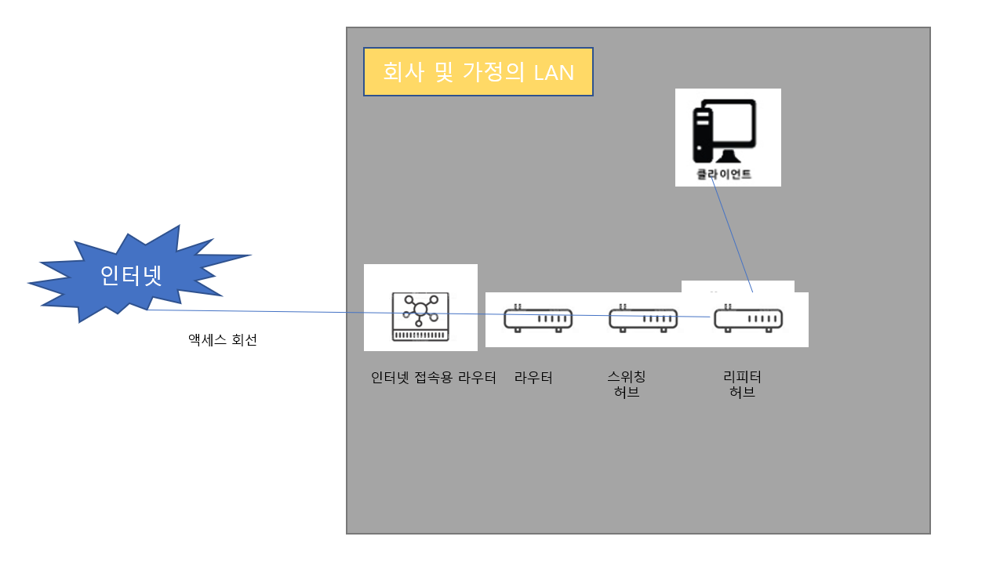

# Chapter03 케이블의 앞은 LAN 기기였다.

[TOC]

## STORY 01 케이블과 리피터 허브속에 신호가 흘러간다

> 중계 장치

이 장의 상황은 클라이언트의 LAN어댑터에서 패킷이 나가는 상황 입니다. 패킷은 허브, 라우터(중계장치)를 거쳐서 원하는 목적지에 패킷이 도착합니다.

cf)

보통, 리피터 허브 또는  스위칭 허브가 내장된 라우터를 사용 합니다. 그러나 단일 기능의 기기 하나 하나 살펴보며 설명하겠습니다.

> LAN 케이블의 신호

이 장의 상황은 클라이언트의 LAN어댑터에서 패킷이 나가는 상황 입니다.

(LAN 어댑터의 PHY(MAU) 회로에서 전기 신호로 형태를 바꾼 패킷이 RJ-45 커넥터를 통해 트위스트 페어 케이블에 흘러 들어가게 됩니다. 더불어, 이더넷의 신호는 +, -의 전압 입니다.)

- RJ-45커넥터에서 송출된 신호는 케이블을 통과하는 사이에 신호의 에너지가 조금씩 떨어집니다.

  (즉, 케이블의 길이가 길어질수록 신호가 약해 집니다.)

- 주파수가 높을 수록(송신측의 원래 신호에서 각진 부분은 주파수가 높음) 에너지가 떨어지는 성질 때문에 해당 부분이 뭉개짐

- 잡음이 없는 경우에도 신호가 변형되는데 잡음의 영향까지 더해지면 더욱 신호가 약해져 0과 1을 잘못 판독할  있게 되어 이것이 통신 오류의 원인이 됩니다.

> '꼼'을 통한 잡음 방지

우선, 잡음이 발생하는 원인은 다음과 같습니다.

- 신호선은 금속(도전체) 으로 만들어 졌다.

- 잡음의 원인은 케이블 주위에 발생하는 전자파 입니다.
- 금속 등의 도전체(전기가 통하기 쉬은 재료)  주위에 전자파가 있으면 신호(송·수신측이 보내는 신호)와는 다른 전류가 케이블안에 흐르게 됩니다.
- 신호도 전압에 의해 생기는 일종의 전류
- 신호와 잡음의 전류(전자파)가 뒤썩여서 신호의 파형이 변형 됩니다. 이것이 잡음 입니다.

**외부에서 오는 전자파**

- 모터, 형광등, CRT 모니터 같은 기기에서 누설되는 전자파

- 위와 같은 전자파는 케이블의 밖에서 오는 것 입니다.
- 트위스트 페어 케이블을 ''꼼"을 통해 해결할 수 있습니다.
- 신호선은 금속으로 만들어 졌고 전자파가 닿으면 전자파의 진행 방향의 오른쪽으로 전류가 생깁니다. 이 전류가 파형을 무너뜨리는 원인이 됩니다.
- 신호선을 마주 꼬면 나선형이 되어 꼰 옆의 선에서 전류가 흐르는 방향이 반대가 됩니다.
- 그 결과, 잡음에서 생긴 전류가 서로 상쇄되어 잡음에 의한 전류는 약해 집니다.

**내부에서 오는 전자파**

- 신호선 안에는 신호라는 전류가 흐르므로 전류에 의해 주위에 전자파가 생깁니다. 이것이 신호선에 대한 잡음이 됩니다. 이러한 잡음을 **크로스토크(crosstalk)**라 합니다.
- 이 잡음은 강한 것은 아니지만 거리가 가까우면 문제가 됩니다. 
- 전자파는 발생 근원에서 떨어지면 확산되어 약해지는데 한 개의 케이블 안에 있는 신호선은 거리가 가까우므로 전자파가 약해지기 전에 인접 신호선에 도달해 버립니다.
- 신호선에서 나오는 약간의 전자파가 주위의 신호선에 닿아 여기에서 전류를 발생시킴
- 이것도 신호선의 꼬는 간격을 미묘하게 변화시켜 해결할 수 있습니다.

> 리피터 허브는 연결되어 있는 전체 케이블에 신호를 송신한다.

신호가 리피터 허브에 도달하면 LAN 전체에 신호가 전달 됩니다. 

이것은 리피터 허브 이더넷의 기본원리(전체에 패킷의 신호를 뿌리고 mac 주소에 해당하는 기기만 패킷을 수신한다.)를 실현한 것입니다. (그림p198 참조)

리피터 회로의 기본 성질을 정리하자면,

- 신호를 그대로 뿌려주는 역할만 함 
- 잡음의 영향을 받은 신호도 그대로 흘려보냄
- 다음 기기(스위칭 허브, 라우터 서버 등)에 도착하여 FCS를 검사하는 곳에세 데이터가 변화가 판명된 패킷을 폐기 시킴

