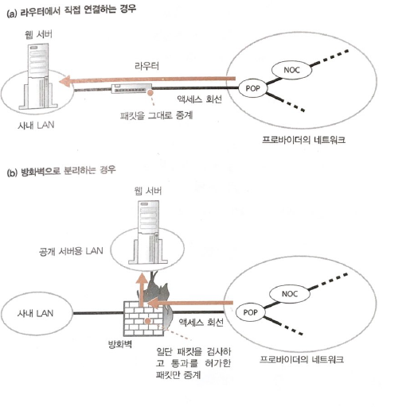
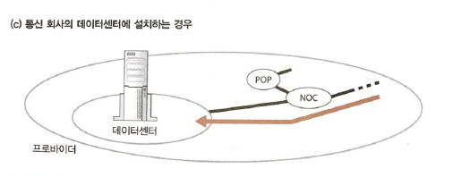
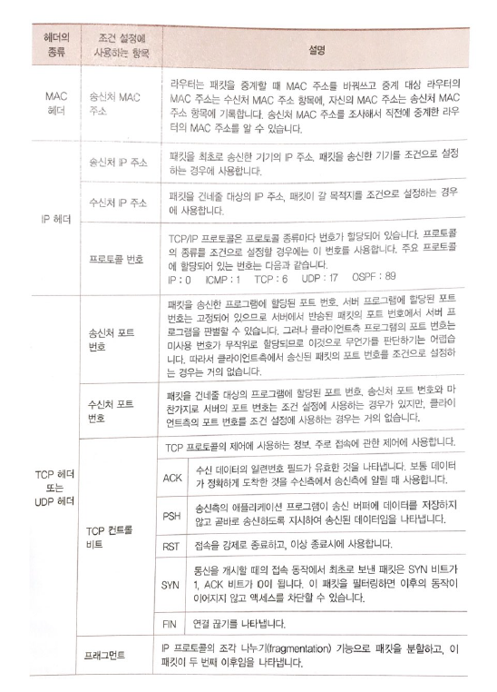
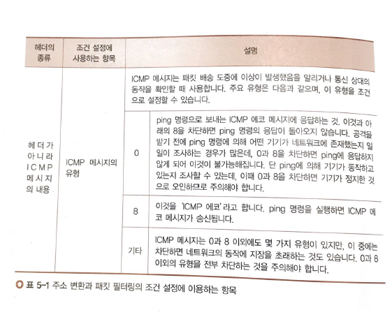
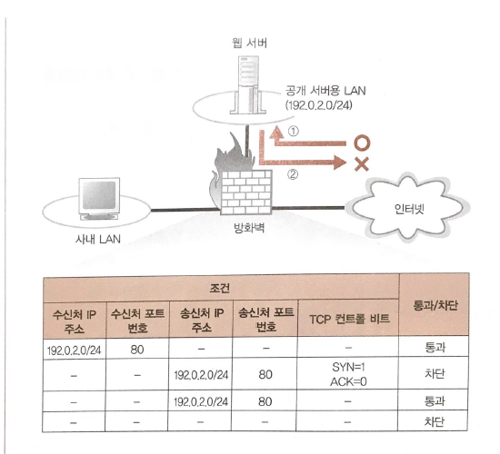

# Chapter05 서버측의 LAN에는 무엇이 있는가?

[TOC]

이전 장에서는, 인터넷에 들어간 패킷이 통신 회선이나 프로바이더의 네트워크를 통해 서버측의 NOC또는 POP로 운반되는 과정을 공부하였습니다. 이번 장은 목적지 서버 앞에 있는 방화벽, 캐시서버, 부하 분산 장치 등을 탐험해보도록 하겠습니다.

## STORY 01 웹서버의 설치 장소

> 사내에 웹 서버를 설치하는 경우

(a)라우터에 직접 연결하는 경우

- (a) 와 같이 구성하다 보면 보안상 취약점이 발생할 수 있습니다.
- 악의적인 패킷이 어플리케이션에 전송되었을때 바로 전달되기 때문에 위협이 발생할 수 있습니다. 

(b)방화벽으로 분리하는 경우

- 보안상의 이유로 방화벽을 중간에 두는 방법을 많이 사용 합니다.
- 방화벽은 특정 서버에서 동작하는 특정 어플리케이션에 액세스하는 패킷만 통과 시키고, 그 외의 패킷을 차단하는 역할을 합니다.(즉, 허가된 어플리케이션만 패킷을 서버에 보낼 수 있습니다.)
- 방화벽을 사용함으로써 보안성이 더 강화됨

> 데이터센터에 웹 서버를 설치하는 경우

(c)데이터센터에 웹 서버를 설치한 경우

- 사내가 아닌 프로바이더가 운영하는 데이터 센터에 웹서버를 설치하는 경우 입니다.
- 사용자는 일정한 금액을 내고 프로바이더가 제공하는 서버를 빌려 운영합닌다.
- 데이터센터는 NOC에 직접 접속되어 있거나 IX에 직접 연결되어 있습니다. 이때 연결하는 회선은 고속회선이기 때문에 다른 측에서 이 웹서버에 접속했을 때 속도가 빠릅니다. 또한, 데이터 센터는 자연재해를 대비하여 내진설계된 건물로 운영되기 때문에 안정적 입니다.
- 데이터 센터는 서버 외에도 기기의 가동 상태감시, 방화벽 설치 운영, 부정 침입 감시라는 부가 서비스를 제공합니다.

## STORY 02 방화벽의 원리와 동작

> 패킷 필터링

방화벽의 주요 개념은 미리 설정된 애플리케이션의 패킷은 통과시키고 그 외의 패킷을 차단하는 역할을 주로 수행합니다. 패킷을 선별하는 방식에 따라 방화벽의 종류는 크게 3가지로 분류됩니다.

- 패킷 필터링형
- 애플리케이션 게이트웨이형
- 서킷 게이트웨이형

그 중 가장 많이 사용하는 방화벽 유형은 패킷 필터링형 입니다.

> 패킷 필터링의 조건 설정 개념

패킷안에 헤더안에 제어정보가 기록되어 있습니다. 이러한 제어정보를 통해 방화벽은 패킷 필터링 기능을 수행합니다.

패킷 필터링은 start poing와 end point에 따라 패킷필터링 조건을 설정합니다.

1. 시점과 종점으로 판단

   - start point:송신처 IP

   - end point:수신처 IP

     

2. 포트번호(애플리케이션 한정)

   시점과 종점만으로 판단한다면, 인터넷과 웹 서버 사이를 흐르는 패킷은 전부 통과하게 됩니다. 만약 하나의 컴퓨터에 웹 서버(80)와 FTP 서버(22)가 존재한다고 가정해봅시다. 시점과 종점만 가지고 판단하게 되면 누군가가 부정정으로 파일 서버에 접속하여 정보를 빼내도 막을 방법이 없습니다.  그 외에도 보안적인 문제가 잠재되기 때문에 포트 번호를 통하여 접속 가능한 애플리케이션을 설정 합니다.

   

3. 컨트롤 비트로 접속 방향을 판단

   - 위의(1,2)만 가지로는 **웹 서버=>인터넷으로 액세스하는 동작을 정지할 수 없습니다**. 기본적으로 웹에서 사용하는 TCP 프로토콜을 양방향으로 패킷이 전송됩니다. 만약 웹 서버에서 인터넷으로 흐르는 패킷을 방화벽을 통해 정지 시키면 인터넷=>웹서버로 액세스 하는 동작도 정지하게 됩니다.

     따라서, 패킷이 흐르는 방향(웹=>인터넷 또는 이터넷=>웹)이 아닌 **액세스 방향을 판단하여 정지시켜야 합니다.** 이때 사용되는 것이 TCP 헤더에 있는 **컨트롤 비트** 입니다.

     

   - TCP 최초의 접속 단계에서는 클라이언트와 서버는 3개의 패킷을 주고 받습니다.

     1. 클라이언트 =>서버(최초의 패킷)

        컨트롤 비트 (SYN=1, ACK=0)

     2. 서버=>클라이언트(두 번째 패킷)

        커트롤 비트(SYN=1, ACK=1)

     3. 클라이언트=>서버

        컨트롤 비트(ACK)

   - 즉, 최초의 패킷만 ACK 컨트롤 비트가 0이고 나머지 ACK 컨트롤 비트는 모두 1 입니다.

     최초의 패킷이 클라이언트에서 서버가 아닌  **웹 서버측에서=> 인터넷(결국 클라로감)**으로 흘러갈 경우

     방화벽을 통하여 2행처럼 구성하게 되면 클라이언트가 패킷을 받지 못하기 때문에 TCP 접속 동작은 실패하게 됩니다. 이를 통해 웹서버에세 인터넷으로 패킷을 보내는 것을 차단시킬 수 있습니다.

​        https://m.blog.naver.com/PostView.nhn?blogId=koromoon&logNo=120162515270&proxyReferer=https%3A%2F%2Fwww.google.com%2F

4. 패킷 필터링 조건으로 사용되는 항목 즉, 헤더는 다양합니다.

<인터넷->웹서버로 패킷이 전송되는 경우>

- 인터넷에서 웹서버로 패킷이 전송되는 경우 방화벽은 **strat point(송신처 IP)는** **누구든 상관 없기 때문**에 패킷필터링 설정에 대하여 end point(수신처 IP) 만 가지고 판단합니다.(1행)

  ex)

  웹 서버가 naver라고 치면 이 곳에 접속하는 클라이언트 송신 ip는 패킷필터링의 대상이 되지 않습니다.

  

<웹서버->인터넷으로 패킷이 전송되는 경우>

- 클라이언트에게 요청받은 웹 서버는 ACK 패킷은 데이터 패킷을 전송해야 합니다.

  이때, start point(송신처 IP)와 패킷 테이블이 일치하는 패킷만 전송합니다.(3행)

위의 조건을 모두 고려하면 판단 해봅시다.

1. 인터넷에서=>서버로 패킷이 도착한 경우 (1행의 경우) 이 패킷은 최초의 패킷이 되고 방화벽의 조건에 따라 통과하게 됩니다.
2. 서버=> 인터넷으로 패킷을 전송할 때 2행이 아닌 3행과 일치하기 때문에 패킷이 통과하게 됩니다.

cf)

그러나 UDP 프로토콜을 사용하면 위의 예시가 적용되지 않습니다.

DNS 서버는 UDP 프로토콜을 사용합니다. UDP는 접속동작이 없기 때문에 액세스 방향을 알 수 없습니다.

따라서, 사내=>인터넷 DNS 서버에 접속하는 것은 허가하고 인터넷=>사내의 DNS 서버에 액세스하는 패킷을 차단한다는 조건을 설정할 수 없습니다.  

정리하자면, 패킷 필터링형 방화벽은 수신처 IP 주소, 송신처 IP 주소, 수신처 포트 번호, 송신처 포트 번호, 컨트롤 비트 등으로 패킷을 통과시킬지 판단합니다.

