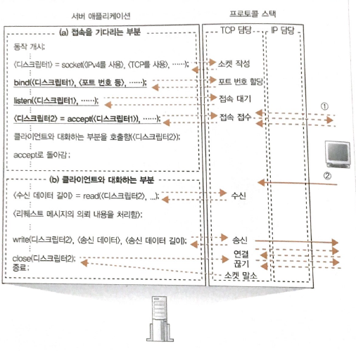

# Chapter06 웹 서버에 도착하여 응답 데이터가 웹 브라우저로 돌아간다.

[TOC]

이전 장에서는, 클라이언트에서 보낸 패킷이 서버로 통과하는 과정을 탐험 해보겠습니다.

## STORY 01 서버의 개요

> 서버 애플리케이션의 구조

서버는 동시에 복수의 클라이언트와 통신 동작을 수행 합니다. **하나의 프로그램**으로 여러 클라이언트를 처리하는것은 어렵습니다. 그 이유는 클라이언트 마다 어디까지 대화가 진행되었는지를 모두 파악해야 하기 때문입니다.

따라서, 서버는 클라이언트가 접속할 때마다 새로 서버 프로그램을 작동하여 **서버 애플리케이션이 클라이언트와 1 대 1로 대화하는 방법**을 주로 사용합니다.

(a)접속을 기다리는 부분

- 서버 프로그램을 작동해서 설정 파일 읽기 등의 초기화 작업 수행
- 접속 동작을 기다리며 쉬는 상태

(b)클라이언트와 대화하는 부분

이 방식이 가능한 이유는 서버 OS는 멀티 태스크 또는 멀티스레드 기능에 의해 다수의 프로그램을 동시에 함께 작동할 수 있는 성질을 이용한 방식 입니다.

cf)

멀티 태스크

- 복수의 태스크(프로그램)를 동시에 실행하는 것 입니다. 하나의 프로세서는 어떤 시점에서 하나의 태스크만 실행하지만 단시간 안에 태스크를 전환하면서 실행하므로 사용자는 동시에 실행하는 것처럼 느껴지는 방식입니다.
- 멀티 프로세스라고도 부름

멀티 스레드

- 멀티 태스크와 같이 복수의 스레드를 동시에 함께 실행하는 기능
- 차이점은 OS 내부적으로 멀티 태스크는 하나 하나 별도의 프로그램으로 취급되지만, 스레드는 한 개의 프로그램 속을 몇 개의 부분으로 나눈것으로 취급됨

> 클라이언트와 서버의 통신

클라이언트 측

1. 소켓을 만듭니다.(소켓 작성 단계)
2. 서버측의 소켓과 파이프로 연결합니다.(접속 단계)
3. 데이터를 송·수신 합니다.(송·수신 단계)
4. 파이프를 분리하고 소켓을 말소합니다.(연결 끊기 단계)

서버 측

1. 소켓을 만듭니다.(소켓 작성 단계)
2. 1 소켓을 접속 대기 상태로 만듭니다.(접속 대기 상태)

2. 2  접속을 접수합니다.(접속 접수 단계)
3. 데이터를 송·수신합니다.(송·수신 단계)
4. 파이프를 분리하고 소켓을 말소합니다.(연결 끊기 단계)

cf)

bind함수는 지정한 포트번호를 소켓에 기록하는 작업을 수행합니다.

listen함수는 소켓에 접속하기를 기다리는 상태라는 제어 정보를 기록합니다.

=>이 두개의 함수가 호출되면 서버 측의 2.1 동작이 완료 됩니다.

accept 시점, 즉 접속을 접수하는 부분에서는 서버 애플리케이션을 기동한 후 즉시 실행되므로 아직 클라이언트의 접속 패킷이 도착하지 않았을 것입니다.

**접속 패킷이 도착하면,**

1.  접속 대기의 소켓을 복사하여 새로운 소켓을 만듭니다.
2.  새 소켓에 접속 상대의 정보와 제어정보를 기록합니다.
3.  1과 2의 절차가 끝나면 클라이언트 소켓과 서버의 소켓이 연결된 상태가 됩니다.

4. 클라이언트와 접속하는 부분(b) 부분을 실행시킵니다.

위에서 보면, 

- 접속대기 소켓을 복사하여 새 소켓을 만든다.
- 새 소켓을 클라이언트측의 소켓과 접속한 후 원래 소켓은 그대로 접속 대기 상태인 채로 둡니다.

클라이언트 접속시 접속 대기 소켓을 복사해서 쓰는 이유는 다음과 같습니다.

접속 대기 소켓을 그대로 사용하게 되면 서버에서는 더 이상 접속대기의 소켓이 없기 때문에 다음 클라이언트는 접속하기 곤란하게 됩니다. 따라서 이러한 이유 때문에 새 소켓을 만들고 여기에 클라이언트가 접속하게 됩니다.

또한, 새로운 소켓을 만들 때의 포트 번호도 요점이 됩니다.

보통, 포트 번호는 소켓을 식별하기 위해 사용됩니다. 그러나 서버측에서는 소켓마다 다른 값을 할당해야 한다는 개념을 따르기 어렵습니다. (웹의 경우, 클라이언트는 80으로 접속한다고 정해져있음) 따라서 새로 만든 소켓도 접속 대기 소켓과 같은 포트 번호를 할당 해야 합니다.

이렇게 되면 포트번호는 소켓을 지정하기 위한 번호 입니다. 그런데  같은 번호를 여러개 할당한 소켓이 존재한다면 이는 어떻게 식별해야 될까라는 문제가 발생합니다.

이 문제는 다음과 같이 해결할 수 있습니다.

- 클라이언트측의 IP주소
- 클라이언트측의 포트 번호
- 서버측의 IP 주소
- 서버측의 포트 번호

**클라이언트측의 IP주소, 클라이언트측의 포트 번호**

서버 측의 소켓에서는 같은 포트 번호를 가진 여러 개의 소켓이 존재합니다. 그러나 클리언트 측의 소켓은 모두 다른 포트 번호를 할당해서 사용합니다. 그러나 이 규칙의 클라이언트 내부에서만 정해지지 다른 클라이언트 포트와 같을 수 도 있습니다. 따라서 클라이언트 IP 주소도 판단 근거에 추가하게 됩니다.

ex)

198.18.203.153/1025

198.18.203.86/1025 

## STORY 01 서버의 수신 동작

> LAN 어댑터에서 패킷 수신동작

1. LAN 어댑터에서 패킷을 수신 받아서 전기 신호로 변환하고
2. FCS오류 검사용 데이터를 비교하여 오류 유무를 검사합니다.
3. FCS가 일치하고 오류가 없다는 것을 확인한 후, 수신처 MAC 주소를 조사하여 패킷이 자신에게 보낸것인지 판단합니다.
4. LAN 어댑터의 내부 메모리에 디지털 데이터 저장
5. 인터랍트 방식을 통해, CPU의 패킷 도착을 알림
6. LAN 드라이버가 동작하여 LAN 어댑터의 버퍼메모리의 패킷을 추출함
7. 그 후 MAC주소에서 프로토콜을 판별하고 이 프로토콜을 처리하는 SW를 호출

> IP 담당 부분의 수신 동작

1. 프로토콜 스택에 패킷이 전달되면 IP 담당 부분이 동작하여 IP 헤더를 점검 그 후 수신처 IP가 자신을 대상으로 온지 판단

2. 패킷이 자신을을 대상인것이 확인되면 조각 나누기에 의해 패킷이 분할되었는지 조사합니다.

3. 분할된 경우 패킷을 일시적으로 메모리에 저장해 둠니다. 그리고 패킷의 조각이 전부 도착한 시점에서 패킷의 조각을 조립하여 원래 패킷으로 복원합니다.

4. IP헤더의 프로토콜 번호 항목을 조사하여 해당하는 담당 부분에 패킷을 전달해줍니다.

   (TCP담당부분 또는 UDP)

> TCP  담당 부분의 수신 동작

<TCP 접속 동작>

1. TCP 헤더에 SYN 컨트롤 비트가 1로 되어  있으면 접속 동작의 패킷입니다. 접속을 접수하는 동작 전, 도착 패킷의 **수신처 포트 번호**를 조사하여 이 번호와 같은 접속 대기 상태의 소켓이 있는지 확인합니다. 만약 해당 소켓이 없다면 ICMP 메시지(오류메시지)를 클라이언트에게 전송합니다.
2. 해당하는 접속 대기 소켓을 복사하여 새 소켓을 작성하고 아래 정보를 기록합니다. 더불어, 송신 버퍼나 수신 버퍼로 사용하는 메모리 영역을 확보합니다.
   - 송신처 IP 주소
   - 포트번호
   - 시퀸스 번호 최값
   - 윈도우 값
   - etc(기타 정보)
3. 클라이언트에 보내는 데이터에 대한 시퀸스 번호 초기값, 서버의 윈도우 값 등의 항목을 tcp 헤더에 작성하고 패킷을 전송합니다.
4. 클리언트 측에서 ACK가 도착하면 접속동작 완료

<TCP 수신 동작>

1.  데이터의 패킷을 수신한 경우 TCP 담당 부분은 도착한 패킷의 아래 4가지 정보로 소켓을 판단 합니다.

   - 송신처 IP 주소

   - 송신처 포트 번호

   - 수신처 IP 주소

   - 수신처 포트번호

2. 데이터의 조각을 연결하여 수신버퍼에 보관합니다.
3. 클라이언트에게 패킷을 수신했다는 의미로 ACK를 되돌려줍니다.

cf) 

TCP에서 수신할 때

데이터 조각을 연결하고 결합하여 원래의 데이터로 복원하는 동작은 데이터 패킷이 도착할 때마다 수행됩니다.

데이터를 전부 수신하고 나서 정리하여 결합하는 것이 아닙니다.

> TCP 연결끊기 동작

HTTP1.0인 경우 서버에서 먼저 연결 끊기에 들어가게 됩니다.

1. 서버측 SOCKET 라이브러리의 close를 호출합니다.
2. TCP 담당 부분은, FIN이라는 컨트롤 비트에 1을 설정한 TCP헤더를 만든 후 IP 담당 부분에 의뢰합니다.
3. 이것이 클라이언트에 도착하면 ACK 번호를 반송합니다. 이때 클라이언트도 close 함수를 호출하고 서버에게  FIN을 1로한 패킷을 전송합니다. 그 이후 서버로 부터 ACK를 전달받으면 연결 끊기 동작이 완료됩니다.

